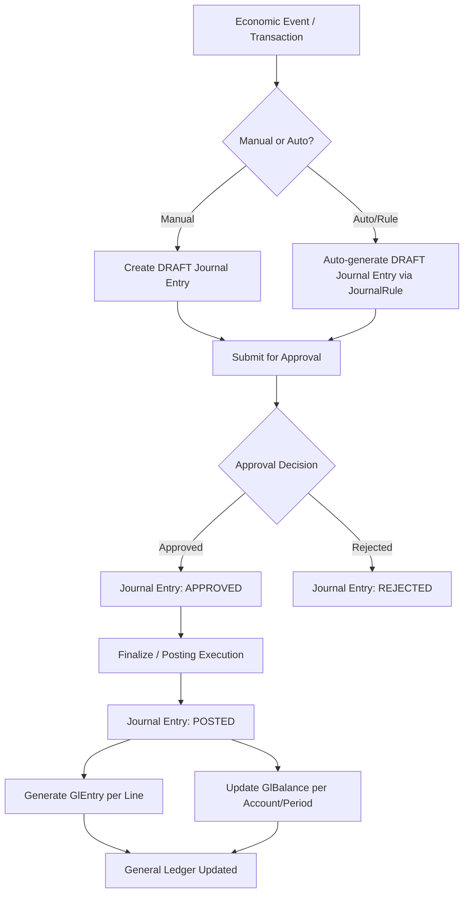
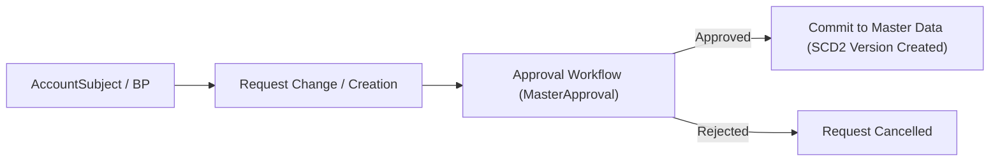
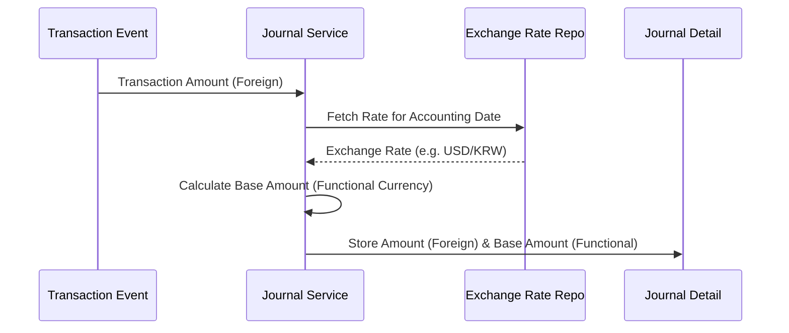

# Business Workflow - Accounting System

This document visualizes the core workflows using Mermaid diagrams.

## 1. Journal-to-Ledger Workflow (전표 처리 및 전기)

## 2. Master Data Approval Workflow (마스터 데이터 및 승인)

## 3. Multi-Currency Conversion Flow (다통화 처리)

