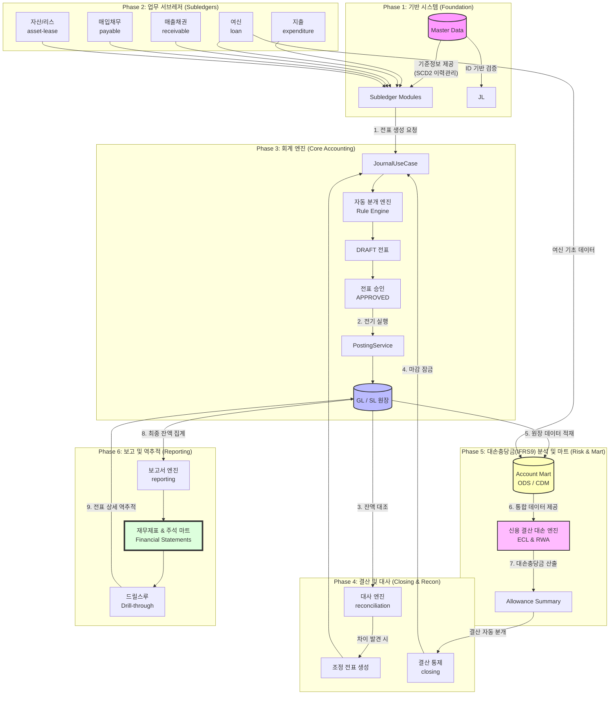

# 🏆 전사 통합 비즈니스 프로세스 흐름도 (Comprehensive Business Flow)

이 문서는 차세대 재무 시스템의 데이터 발생부터 최종 보고서 생성 및 대손충당금(IFRS9) 분석까지의 전체 비즈니스 흐름을 Mermaid 다이어그램으로 시각화한 것입니다.

---

## 1. 전사 통합 업무 파이프라인

---

## 2. 상세 단계별 설명

### 🟢 1단계: 원천 거래 발생 (Subledgers)
- 각 업무 모듈(지출, 대출, 매출 등)에서 비즈니스 이벤트가 발생합니다.
- 모든 모듈은 `contracts`에 정의된 포트 인터페이스를 통해 통신하며, 엔티티를 직접 공유하지 않고 **ID(Code) 기반**으로 데이터를 주고받습니다.

### 🔵 2단계: 전표 생성 및 전기 (Journalizing & Posting)
- **분개(Journalizing):** 룰 엔진(`JournalRuleEngine`)이 원천 데이터를 해석하여 차변/대변 계정과목을 결정합니다.
- **승인(Approval):** 생성된 전표는 시스템 자동 승인 또는 수동 결재를 거쳐 확정됩니다.
- **전기(Posting):** 확정된 전표 정보가 총계정원장(GL)과 보조원장(SL) 잔액에 실시간으로 반영됩니다.

### 🟡 3단계: 대사 및 대손충당금(IFRS9) 분석 (Recon & Risk Mart)
- **대사(Reconciliation):** `reconciliation` 모듈이 은행 계좌 내역(Source)과 내부 장부(Target)를 비교하여 차이를 찾아내고 조정합니다. 대용량 처리를 위해 DB 레벨 집계를 수행합니다.
- **재무 마트(Account Mart):** 흩어진 원천 데이터(여신 원장 등)와 재무 원장(GL) 데이터를 ODS로 수집하고, 대손충당금(IFRS9) 산출을 위한 통합 데이터 모델(CDM)로 변환합니다.
- **ECL 엔진(Credit Risk):** `ecl` 모듈이 마트 데이터를 기반으로 부도율(PD), 부도시손실률(LGD), 부도시노출액(EAD)을 결합하여 IFRS 9 기준 IFRS9 기대신용손실(ECL) 및 충당금(Allowance Summary)을 산출합니다.

### 🟠 4단계: 결산 및 보고서 생성 (Closing & Reporting)
- **결산(Closing):** 산출된 충당금(ECL) 및 외화평가(FX) 결과를 바탕으로 결산 자동 조정 전표를 생성하며, 이후 해당 회계 기간의 추가 전표 입력을 막습니다(Closing Lock).
- **보고(Reporting):** 확정된 원장 데이터를 기반으로 재무제표(BS, PL)와 주석 마트(Disclosure Note Mart)를 생성합니다.
- **드릴스루(Drill-through):** 프론트엔드 대시보드에서 합계 금액을 클릭하면 해당 금액을 구성하는 원천 전표 상세 내역까지 역추적할 수 있습니다.

---

## 3. 핵심 아키텍처 원칙 (초보자 가이드)

- **ID Reference (ID 기반 참조):** 모듈 간에 "객체" 자체를 전달하지 않습니다. "학생"이라는 객체를 통째로 주는 대신, "학번(ID)"만 전달하고 이름이 궁금할 때만 학생 모듈에 물어보는 방식입니다. 이를 통해 시스템 한 곳이 고장 나도 전체가 멈추지 않는 유연함을 확보합니다.
- **Hexagonal Architecture (헥사고날 아키텍처):** 핵심 비즈니스 로직(도메인)을 가운데 두고, 외부 시스템(DB, 웹, 타 모듈)은 어댑터를 통해서만 연결합니다.
- **Single Source of Truth (진실의 원천):** 대손충당금(IFRS9) 분석(ECL)에 필요한 모든 데이터는 개별 서비스에서 직접 가져오지 않고, 오직 `Account Mart`의 정제된 CDM(Common Data Model)을 통해서만 참조하여 정합성을 보장합니다.
