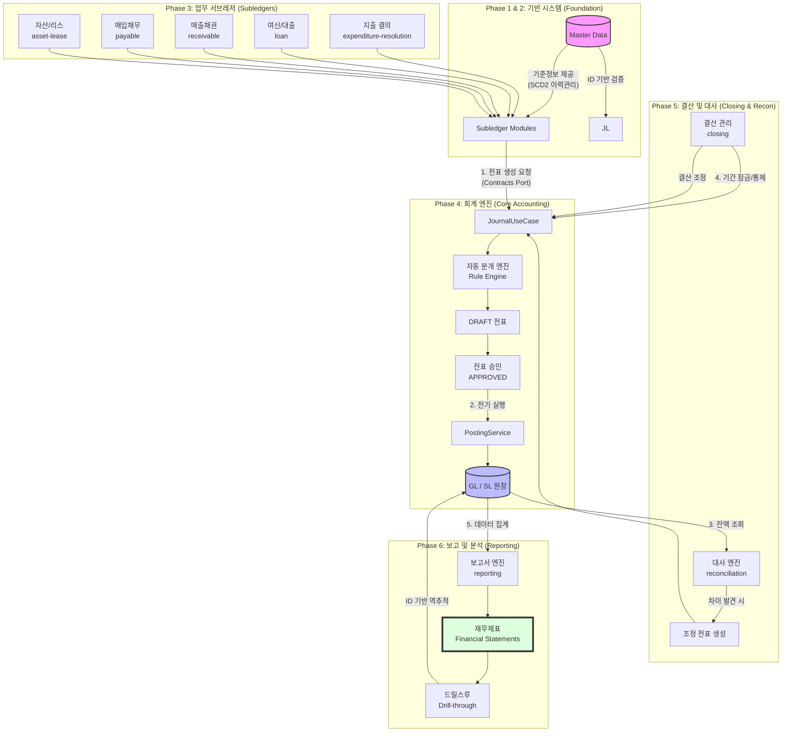

# 🏆 전사 통합 비즈니스 프로세스 흐름도 (Comprehensive Business Flow)

이 문서는 차세대 재무 시스템의 데이터 발생부터 최종 보고서 생성까지의 전체 비즈니스 흐름을 Mermaid 다이어그램으로 시각화한 것입니다.

---

## 1. 전사 통합 업무 파이프라인

---

## 2. 상세 단계별 설명

### 🟢 1단계: 원천 거래 발생 (Subledgers)
- 각 업무 모듈(지출, 대출, 매출 등)에서 비즈니스 이벤트가 발생합니다.
- 예: 대출 실행(Loan Disbursal), 지출 승인(Expenditure Approved).
- 모든 모듈은 `contracts`에 정의된 인터페이스를 통해 통신하며, 엔티티를 직접 공유하지 않고 **ID(Code) 기반**으로 데이터를 주고받습니다.

### 🔵 2단계: 전표 생성 및 전기 (Journalizing & Posting)
- **분개(Journalizing):** 룰 엔진(`JournalRuleEngine`)이 원천 데이터를 해석하여 차변/대변 계정과목을 결정합니다.
- **승인(Approval):** 생성된 전표는 승인 프로세스를 거쳐 확정됩니다.
- **전기(Posting):** 확정된 전표 정보가 총계정원장(GL)과 보조원장(SL) 잔액에 실시간 또는 배치로 반영됩니다.

### 🟡 3단계: 대사 및 결산 (Reconciliation & Closing)
- **대사(Reconciliation):** 외부 시스템(은행 등) 데이터와 내부 장부를 비교하여 차이를 찾아내고 조정합니다.
- **결산(Closing):** 해당 회계 기간의 추가 전표 입력을 막고(Lock), 마감 조정 분개를 통해 장부를 확정합니다.

### 🔴 4단계: 보고서 생성 (Reporting)
- 확정된 원장 데이터를 기반으로 재무상태표(BS), 손익계산서(PL) 등을 생성합니다.
- **드릴스루(Drill-through):** 보고서의 합계 금액을 클릭하면 해당 금액을 구성하는 원천 전표 상세 내역까지 ID 기반으로 역추적할 수 있습니다.

---

## 3. 핵심 아키텍처 원칙 (초보자 가이드)

- **ID Reference (ID 기반 참조):** 모듈 간에 "객체" 자체를 전달하지 않습니다. "학생"이라는 객체를 통째로 주는 대신, "학번(ID)"만 전달하고 이름이 궁금할 때만 학생 모듈에 물어보는 방식입니다. 이를 통해 시스템 한 곳이 고장 나도 전체가 멈추지 않는 유연함을 확보합니다.
- **Hexagonal Architecture (헥사고날 아키텍처):** 핵심 비즈니스 로직(도메인)을 가운데 두고, 외부 시스템(DB, 웹, 타 모듈)은 어댑터를 통해서만 연결합니다. 코드가 깔끔해지고 테스트가 쉬워집니다.
- **SCD2 (Slowly Changing Dimensions):** 기준 정보(계정과목, 부서 등)가 변경되어도 과거 기록을 지우지 않습니다. "옛날 영수증"을 볼 때는 "그 당시에 유효했던 부서명"이 나오도록 이력을 관리합니다.
