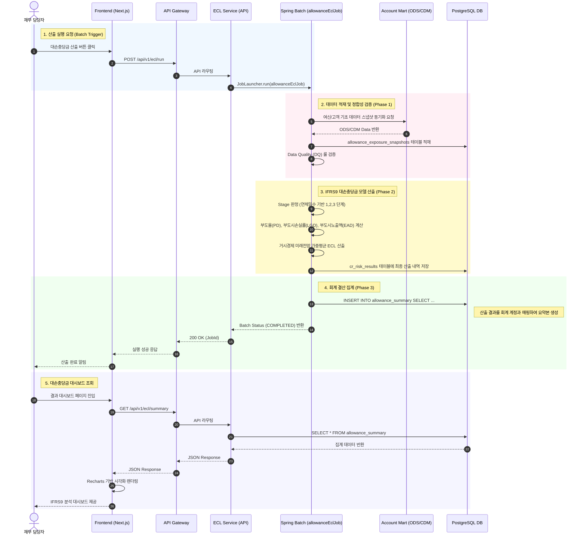

# IFRS9 대손충당금 산출 End-to-End 프로세스 명세서

이 문서는 모던 재무 시스템의 대손충당금(ECL) 모듈에 대해 **프론트엔드(UI)에서 시작하여 API Gateway, Batch, 데이터 마트를 거쳐 DB에 저장되고 다시 화면에 시각화되기까지의 전체 흐름**을 정의한 리포트용 산출물입니다.

---

## 📊 IFRS9 대손충당금 산출 E2E 시퀀스 다이어그램

### 💡 주요 프로세스 설명
1. **산출 실행 (Batch Trigger)**: 사용자가 프론트엔드에서 산출을 지시하면 Gateway를 거쳐 ECL 백엔드의 API가 호출되고, 이는 내부적으로 비동기 Spring Batch(`allowanceEclJob`)를 구동시킵니다.
2. **데이터 적재 (Snapshot Sync)**: 마스터 데이터 및 서브레저의 변동을 반영하기 위해 `account-mart`의 CDM(Common Data Model) 데이터를 스냅샷으로 당겨와 정합성을 확보합니다.
3. **리스크 모델 산출 (Calculation)**: 바젤 및 IFRS 9 규제 요건에 따라 대출 계약별로 Stage를 분류하고 PD, LGD, EAD 파라미터를 곱해 최종 기대신용손실(ECL)을 계산합니다.
4. **회계 집계 (Summary)**: 산출된 개별 건의 리스크 데이터를 재무제표(B/S, I/S) 계정과목 기준으로 Group By하여 `allowance_summary` 테이블에 Bulk Insert 합니다. 이후 이 데이터는 결산(`closing`) 모듈의 전표 생성 소스로 활용됩니다.
5. **결과 시각화 (Dashboard)**: 배치가 완료된 후 프론트엔드가 API를 재호출하면, 산출된 요약 데이터를 바탕으로 Recharts 라이브러리를 활용해 대시보드에 그래프와 표로 시각화합니다.
