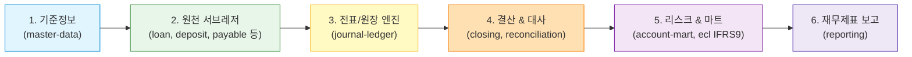
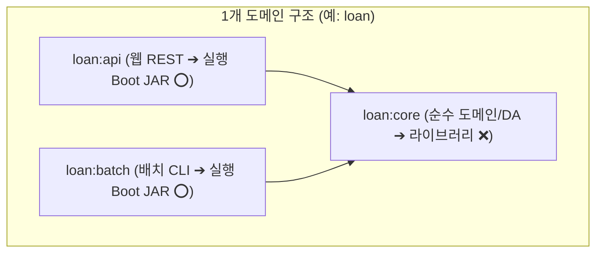

# 🐣 모던 재무/회계 시스템 통합 입문 가이드 (Beginner Guide)

이 문서는 새로 합류한 개발자와 업무 담당자가 저장소의 **전체 비즈니스 흐름, 72개 모듈 구조, 4대 실무 실행 모드, 헥사고날/DDD 아키텍처 원칙**을 가장 빠르게 이해하도록 돕는 마스터 가이드입니다.

---

## 1. 🌊 전사 6단계 비즈니스 파이프라인 (E2E)

우리 시스템은 원천 거래 발생부터 최종 재무제표 산출까지 6단계로 유기적으로 연결됩니다.

1. **Phase 1 (기준정보 Foundation)**: 계정과목, 거래처(SCD2 이력관리), 환율 등 마스터 데이터 제공.
2. **Phase 2 (업무 서브레저 Subledgers)**: 여신(Loan), 수신(Deposit), 매입채무(Payable), 매출채권(Receivable), 고정자산/리스(Asset-Lease), 세무(Tax), 지출결의(Expenditure), 예산(Budget)에서 경제적 사건 발생.
3. **Phase 3 (회계 엔진 Core Accounting)**: 분개 룰 엔진(JournalRuleEngine)으로 DRAFT 전표 생성 및 승인 후 총계정원장(GL)/보조원장(SL)으로 전기(Posting).
4. **Phase 4 (결산 및 대사 Closing & Recon)**: 계좌 대사 검증 및 일/월/년 결산 마감 잠금(Closing Lock).
5. **Phase 5 (리스크 & 마트 Risk & Mart)**: 원장 데이터를 마트로 ETL 적재하고 IFRS 9 대손충당금(ECL) 산출.
6. **Phase 6 (재무보고 Reporting)**: 재무상태표(BS), 손익계산서(PL) 산출 및 드릴스루(Drill-through) 전표 역추적.

---

## 2. 🔢 72개 모듈 vs 36개 실행 파일의 구조 공식

우리 저장소는 **1개 도메인당 3개 모듈(`api`, `batch`, `core`)**로 분리되어 있습니다.

### 1) 실행 파일 (Boot JAR): **총 36개**
- **17개 API 서버**: `master-data:api`, `journal-ledger:api`, `loan:api`, `deposit:api` 등
- **15개 Batch 프로세스**: `master-data:batch`, `journal-ledger:batch`, `loan:batch` 등
- **3개 플랫폼 인프라**: `config-server`(8888), `discovery`(8761), `gateway`(8000)
- **1개 마이그레이션 도구**: `migration-runner` (Flyway 스키마 DDL 전담)

### 2) 전체 Gradle 서브프로젝트: **총 72개**
- 36개 실행 모듈 + 19개 공유 라이브러리(`*:core`, `contracts`, `shared-kernel`) + 17개 폴더 Aggregator = **72개**

---

## 3. 🚀 4대 실무 개발자 실행 모드 (Developer Workflow)

개발 상황에 맞춰 아래 4가지 모드 중 하나를 선택하여 작업합니다.

| 실행 모드 | 데이터베이스 | 실행 명령어 / 방법 | 용도 및 특징 |
| :--- | :---: | :--- | :--- |
| **1. 로컬 단독 (Standalone)** | **H2 In-Memory** | IntelliJ `.run/` 실행 또는 `.\gradlew :<module>:api:bootRun` | • 외부 도커/DB 없이 **3초 만에 기동** • 단위 개발 및 IDE 초고속 디버깅 |
| **2. 로컬 풀 컨테이너 (Container)** | **로컬 PostgreSQL** | `docker compose -f compose.self-contained.yml up -d` | • 내 PC에서 전체 스택(Frontend+Gateway+DB) 연동 확인 |
| **3. 개발서버 하이브리드 (Hybrid)** | **개발서버 DB/Kafka** | `docker compose -f compose.external-dev.yml up -d` | • 내 PC 자원을 아끼며 개발서버 인프라 공유 연동 |
| **4. 실운영 (Production)** | **운영 PostgreSQL** | `docker compose -f compose.prod.yml up -d` | • Vault 시크릿 암호화, Nginx SSL/TLS, 무중단 운영 |

---

## 4. 💻 IntelliJ IDEA에서 클릭 1번으로 실행하기

루트의 `.run/` 디렉터리에 **34개의 실행 구성**이 이미 등록되어 있습니다.

1. IntelliJ 우측 상단의 실행 드롭다운 클릭.
2. 원하는 서비스 선택 (예: `Master Data bootRun`, `Journal Ledger API bootRun`, `Deposit API bootRun`).
3. 초록색 **▶ (Run)** 또는 **🪲 (Debug)** 버튼을 누르면 즉시 실행됩니다.

---

## 5. 📚 추천 상세 가이드 목록

- [hexagonal-ddd-architecture-guide.md](./hexagonal-ddd-architecture-guide.md): 헥사고날 포트/어댑터, 도메인 vs JPA 엔티티, OOP/FP 융합 가이드
- [flyway-migration-guide.md](./flyway-migration-guide.md): Flyway DB 버전 관리 및 migration-runner 동작 가이드
- [local-development.md](./local-development.md): 로컬 개발 환경 구축 및 Gradle CLI 상세 가이드
- [ssl-nginx-reverse-proxy-guide.md](./ssl-nginx-reverse-proxy-guide.md): Nginx 단일 진입점 및 SSL/TLS 구축 가이드
