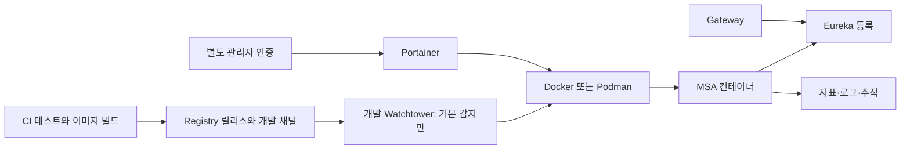

# 컨테이너 생명주기 관리와 배포 로드맵

Issue #710은 기존 **Portainer CE 관리 화면을 재사용**하고 개발용 이미지 자동
동기화 가능성을 검증한다. 로컬 Kubernetes 설치나 Spring Cloud 업무 코드 변경은
포함하지 않는다. 기준일은 2026-09-13이다.

## 역할과 책임

| 계층 | 현재 도구 | 담당 | 담당하지 않는 일 |
| --- | --- | --- | --- |
| 관측 | Prometheus/Grafana, ELK, Zipkin | 지표·로그·분산 추적, 장애 신호 | 컨테이너 재생성·배포 승인 |
| 발견·라우팅 | Eureka, Gateway | 인스턴스 등록·조회, 요청 라우팅·인증 | 호스트 프로세스 복구·이미지 교체 |
| 설정 | Config Server | 애플리케이션 설정 제공 | 기동 순서·DB migration 승인 |
| 실행·관리 | Docker/Podman, Compose, Portainer | 생성·중지·재시작, 운영자 GUI | 단일 복제본 무중단·업무 정합성 보장 |
| 이미지 동기화 | 개발용 Watchtower 실험 | 선택 컨테이너 이미지 확인·순차 재생성 | 새 태그 선택, migration, readiness 기반 전환 |
| 운영 조정 | 향후 Kubernetes/ArgoCD | 선언 상태 유지·복구, 검토된 manifest 배포 | 회계 승인·멱등성·마감 규칙 |



## 1단계: 로컬 Compose 경량 운영

[개발 Compose](development-compose.md)와 `tools/compose.*-external-dev.yml`의
도메인별 프로젝트를 사용한다. 필요한 도메인만 실행하고 Batch·ELK 등은 필요할 때
켠다. 기존 `account-network`는 외부 네트워크로 공유하며 새 관리 스택은 네트워크나
업무 볼륨의 수명주기를 소유하지 않는다.

기동 순서는 DB/Redis 준비 및 별도 migration/권한 gate → Config Server →
Discovery → Auth/Master Data → Gateway/Frontend → 필요한 도메인 API다.
같은 Compose 안의 health 기반 `depends_on`은 최초 기동을 도울 뿐이다.
서로 다른 Compose 프로젝트 간 의존성을 자동 해결하지 않으며 GUI의 전체
Restart 버튼도 이 순서를 보장하지 않는다. 종료는 요청 유입·Batch를 먼저
중지한 뒤 반대 순서로 진행하고 공용 DB·데이터 볼륨을 보존한다.

프로세스 종료 후 restart policy와 healthcheck의 unhealthy 상태를 구분한다.
Compose는 unhealthy라는 이유만으로 자동 재시작하지 않는다. 금융 Batch는
job parameter·처리 이력·재실행 지점을 확인하고 수동으로 재개한다.

## 2단계: 단일 호스트 Portainer 관리와 선택적 업데이트

### GUI는 기존 구성을 재사용한다

canonical template은 [portainer/docker-compose.yml](../../portainer/docker-compose.yml),
접속은 Nginx의 `/portainer/` 경로다. 별도 `deploy/portainer`를 만들지 않는다.
[Portainer 런북](portainer.md)에 최초 관리자 파일, 실행, loopback Nginx,
WebSocket/로그 스트림, 재생성 및 롤백 절차가 있다.

동일 엔진의 전체 컨테이너·상태·CPU/RAM·로그와 시작/중지/재시작을 GUI에서
확인할 수 있다. rootless는 **동일 Unix 사용자 엔진**만 보며 rootful/다른 사용자
컨테이너는 별도 환경이다. 외부 CLI Compose 스택을 볼 수 있다고 그 원본 YAML이
Portainer 관리로 자동 이관되지는 않는다. 원본은 Git에 두고 GUI와 CLI가 동시에
재배포하지 않도록 한 명을 배포 담당자로 둔다.

Dockge는 Compose 편집/스택 조작 중심이지만 기존 Portainer와 책임이 겹치므로
추가하지 않는다. Podman 완벽 지원을 가정하지 않는다. Portainer 공식 지원 범위와
이 저장소의 rootless 4.9.3 실험 증거는 다르다.
[공식 지원 설명](https://docs.portainer.io/faqs/installing/does-portainer-support-podman)

### 안전한 Watchtower 기본값

[템플릿](../../deploy/watchtower/compose.yml)은 `watchtower` profile을 명시해야
실행된다. 명령은 [README](../../deploy/watchtower/README.md)에 있다.
기본 `WATCHTOWER_MONITOR_ONLY=true`는 확인/필요한 pull만 수행한다.
감지만 해도 디스크·네트워크 비용이 생기며 읽기 전용 엔진 권한을 뜻하지 않는다.

두 레이블을 모두 만족한 **실행 중 컨테이너**만 선택한다. 예시는 별도로 승인한
개발 stateless API의 기존 Compose 서비스 항목에 병합한다. 기존 서비스에는
이 PR에서 레이블을 적용하지 않는다.

```yaml
services:
  selected-dev-api:
    image: ghcr.io/skyg547/account/reporting-api:dev-approved
    labels:
      com.centurylinklabs.watchtower.enable: "true"
      com.centurylinklabs.watchtower.scope: account-dev
```

예시 이름은 해당 원본 Compose의 실제 서비스 이름으로 바꾼다. Stateful DB,
Redis, Batch, migration runner, Config/Discovery/Auth/Gateway, Portainer 자체는
자동 업데이트에서 제외한다. updater에도 같은 scope와 `enable=false`를 적용했다.
unscoped Watchtower는 다른 인스턴스를 중지할 수 있으므로 함께 실행하지 않는다.
[선택 규칙](https://containrrr.dev/watchtower/container-selection/),
[다중 인스턴스 규칙](https://containrrr.dev/watchtower/running-multiple-instances/)

`containrrr/watchtower`는 **2025-12-17 아카이브**되었다. 1.7.1은 재현용 고정
프로토타입이며 신규 운영 표준으로 채택하지 않는다. 보안 패치·엔진 API 호환성을
보장할 유지보수가 없다. 확대 시 검토된 digest를 배포하는 CI 작업 또는 Podman
Quadlet/systemd native auto-update를 별도 검증하고, 중규모 이후는 Kubernetes로
전환한다. 임의 fork로 자동 교체하지 않는다.
[유지관리자 공지](https://github.com/containrrr/watchtower/discussions/2135)

`--rolling-restart`는 한 번에 하나씩 기존 컨테이너를 중지·재생성한다.
단일 복제본은 중단 구간이 있고 readiness, Eureka 등록, 트래픽 배제, DB 호환성
또는 자동 롤백을 제공하지 않는다. 수용 결과는 **버전 감지와 순차 교체 검증**이며
무중단 검증이 아니다. [공식 옵션](https://containrrr.dev/watchtower/arguments/)

### CI/CD 연결과 버전 계약

1. `deploy/image-targets.json`의 36개 활성 대상이 이미지 목록의 원본이다.
   [빌드 가이드](container-images.md)의 Java/Frontend 빌드와 테스트를 먼저 수행한다.
2. 기존 [GHCR 게시 도구](ghcr-container-registry-guide.md)로 명시적 불변 릴리스
   태그를 게시하고 manifest digest를 보관한다. 게시·배포 권한은 별도다.
3. 검증한 **한 대상의 같은 image ID**를 `dev-approved` 같은 가변 개발 채널로
   승격한다. Watchtower는 새 태그 이름을 찾지 않으므로 `sha-새커밋`을 게시해도
   이전 태그를 사용하는 컨테이너는 바뀌지 않는다. 운영은 기존 digest 고정을 유지한다.
4. monitor-only 결과와 대상·rollback digest를 확인한 뒤에만
   `compose.update.yml`을 추가로 병합하여 updater를 재생성한다. 이 override가
   monitor-only를 끄고 rolling-restart를 함께 켠다. 1.7.1은 두 모드의 동시 설정을
   거부한다. 환경변수 하나만으로 업데이트를 켤 수 없다. 최초 레이블 적용은
   원본 Compose 재생성이 필요하다. 환경/YAML 변경은 Watchtower가 배포하지 않는다.
5. 새 image ID, 애플리케이션 readiness, 합성 API smoke와 오류율을 확인한다.
   실패하면 updater부터 중지한다. Migration은 별도 승인된 release job이다.

장래 GitHub Actions 게시 작업은 보호된 `main`의 테스트 완료 commit에 대해
`GITHUB_TOKEN`의 `contents:read/packages:write`만 사용하고, 개발 채널별 concurrency와
승인 environment를 둔다. PR 및 `pull_request_target`의 비신뢰 코드에 레지스트리
쓰기 권한을 주지 않는다. 고정 SHA action, digest 기록, 짧은 수명의 인증으로
구현한다. [GitHub 공식 GHCR 예제](https://docs.github.com/en/actions/tutorials/publish-packages/publish-docker-images)

이 PR의 [실행 워크플로](../../.github/workflows/container-management-validation.yml)는
`contents:read` 권한의 일회용 Docker runner에서 **로컬 registry build/push 후
같은 채널 v1→v2를 감지·교체**한다. GHCR 게시와 실제 개발 서버 배포를 활성화하지
않는다. private GHCR 권한·승격 정책은 실제 적용 전 별도 검증 대상이다.

호스트 login 또는 소켓만으로 Watchtower에 인증이 전달되지 않는다. 비공개 이미지는
전용 pull-only 계정의 `config.json`을 외부 private 디렉터리에 준비해
`/config/config.json`으로 읽기 전용 디렉터리 마운트하고 `DOCKER_CONFIG=/config`를
설정하는 별도 override가 필요하다. 소유권·0600 파일·rotation을 검증하며 전체
사용자 홈/기존 인증 파일을 재사용하지 않는다. 기본 이미지에는 credential helper가
없으므로 helper만 참조하는 config는 작동하지 않는다. debug/trace 로그, config
출력, 토큰 포함 webhook URL은 사용하지 않는다.
[공식 인증 지침](https://containrrr.dev/watchtower/private-registries/)

### 보안, 자원, 장애 복구

Unix socket은 생성/exec/호스트 bind mount까지 가능한 관리자 권한이다.
`:ro`, `cap_drop`, read-only rootfs는 API 쓰기를 막지 못한다. 엔진 TCP API,
updater HTTP API/webhook은 열지 않는다. GUI와 앱 계정을 분리하고 Nginx를
loopback에 묶어 SSH 터널로 접근한다. 외부 공개는 TLS/별도 접근제어 검증 후에만
한다. `account-network` 내부 접근 역시 신뢰 경계다.

Watchtower 제한은 0.25 CPU/64MiB/64PID, Portainer는 기존
0.5 CPU/512MiB/128PID다. 제한 합계 576MiB는 **100MB 보장이 아니다**.
100MB는 100,000,000 bytes로 판정하고 MB/MiB를 혼용하지 않는다. stats/cgroup peak를
idle·GUI 목록/로그/콘솔·이미지 pull/교체 중 측정한다. 공유 Nginx·엔진 비용까지
포함한 증가분을 평가해야 호스트 오버헤드 목표를 판정할 수 있다. 초과하면 updater
상시 실행 대신 승인된 일회성 배포나 별도 관리 호스트를 선택한다. 검증 없이
Portainer 상한을 96MiB로 낮추거나 OOM을 restart로 감추지 않는다.

롤백: updater 중지 → 원본 Compose에서 해당 API image를 이전 `@sha256`로 지정 →
해당 서비스만 `up -d --no-deps` → readiness/업무 smoke → Eureka·오류율 확인.
재개 전 채널과 정책을 재검토한다. `--cleanup`, `--remove-volumes`,
`--include-stopped`, `--revive-stopped`를 사용하지 않고 기존 image/volume을 보존한다.
DB schema 자동 rollback은 없다. GUI 장애는 [Portainer 런북](portainer.md)에 따라
관리 컨테이너만 복구한다.

## 3단계: 프로덕션 Kubernetes 전환

단일 호스트 장애를 허용할 수 없거나 무중단·여러 복제본·다중 운영자 권한이 필요할 때
EKS/GKE를 별도 Issue로 평가한다. 로컬에 전체 클러스터를 강제하지 않는다.
제어면 3~5GB를 모든 배포의 고정값으로 간주하지 않고 managed control plane 비용,
worker·관측·스토리지 자원을 실측 산정한다.

| 전환 | 작업 | 완료 gate |
| --- | --- | --- |
| 패키징 | Helm chart 또는 Kustomize base/환경 overlay, digest, requests/limits | 렌더링·정책 검사·테스트 배포 |
| 발견 | Kubernetes Service/CoreDNS, Gateway 주소 전환 | `lb://SERVICE-ID`/Feign/Eureka 소비 경로 전수 검사 |
| 설정 | Config Server 유지/전환, ConfigMap/외부 secret manager, RBAC/NetworkPolicy | 환경 분리·rotation·최소권한 |
| 가용성 | 복수 replicas, startup/readiness/liveness, graceful shutdown, `maxUnavailable:0`와 surge | 부하 중 rollout·node 장애·rollback |
| 배치·데이터 | Job/CronJob, 멱등성·재시작, 별도 migration Job, DB backup | 중복·마감·부분 실패 복구 |
| GitOps | ArgoCD 승인 manifest 동기화, CI는 image/digest만 게시 | 작성자·리뷰어·배포자 분리, drift 감사 |

CoreDNS는 Service/Pod DNS를 제공한다. Eureka 클라이언트를 지우는 것만으로
`lb://` 라우팅이 DNS로 바뀌지 않는다. 호환 기간에는 Eureka를 유지하고 서비스별
주소/클라이언트를 테스트한 뒤 등록 서버를 제거한다. Gateway 인증·외부 라우팅은
남는다. [Kubernetes DNS](https://kubernetes.io/docs/concepts/services-networking/dns-pod-service/)

Kubernetes는 실행 상태 복구와 rolling Deployment를 제공하지만 잘못된 업무 버전의
자동 판단/롤백을 보장하지 않는다. readiness·복제본·자원 여유·외부 LB·connection
draining을 함께 검증한다. [Deployment 동작](https://kubernetes.io/docs/concepts/workloads/controllers/deployment/)

## 검증 기록과 권한 분리

2026-09-13 검증 결과:

| 검사 | 근거와 결과 |
| --- | --- |
| 정적 계약 | Watchtower 11개, Portainer 7개, base/update Compose render, 소켓 미지정 거부, harness schema55 PASS |
| Docker CI | [run 34704895259](https://github.com/skyg547/account/actions/runs/34704895259), 구현 `73772b49`: registry v2 실제 pull, monitor 중 v1 유지, 두 대상 순차 교체, 제외 4개 보존, 동일 버전 반복, registry 장애 보존, v1 rollback 모두 PASS |
| GUI 실기동 | 별도 임시 Portainer2.39.7/rootless Podman4.9.3: 관리자 로그인, 컨테이너73 목록, 합성 probe stats/재시작 PASS; 테스트 인스턴스 제거 |
| 메모리 | GUI peak 22,380,544 bytes/OOM0; 별도 Docker CI updater idle 9.039MiB. 서로 다른 호스트·시점의 값이며 합산 호스트 peak100MB 증거가 아님 |
| 남은 적용 gate | rootless 전체 registry 갱신, private GHCR 권한/채널 승격, 실제 개발 서버 배포, 동일 호스트 GUI 활성 사용+pull 중 전체100MB 측정 |

Podman의 `--no-pull` 선택 실험은 2개만 골랐지만 전체 HTTP-registry 시도는 scan
assertion에서 중단했다. Docker의 통과를 Podman 완전 호환으로 확대하지 않는다.
브라우저/로그 스트림/WebSocket은 기존 #713 증거를 재사용했고 이번에는 API 검증을
추가했다. Java/SQL/build 변경이 없어 전체 Gradle 검증은 수행하지 않았다.

정적/실기동 재현 명령은 [prototype README](../../deploy/watchtower/README.md)에 있다.
#713의 브라우저·로그·WebSocket·재생성 증거는 [Portainer 런북](portainer.md)에
기록돼 있으며 상시 운영 GUI로 오인하지 않는다. 이번 실측과 CI 결과는 Issue #710
Draft PR과 `docs/ai-harness/handoff.md`의 GH-710 항목에 기록한다.

구현자는 수정·검증·Draft 게시를 담당한다. 독립 Reviewer는 읽기 전용으로 검토한다.
이미지 게시, 개발 서버 자동 업데이트 활성화, PR Ready, merge, Issue close는
각각 별도 권한이며 Draft PR 생성이 그 권한들을 부여하지 않는다.
