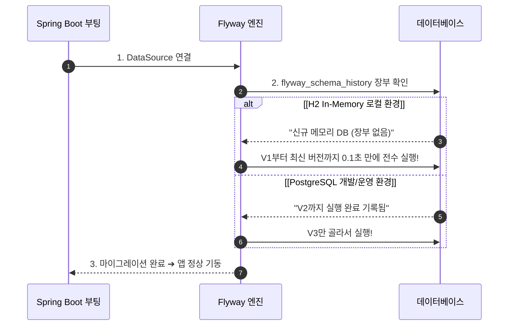

# 🗄️ Flyway 데이터베이스 형상관리 및 마이그레이션 가이드

이 문서는 Account 재무/회계 시스템에서 **Flyway를 통한 DB 버전 관리 원리, H2 vs PostgreSQL 동작 차이점, 모듈별 독립 소유 구조, 그리고 `migration-runner` 단독 전담 아키텍처**를 정리한 가이드입니다.

---

## 1. 🐣 Flyway란 무엇인가요? ("데이터베이스의 Git")

Git이 소스코드의 변경 이력을 관리하듯이, **Flyway는 데이터베이스의 테이블과 컬럼 변경 이력을 버전 번호(`V1`, `V2`, ...)로 추적하여 자동으로 적용하는 도구**입니다.

### 도입 이유:
- 수동으로 DB에 접속해 `ALTER TABLE` 쿼리를 실행하던 방식을 완전히 없애고,
- 로컬 개발망, 통합 개발망, 운영 서버의 DB 스키마를 100% 동일하게 일치시킵니다.

---

## 2. 🛠️ 핵심 동작 원리

### 1) 마이그레이션 파일 명명 규칙 (Versioning)
```text
V1__init_loan_schema.sql            ➔ 1번째 실행 파일 (초기 테이블 생성)
V2__add_interest_rate_column.sql    ➔ 2번째 실행 파일 (금리 컬럼 추가)
V3__create_repayment_schedule.sql   ➔ 3번째 실행 파일 (상환 스케줄 테이블 생성)
```
- **대문자 `V` + 버전 번호 + 언더바 2개(`__`) + 설명.sql**

### 2) 메타데이터 장부: `flyway_schema_history`
Flyway는 DB 안에 `flyway_schema_history` 테이블을 생성하여 어떤 파일이 성공적으로 적용되었는지 기록합니다.

| installed_rank | version | description | installed_on | success |
| :---: | :---: | :--- | :--- | :---: |
| 1 | 1 | init loan schema | 2026-08-01 10:00 | true |
| 2 | 2 | add interest rate column | 2026-08-05 14:30 | true |

- 이미 기록된 버전은 건너뛰고, **새로 추가된 버전(`V3`)만 쏙 골라 실행**합니다.

---

## 3. ⚙️ H2 (로컬) vs PostgreSQL (개발/운영) 동작 방식



- **H2 (Local In-Memory)**: 켤 때마다 DB가 새로 생성되므로 `V1`부터 끝까지 매번 초고속으로 전수 실행되어 최신 스키마를 구성합니다. (`MODE=PostgreSQL` 모드로 PostgreSQL 전용 문법 호환).
- **PostgreSQL (Dev/Prod)**: 데이터가 영구 보존되므로, 새로 추가된 마이그레이션 파일만 증분(Incremental) 실행합니다.

---

## 4. 🏛️ 모듈별 독립 소유 및 `migration-runner` 단독 전담제

### 1) 모듈별 분산 배치 (Decentralized Ownership)
각 마이크로서비스는 **자신의 디렉터리(`*:core/src/main/resources/db/migration/`) 안에 전용 SQL을 소유**합니다:
- `auth/api/.../db/migration/V70__...sql`
- `deposit/core/.../db/migration/V40__...sql`
- `loan/core/.../db/migration/V10__...sql`
- `journal-ledger/core/.../db/migration/V1__...sql`

### 2) 왜 일반 서비스는 Flyway를 끄고 `migration-runner`가 전담할까요?
- **문제점**: 20개 MSA 서비스가 동시에 뜨면서 DB에 일제히 `ALTER TABLE`을 날리면 **DB 테이블 락(Lock) 충돌 및 데드락**이 발생합니다.
- **해결책**:
  - 업무 서비스(`loan`, `deposit` 등)는 `spring.flyway.enabled: false`, `spring.jpa.hibernate.ddl-auto: validate`로 설정하여 스키마 검증만 수행합니다.
  - 배포 시점에 **`migration-runner` 단독 도구가 먼저 실행**되어 모든 모듈의 SQL을 락 없이 안전하게 일괄 적용합니다.

---

## 5. 💡 실무 3대 주의사항

1. **이미 배포된 V 파일은 절대 수정 금지**:
   - Flyway는 파일의 지문(Checksum)을 검증합니다. 기실행된 파일 내용을 수정하면 `Checksum mismatch` 에러로 부팅이 실패합니다. 수정이 필요하면 **새로운 버전(`V4__...sql`)**을 생성해야 합니다.
2. **언더바 2개 준수**: `V1_init.sql` (❌ 에러) ➔ `V1__init.sql` (⭕ 정상).
3. **DDL과 DML 분리**: 대량 데이터 삽입(DML)과 테이블 변경(DDL)을 가급적 분리하여 트랜잭션 롤백 안정성을 확보합니다.
