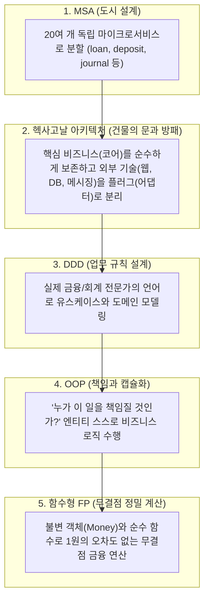
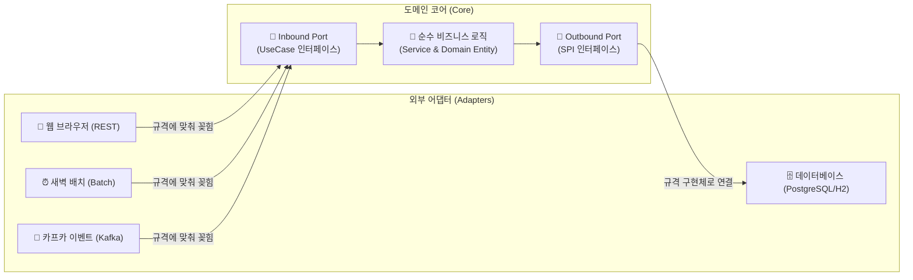

# 🏛️ 헥사고날(Hexagonal) & DDD & 함수형(FP) 아키텍처 실무 가이드

이 문서는 Account 재무/회계 시스템에 적용된 **헥사고날(Hexagonal) 아키텍처, 도메인 주도 설계(DDD), 객체지향(OOP), 그리고 함수형 프로그래밍(FP)**의 융합 원리와 실무 코딩 표준을 초보자도 쉽게 이해할 수 있도록 정리한 가이드입니다.

---

## 1. 🌟 큰 그림: 5가지 패러다임의 완벽한 조화

우리 시스템은 5가지 소프트웨어 설계 패러다임이 유기적으로 결합되어 있습니다.



---

## 2. 🔌 헥사고날 아키텍처란? (포트와 어댑터)

공식 명칭은 **포트와 어댑터(Ports and Adapters) 아키텍처**입니다. 스마트폰의 **USB C타입 단자**를 떠올리면 쉽습니다.



### 3대 구성 요소
1. **도메인 코어 (`domain` & `application`)**:
   - 우리 시스템의 가장 소중한 비즈니스 로직(대출 이자 계산, 복식부기 차변=대변 검증 등).
   - Spring, JPA, HTTP 같은 프레임워크 어노테이션이 전혀 없는 **100% 순수한 자바(POJO)**입니다.
2. **포트 (`port`)**:
   - 코어의 입구와 출구에 뚫어놓은 **인터페이스(Interface) 규격**.
   - **Inbound Port (UseCase)**: "나(코어)를 실행하려면 이 메서드로 요청을 보내!" (`ApplyLoanUseCase`)
   - **Outbound Port (SPI)**: "나(코어)의 결과를 저장하거나 보내려면 이 규격으로 만들어 와!" (`SaveLoanPort`)
3. **어댑터 (`adapter` / `infrastructure`)**:
   - 포트에 꽂히는 **구체적인 기술 부품들**.
   - 인바운드 어댑터: `RestController`(웹), `BatchJobRunner`(배치), `KafkaConsumer`(메시지 수신).
   - 아웃바운드 어댑터: `LoanJpaAdapter`(PostgreSQL 저장), `KafkaProducer`(이벤트 발행).

---

## 3. 📂 엔티티(Entity)의 분리: 도메인 엔티티 vs JPA 엔티티

헥사고날에서는 역할에 따라 **엔티티가 2종류로 분리**됩니다.

```mermaid
flowchart LR
    subgraph "1. core/domain/ (순수 비즈니스)"
        DOM["💎 도메인 엔티티 (Domain Entity)<br>BusinessPartner.java<br>──────────────────<br>• 순수 자바 (JPA 없음)<br>• 비즈니스 규칙 & 계산 행동"]
    end

    subgraph "2. core/infrastructure/persistence/ (ORM/DB)"
        MAPPER["🔄 Mapper (변환기)"]
        JPA["🗄️ JPA 엔티티 (ORM Entity)<br>BusinessPartnerJpaEntity.java<br>──────────────────<br>• @Entity, @Table, @Column<br>• DB 테이블 모양 매핑"]
    end

    DOM <-->|toEntity() / toDomain()| MAPPER
    MAPPER <--> JPA
```

### 왜 2개로 분리할까요?
1. **JPA 복잡성 격리**: JPA의 지연 로딩(`LazyLoading`), 프록시(`Proxy`) 객체로 인해 비즈니스 계산 도중 에러가 터지는 것을 원천 차단합니다.
2. **DB 변경에 안전**: DB 컬럼명이나 인덱스 구조가 바뀌어도 순수 자바 비즈니스 로직은 단 1줄도 수정할 필요가 없습니다.
3. **초고속 단위 테스트**: 무거운 스프링이나 DB 없이 `new BusinessPartner()`로 0.001초 만에 비즈니스 규칙을 단위 테스트할 수 있습니다.

---

## 4. 👔 유스케이스, 서비스, 엔티티, 리포지토리의 역할 분담

**"레스토랑의 지배인(Service)과 셰프(Entity)"**의 관계로 이해할 수 있습니다.

| 구성 요소 | 비유 | 헥사고날 계층 | 주요 역할 |
| :--- | :---: | :--- | :--- |
| **`UseCase`** | **메뉴판 / 목차** | Inbound Port | 시스템이 사용자에게 제공하는 기능 명세서 (`ApplyLoanUseCase`) |
| **`Service`** | **레스토랑 지배인** | Application Service | 직접 계산하지 않고, DB 조회 ➔ 엔티티 실행 ➔ DB 저장 흐름을 조율(Orchestration) |
| **`Entity`** | **진짜 셰프 (주방장)** | Domain Model | **진짜 비즈니스 계산/규칙을 스스로 수행** (`loan.approve()`, `account.withdraw()`) |
| **`Repository`** | **식자재 냉장고** | Outbound Port / Adapter | 도메인 객체를 저장하고 꺼내오는 컬렉션 인터페이스 및 JPA 구현체 |

```java
// [Service의 조율 흐름 예시]
@Service
@Transactional
public class LoanService implements ApplyLoanUseCase {
    private final LoanPersistencePort loanPersistencePort;

    public void approveLoan(LoanId loanId, String approverId) {
        // 1. DB에서 엔티티 꺼내오기
        Loan loan = loanPersistencePort.findById(loanId);

        // 2. 엔티티 스스로에게 비즈니스 로직 시키기 (핵심!)
        loan.approve(approverId);

        // 3. 변경된 엔티티를 다시 DB에 저장
        loanPersistencePort.save(loan);
    }
}
```

---

## 5. ⚡ 함수형 코어, 명령형 껍데기 (Functional Core, Imperative Shell)

우리 프로젝트는 **함수형 프로그래밍(FP)**의 장점을 도메인 코어에 적극 적용합니다.

```java
// [OOP + FP 결합 도메인 엔티티 예시]
public class JournalEntry {
    private final JournalId id;
    private final List<JournalLine> lines; // 불변 컬렉션

    // FP: 함수형 스트림 파이프라인으로 차변 합계 순수 계산
    public Money calculateTotalDebit() {
        return this.lines.stream()
                .filter(JournalLine::isDebit)
                .map(JournalLine::getAmount)
                .reduce(Money.ZERO, Money::add);
    }

    // OOP + FP: 비즈니스 검증 후 '새로운 불변 객체'를 반환
    public JournalEntry approve(String approverId) {
        if (!isBalanced()) {
            throw new UnbalancedJournalException("차변과 대변의 합계가 일치하지 않습니다.");
        }
        return new JournalEntry(this.id, this.lines, ApprovalStatus.APPROVED, approverId);
    }
}
```

- **불변성 (Immutability)**: 회계 장부는 수정할 수 없으므로, 상태 변경 시 항상 새로운 불변 객체를 반환합니다.
- **`BigDecimal` 무오차 계산**: 부동소수점 오차가 없는 `BigDecimal`과 `Money` 값 객체(Value Object)를 사용하여 1원의 오차도 허용하지 않습니다.
