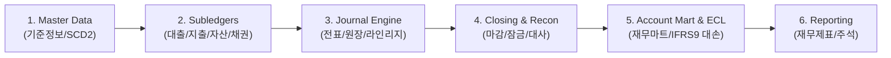

# 📖 차세대 재무 시스템 마스터 개념 용어집 & 초보자 입문서 (Master Domain Glossary)

> **"회계/재무 시스템의 어려운 전문 용어와 마이크로서비스(MSA) 기술 개념을 직관적인 비유로 쉽게 배우는 초보자용 필독 가이드"**

---

## 🧭 1. 도메인 한눈에 보기 (Domain Map)

본 차세대 재무 플랫폼은 금융 데이터의 정합성과 불변성을 보장하기 위해 6개 비즈니스 파이프라인으로 작동합니다.

---

## 💡 2. 초보자를 위한 핵심 도메인 개념 쉬운 비유 풀이

| 회계/금융 전문 용어 | 영문 개념명 | 💡 쉬운 비유 및 개념 설명 |
| --- | --- | --- |
| **전표** | `JournalEntry` | **"거래 영수증"**: 어디서 얼마가 나가고 들어왔는지 기록하는 회계 단위. 차변(Debit)과 대변(Credit) 합계가 1원도 틀리지 않고 일치해야 함. |
| **원장 (GL / SL)** | `General Ledger` / `SubLedger` | **"통합 장부와 세부 수첩"**: `GL`은 전체 합계가 적힌 메인 장부, `SL`은 거래처/부서별 상세 내역이 적힌 세부 수첩. |
| **라인리지 (추적성)** | `Lineage` | **"족보 꼬리표"**: 전표의 원본 출처(예: 특정 지출결의서 ID, 대출 실행 ID)를 역추적할 수 있게 붙여놓은 꼬리표. |
| **결산 마감** | `Closing` | **"가계부 테이프 봉인"**: 한 달 장부가 끝나면 더 이상 과거 숫자를 몰래 수정하지 못하도록 장부를 테이프로 꽁꽁 동여매는 통제 작업. |
| **영업일 마감 (EOD / BOD)** | `EOD / BOD` | **"오늘 장부 닫고 내일 장부 열기"**: End Of Day (오늘 장사 끝내고 닫기), Beginning Of Day (다음날 장 준비하고 열기). |
| **대사** | `Reconciliation` | **"통장 잔액 1원 대조"**: 은행 통장에 찍힌 잔액과 우리 시스템 장부 잔액을 하나하나 대조하여 차이가 없는지 검사하는 작업. |
| **대손충당금 (IFRS 9)** | `Expected Credit Loss (ECL)` | **"떼일 돈 대비 비상금 저금"**: 대출해 준 돈 중 차주 신용도에 따라 못 받을 가능성이 있는 금액을 미리 계산하여 미리 충당금(비상금)으로 쌓아두는 회계 처리. |
| **SCD Type 2 이력 관리** | `Slowly Changing Dimension` | **"타임머신 이력 카드"**: 부서 이름이나 기준정보가 바뀌어도 "2026년 4월 당시의 이름"과 "현재 이름"을 과거 시점 그대로 타임머신 타듯 조회할 수 있게 관리하는 기법. |

---

## 🛠️ 3. 기술 & 아키텍처 핵심 개념 비유 풀이

| 기술 아키텍처 용어 | 모듈/패턴 명칭 | 💡 쉬운 비유 및 개념 설명 |
| --- | --- | --- |
| **헥사고날 아키텍처** | `Hexagonal Architecture` | **"콘센트 멀티탭 구조"**: 비즈니스 로직(알맹이)을 메인으로 두고, 웹(Controller), DB(JPA/H2), 배치 등 기술 요소는 부품(Adapter)처럼 뺐다 꼈다 할 수 있게 분리한 설계. |
| **트랜잭셔널 아웃박스** | `Transactional Outbox` | **"우체통 임시저장함"**: DB에 데이터를 저장함과 동시에 메시지(Kafka)를 날릴 때, DB 실패 시 메일만 날아가는 사고를 막기 위해 DB에 이벤트 우체통 표를 먼저 안전하게 아웃박스 엔티티로 묶어 저장하는 기법. |
| **청크 스트리밍 배치** | `Spring Batch Chunk` | **"컨베이어 벨트 분할 처리"**: 100만 건 데이터를 한 번에 메모리에 올리면 컴퓨터가 터지므로(OOM), 500건씩 감질나게 상자에 담아(Chunk) 처리하고 메모리를 비우는 기술. |
| **서킷 브레이커** | `Resilience4j CircuitBreaker` | **"전기 두꺼비집"**: 특정 외부 서비스나 DB가 고장 났을 때, 전체 시스템이 같이 죽지 않도록 전기를 차단하듯 연결을 끊고 안전한 예외를 반환하는 안전장치. |
| **프로파일 격리** | `Spring Active Profiles` | **"스위치 전환"**: `local` 스위치를 켜면 인메모리 H2 가상 DB로 빛의 속도로 테스트하고, `dev`/`prod` 스위치를 켜면 실제 PostgreSQL 서버에 연결되는 환경 전환 스위치. |

---

## 🎯 4. 개발자 입문 학습 로드맵 (Quick Start Guide)

1. **1단계**: 본 [마스터 용어집](master-domain-glossary.md)을 읽어 전표, 원장, 마감, 대사의 비즈니스 의미 파악.
2. **2단계**: [통합 아키텍처 명세서](../architecture.md) 및 [개발자 환경 구축 가이드](local-development.md) 확인.
3. **3단계**: 개별 모듈 README (예: [journal-ledger/README.md](../../journal-ledger/README.md))로 이동하여 해당 모듈의 Inbound/Outbound Port와 단위 테스트 구동.
