# 대손충당금(IFRS 9) 관리 서비스

`ecl`은 재무 결산 모듈에서 사용할 IFRS 9 기대신용손실(ECL)과 대손충당금 summary를 산출하는 서비스다. 현재 운영 기준 경로는 `account-mart`의 `allowance_exposure_snapshots`를 입력으로 받아 `closing`이 전표 생성에 사용하는 `allowance_summary`를 재생성하는 대손충당금 전용 배치다.

이 모듈의 신규 구현과 문서는 IFRS 9 대손충당금 산출에 필요한 범위만 기준으로 한다.

## 모듈 구성

- `ecl-core`: IFRS 9 Stage, PD/LGD/EAD/ECL, summary 재생성 유즈케이스와 JDBC bulk adapter를 포함한다.
- `ecl-batch`: Spring Batch Job/Step 오케스트레이션만 담당한다. 산식, 검증, bulk SQL 로직은 core service/adapter에 둔다.
- `ecl-api`: 스키마 마이그레이션과 외부 조회 API 계층이다.

## 주요 개념

1. **EAD (Exposure At Default)**: 부도 시 회수 대상이 되는 노출액이다. 현재 잔액과 미사용 한도, CCF를 반영한다.
2. **PD (Probability of Default)**: 일정 기간 내 부도 발생 확률이다. IFRS 9 Stage 및 등급 정보를 기반으로 산출한다.
3. **LGD (Loss Given Default)**: 부도 발생 시 최종 손실률이다. 담보와 회수 가능성을 반영한다.
4. **ECL (Expected Credit Loss)**: `EAD * PD * LGD` 및 미래전망 가중치를 반영한 기대신용손실이다.
5. **allowance_summary**: 완료된 ECL 결과를 회계 계정 매핑과 결합한 결산 입력 summary다.

## 현재 표준 실행 흐름

```mermaid
flowchart LR
    MART[account-mart<br/>allowance_exposure_snapshots] --> SYNC[allowanceExposureSyncStep]
    SYNC --> DQ[dqStep]
    DQ --> STAGE[stagingManagerStep<br/>IFRS 9 Stage/PD]
    STAGE --> EAD[eadCrmManagerStep<br/>EAD/LGD]
    EAD --> ECL[eclManagerStep<br/>Weighted ECL]
    ECL --> DONE[allowanceEclCompletionStep]
    DONE --> SUMMARY[allowanceSummaryStep<br/>allowance_summary]
    SUMMARY --> CLOSING[closing<br/>대손충당금 전표]
```



표준 Job은 `allowanceEclJob`이다.

- `AllowanceExposureSyncService`: `allowance_exposure_snapshots`를 읽어 `cr_customers`, `cr_accounts`에 bulk upsert한다.
- `AllowanceEclCompletionService`: weighted ECL 산출 결과를 `COMPLETED`로 확정한다.
- `AllowanceSummaryService`: 완료된 ECL 결과와 `allowance_account_mappings`를 조인해 `allowance_summary`를 기준일 단위로 재생성한다.
- summary 재생성은 계정 매핑 검증이 통과한 뒤 기존 기준일 데이터를 교체해 재실행 멱등성을 유지한다.
- `allowance_input_positions`는 ECL 소유 엔티티가 아니다. ECL은 자체 읽기 JPA 모델을 `AllowanceInputPositionSnapshot`으로 변환해 애플리케이션 계층에 전달한다.
- 중복 계정 매핑 우선순위는 `AllowanceAccountMappingPriorityPolicy`에 이름을 부여하고, JDBC summary SQL이 동일한 순서를 따르도록 문서화한다.

## 실행 예시

Windows PowerShell 또는 IntelliJ Gradle Run Configuration 기준입니다.

```powershell
# 대손충당금 전용 ECL 산출
.\gradlew :ecl:ecl-batch:bootRun --args="--spring.batch.job.enabled=false job.name=allowanceEclJob baseDate=2026-04-30 runId=RUN-20260430 modelVersion=v1" --console=plain

# snapshot 동기화만 단독 실행
.\gradlew :ecl:ecl-batch:bootRun --args="--spring.batch.job.enabled=false job.name=standaloneAllowanceExposureSyncJob baseDate=2026-04-30 runId=SYNC-20260430" --console=plain

# allowance summary만 단독 재생성
.\gradlew :ecl:ecl-batch:bootRun --args="--spring.batch.job.enabled=false job.name=standaloneAllowanceSummaryJob baseDate=2026-04-30 runId=RUN-20260430 modelVersion=v1" --console=plain
```

`spring.batch.job.enabled=false`는 Spring Boot 기본 Job 자동 실행을 막기 위한 값이다. `JobRunner`는 `job.name` 또는 `spring.batch.job.name`이 명시된 경우에만 해당 Job을 한 번 실행하고, Job 상태가 `COMPLETED`가 아니면 프로세스를 실패시킨다.
IntelliJ에서 컨텍스트만 먼저 띄워볼 때는 공유 실행 설정 `ECL Batch Context`를 사용합니다.

## 데이터 준비

로컬 H2 기본 DB 파일은 `./data/ifrs9_allowance_db`를 사용한다. PostgreSQL을 사용할 경우 운영 환경의 DB명과 계정은 배포 환경 변수 또는 프로파일 설정으로 분리한다.

대손충당금 모듈만 단독으로 서비스할 때는 ECL 스키마, `allowance_exposure_snapshots` 입력 테이블, 모델 마스터, 회계 계정 매핑을 먼저 준비해야 한다. 상세 절차는 [ALLOWANCE_SERVICE_RUNBOOK.md](docs/ALLOWANCE_SERVICE_RUNBOOK.md)를 따른다.

`allowance_account_mappings`에 상품/사업부/통화별 회계 계정 매핑이 없으면 summary 재생성은 기존 데이터를 삭제하지 않고 실패한다.

## IntelliJ 로컬 실행

루트 [docs/local-development.md](../docs/local-development.md)를 먼저 확인합니다.

- API 실행: `ECL API bootRun` 공유 실행 설정 또는 `AllowanceEclApiApplication`
- Batch 컨텍스트 확인: `ECL Batch Context` 공유 실행 설정 또는 `AllowanceEclBatchApplication`
- 실제 산출 Job 실행: `allowance_exposure_snapshots`, 모델 마스터, 계정 매핑 시드가 준비된 뒤 위 PowerShell 명령을 사용

`demo` 프로파일의 `allowance-batch-demo-data.sql`은 오래된 fixture와 결합되지 않도록 비워져 있습니다. 즉, demo profile은 빠른 컨텍스트 확인용이고, 실제 산출 결과 검증은 integration test fixture나 별도 시드 데이터를 준비한 뒤 실행합니다.

## 검증 기준

- 계산 및 금액 로직은 `BigDecimal` 중심으로 유지한다.
- Batch 모듈은 Job/Step 흐름 제어만 담당하고 비즈니스 산식은 core에 둔다.
- 대량 데이터 처리는 application 반복문이 아니라 JDBC adapter의 bulk SQL로 수행한다.
- 배치 변경 시 `baseDate`, `modelVersion`, 재실행 멱등성, 계정 매핑 검증을 함께 확인한다.

## 참고

- 문서 전체 안내와 추천 읽기 순서: [docs/README.md](docs/README.md)
- 초보자 입문과 코드 탐색: [ALLOWANCE_BEGINNER_GUIDE.md](docs/ALLOWANCE_BEGINNER_GUIDE.md)
- 업무·데이터 흐름: [ALLOWANCE_PROCESS_FLOW.md](docs/ALLOWANCE_PROCESS_FLOW.md)
- 상세 흐름: [BATCH_EXECUTION_FLOW.md](docs/BATCH_EXECUTION_FLOW.md)
- 아키텍처/설계 흐름도: [ALLOWANCE_ARCHITECTURE.md](docs/ALLOWANCE_ARCHITECTURE.md)
- 단독 서비스 런북: [ALLOWANCE_SERVICE_RUNBOOK.md](docs/ALLOWANCE_SERVICE_RUNBOOK.md)
- 재집중 계획: [allowance-ecl-refocus-plan.md](../docs/allowance-ecl-refocus-plan.md)
