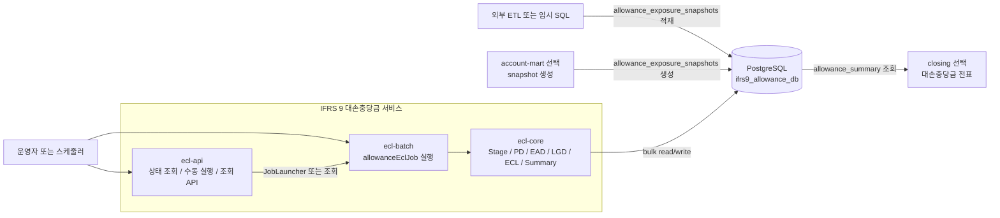
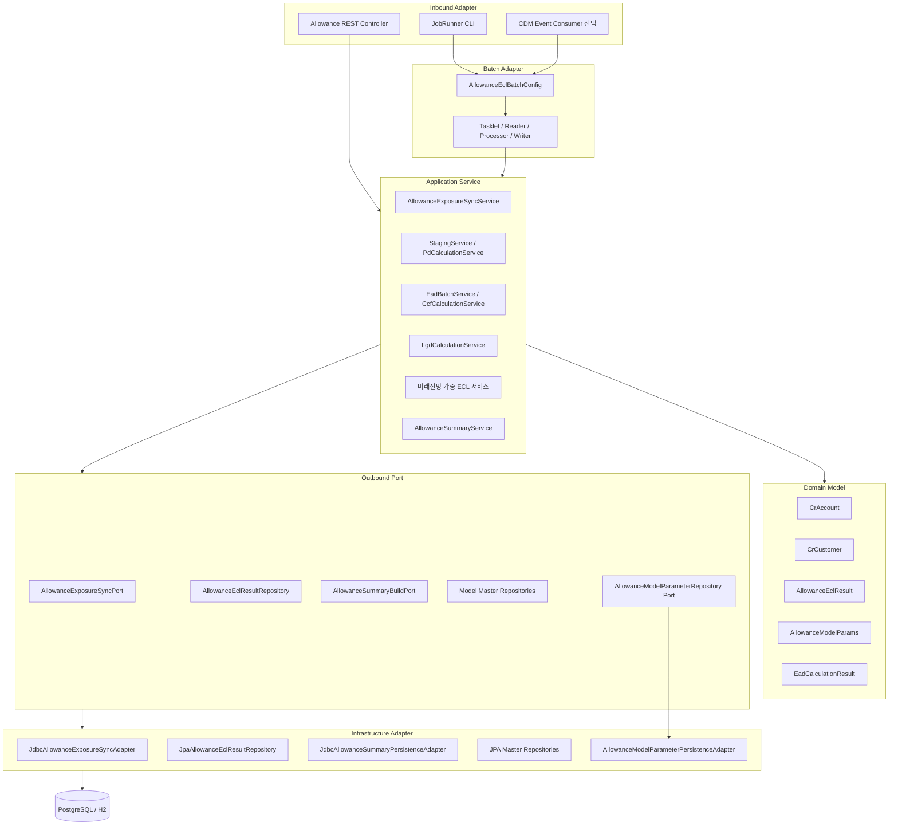
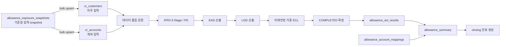
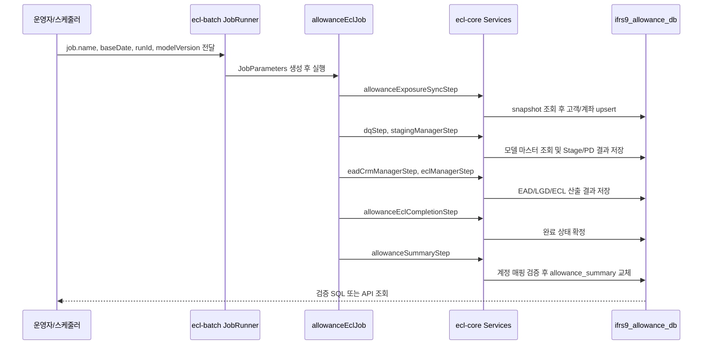
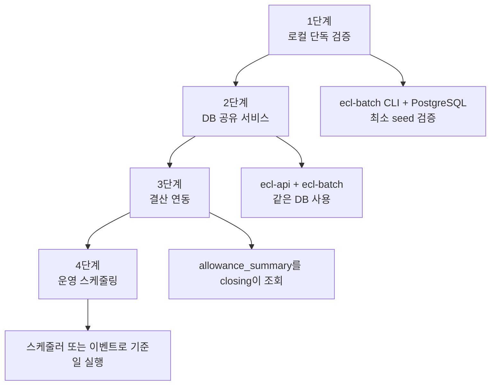

# IFRS 9 대손충당금 아키텍처와 설계 흐름도

이 문서는 대손충당금 모듈만 먼저 서비스할 때의 구성과 내부 설계 흐름을 다이어그램으로 정리한다. 실행 절차는 [ALLOWANCE_SERVICE_RUNBOOK.md](ALLOWANCE_SERVICE_RUNBOOK.md)를 따른다.

## 단독 서비스 구성도

처음 서비스 검증에서는 `PostgreSQL`, `ecl-batch`, `ecl-api`, `allowance_exposure_snapshots` 공급만 있으면 된다. `closing`은 summary 검증 뒤 연결한다.

## 헥사고날 레이어 설계

설계 기준:

- `ecl-batch`는 Job/Step 흐름 제어만 담당한다.
- 산식, 상태 판단, summary 생성 검증은 `ecl-core`의 service/domain/adapter에 둔다.
- 대량 입력과 summary 생성은 JDBC bulk SQL로 처리한다.
- 금액과 비율 계산은 `BigDecimal` 중심으로 유지한다.

## 런타임 산출 흐름

`allowance_summary`는 `allowance_account_mappings` 검증이 끝난 뒤 기준일 단위로 교체한다. 매핑이 없으면 기존 summary를 보존하고 실패한다.

## 실행 시퀀스

## 데이터 설계 흐름

```mermaid
erDiagram
    ALLOWANCE_EXPOSURE_SNAPSHOTS {
        date base_date
        string exposure_id
        string source_account_no
        string customer_code
        string product_code
        string currency_code
        decimal outstanding_amount
        decimal undrawn_amount
        string staging
    }

    CR_CUSTOMERS {
        bigint id
        string customer_code
        string customer_type
        string internal_rating
    }

    CR_ACCOUNTS {
        bigint id
        bigint customer_id
        string account_no
        string product_code
        decimal outstanding_amt
        decimal notional_amt
        string staging
    }

    ALLOWANCE_ECL_RESULTS {
        bigint id
        date base_date
        bigint account_id
        string staging
        decimal ead
        decimal pd
        decimal lgd
        decimal weighted_ecl
        string status
    }

    ALLOWANCE_ACCOUNT_MAPPINGS {
        bigint id
        string product_code
        string biz_unit_code
        string currency_code
        string allowance_account_code
    }

    ALLOWANCE_SUMMARY {
        bigint id
        date base_date
        string run_id
        string model_version
        string allowance_account_code
        decimal target_allowance_amount
    }

    ALLOWANCE_EXPOSURE_SNAPSHOTS ||--o{ CR_CUSTOMERS : "customer_code"
    CR_CUSTOMERS ||--o{ CR_ACCOUNTS : "customer_id"
    CR_ACCOUNTS ||--o{ ALLOWANCE_ECL_RESULTS : "account_id"
    ALLOWANCE_ECL_RESULTS }o--|| ALLOWANCE_ACCOUNT_MAPPINGS : "product/biz/currency"
    ALLOWANCE_ACCOUNT_MAPPINGS ||--o{ ALLOWANCE_SUMMARY : "account mapping"
```

## 배포 단계별 확대

처음에는 1단계와 2단계를 완료한 뒤 `allowance_summary` 금액과 계정 매핑을 확인한다. 그 다음 closing 연결 여부를 결정한다.
