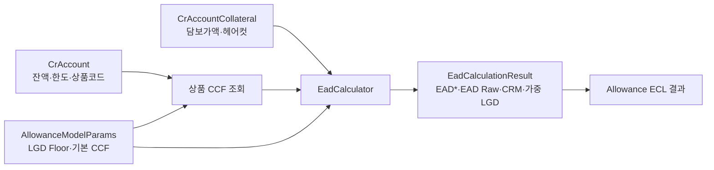

# 대손충당금(IFRS 9) 산출 흐름

이 문서는 현재 구현 범위인 IFRS 9 대손충당금 산출 흐름만 설명합니다.

## Job

- 표준 Job: `allowanceEclJob`
- 입력: `allowance_exposure_snapshots`
- 출력: `allowance_ecl_results`, `allowance_summary`

## 순서

| 순서 | 단계 | 입력 | 처리 | 출력·실패 기준 |
| ---: | --- | --- | --- | --- |
| 1 | Exposure Sync | 기준일 `allowance_exposure_snapshots` | 고객·계좌를 JDBC bulk upsert | `cr_customers`, `cr_accounts`; 기준일 입력 누락 시 중단 |
| 2 | DQ | 동기화된 고객·계좌 | 필수값, 금액, 상태 검증 | 산출 가능 대상만 다음 단계 진행 |
| 3 | Stage/PD | 연체·등급·경보 정보 | IFRS 9 Stage와 PD 산출 | Stage/PD 결과; 필수 모델 파라미터 누락 시 실패 |
| 4 | EAD/LGD | 잔액, 한도, 상품 CCF, 담보, 모델 LGD | EAD/CRM/LGD 계산 | `EadCalculationResult`; 비율 범위 오류 시 실패 |
| 5 | Weighted ECL | Stage, PD, LGD, EAD, 적용 연도의 시나리오 | 시나리오 확률 검증 후 미래전망 가중 평균 | 계좌별 `weighted_ecl`; 가중치 오류 시 중단 |
| 6 | Completion | 산출 완료 계좌 결과 | 완료 상태 확정 | `COMPLETED` 결과만 summary 대상 |
| 7 | Summary | 완료 결과와 계정 매핑 | 기준일 summary 검증 후 교체 | `allowance_summary`; 매핑 누락 시 기존 summary 보존 후 실패 |

## EAD/LGD 단계 상세 흐름

상품 CCF가 없으면 모델 정책의 `DEFAULT_CCF_RATE`를 사용합니다. 필수 LGD 값이 없거나 비율이 0~1 범위를 벗어나면 계산을 계속하지 않습니다.

## 미래전망 시나리오 검증

적용 연도에 시나리오가 하나라도 있으면 `ForwardLookingEclService`는 캐시 또는 실시간 조회로 얻은 모든 `probability_weight`가 null이 아니고 0~1 범위인지 확인합니다. 이어 `BigDecimal.compareTo`로 합계가 정확히 1인지 확인한 뒤에만 시나리오별 ECL을 계산합니다. 예를 들어 0.20 + 0.50 + 0.20 = 0.90인 모델 입력은 실패하며, 부족분을 자동 보정하지 않습니다.

검증 실패는 `eclManagerStep`을 실패시켜 해당 계좌의 weighted ECL 저장과 뒤따르는 `allowanceEclCompletionStep`, `allowanceSummaryStep`을 막습니다. 이전 단계에서 기록한 미완료 결과가 남을 수 있으므로 실패한 실행의 결과를 `COMPLETED`로 해석하지 않습니다. 시나리오가 0건이면 기존 단일 시나리오 ECL 폴백을 사용합니다. 모델 값을 바로잡고 새 실행 파라미터로 배치를 재실행한 뒤 Job 상태, 완료 결과, summary를 확인합니다.

## 재실행과 정합성

- `baseDate`는 어떤 시점의 입력과 결과인지 결정합니다.
- `runId`는 같은 기준일의 실행 이력을 구분합니다.
- `modelVersion`은 사용한 모델 정책을 추적합니다.
- summary는 계정 매핑 검증이 끝난 뒤 교체하여, 실패한 재실행이 기존 정상 결과를 지우지 않게 합니다.

Job/Step과 클래스 단위 호출은 [BATCH_EXECUTION_FLOW.md](BATCH_EXECUTION_FLOW.md)를 참고합니다.
