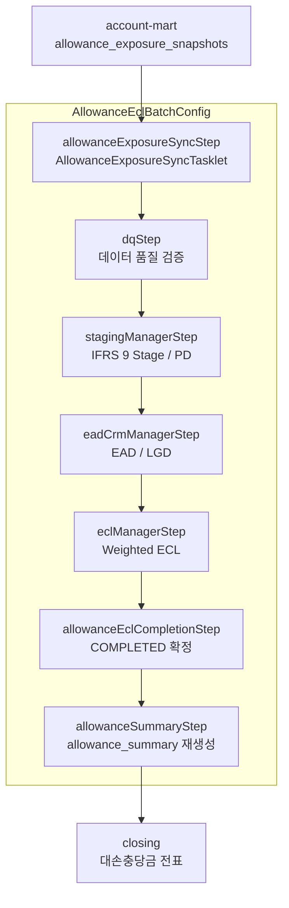

# 대손충당금(IFRS 9) 배치 실행 흐름

이 문서는 재무 결산용 IFRS 9 대손충당금 산출 경로를 클래스 단위로 추적한다. 표준 실행 Job은 `AllowanceEclBatchConfig`의 `allowanceEclJob`이며, 결과는 `closing` 모듈이 읽는 `allowance_summary`로 이어진다.

이 문서의 기준은 결산 대손충당금 산출에 필요한 IFRS 9 흐름이다.

서비스 구성과 레이어 설계도는 [ALLOWANCE_ARCHITECTURE.md](ALLOWANCE_ARCHITECTURE.md)를 함께 본다.

## 전체 흐름

## 단계별 추적

### STEP 1. Snapshot 동기화

- **Step**: `allowanceExposureSyncStep`
- **Tasklet**: `AllowanceExposureSyncTasklet`
- **Core Service**: `AllowanceExposureSyncService`
- **Adapter**: `JdbcAllowanceExposureSyncAdapter`

`account-mart`가 생성한 `allowance_exposure_snapshots`를 읽어 ECL 산출 입력 테이블인 `cr_customers`, `cr_accounts`에 bulk upsert한다. PostgreSQL은 `INSERT ... ON CONFLICT`, H2 테스트는 `MERGE INTO ... KEY`를 사용한다.

### STEP 2. 데이터 품질 검증

- **Step**: `dqStep`
- **Service**: `AllowanceDataQualityService`

기준일의 고객/계좌 입력값 누락, 상태값 오류, 산출 불가 데이터를 사전에 차단한다.

### STEP 3. IFRS 9 Stage 및 PD 산출

- **Step**: `stagingManagerStep`
- **Processor Adapter**: `StagingProcessor`
- **Core Pipeline**: `StagingCalculationPipeline`

계좌별 IFRS 9 Stage와 기초 PD를 산출하고 결과 레코드를 생성한다. Batch config는 reader/processor/writer 연결만 담당하며, processor adapter는 core pipeline에 위임한다.

### STEP 4. EAD/LGD 산출

- **Step**: `eadCrmManagerStep`
- **Processor Adapter**: `EadCrmProcessor`
- **Core Pipeline**: `EadCrmCalculationPipeline`

CCF를 반영한 EAD와 회수 가능성을 반영한 LGD를 확정한다. 산출 금액과 비율은 core pipeline/service의 `BigDecimal` 기반 정밀도 정책을 따른다.

### STEP 5. Weighted ECL 산출

- **Step**: `eclManagerStep`
- **Processor Adapter**: `EclProcessor`
- **Core Pipeline**: `ForwardLookingEclCalculationPipeline`

미래전망 시나리오 가중치를 반영해 IFRS 9 기대신용손실을 산출한다. batch adapter는 기준일만 넘기고, 잔존 만기와 Lifetime PD, weighted ECL 산출은 core pipeline이 수행한다.

### STEP 6. 산출 완료 상태 확정

- **Step**: `allowanceEclCompletionStep`
- **Tasklet**: `AllowanceEclCompletionTasklet`
- **Core Service**: `AllowanceEclCompletionService`
- **Adapter**: `JdbcAllowanceEclCompletionAdapter`

weighted ECL이 완료된 결과를 `COMPLETED`로 확정해 summary 집계 대상이 되도록 한다.

### STEP 7. 회계 summary 재생성

- **Step**: `allowanceSummaryStep`
- **Tasklet**: `AllowanceSummaryTasklet`
- **Core Service**: `AllowanceSummaryService`
- **Adapter**: `JdbcAllowanceSummaryPersistenceAdapter`

완료된 ECL 결과를 `allowance_account_mappings`와 결합해 `allowance_summary`를 기준일 단위로 재생성한다. 계정 매핑 누락 시 기존 summary를 삭제하지 않고 실패하며, 검증 통과 후 기존 기준일 데이터를 교체한다.

## 단독 실행 Job

- `standaloneAllowanceExposureSyncJob`: snapshot 동기화만 실행한다.
- `standaloneAllowanceEclCompletionJob`: weighted ECL 결과 완료 확정만 실행한다.
- `standaloneAllowanceSummaryJob`: 회계 summary만 재생성한다.

## 운영 주의사항

- 실행 기본 Job은 `allowanceEclJob`이다.
- 필수 파라미터는 `baseDate`, 권장 파라미터는 `modelVersion`이다.
- 재실행 가능성을 위해 기준일 단위 delete/insert 또는 upsert가 adapter에서 멱등적으로 처리되어야 한다.
- Batch 모듈에는 산식, 반복 집계, 금액 계산을 넣지 않는다.
