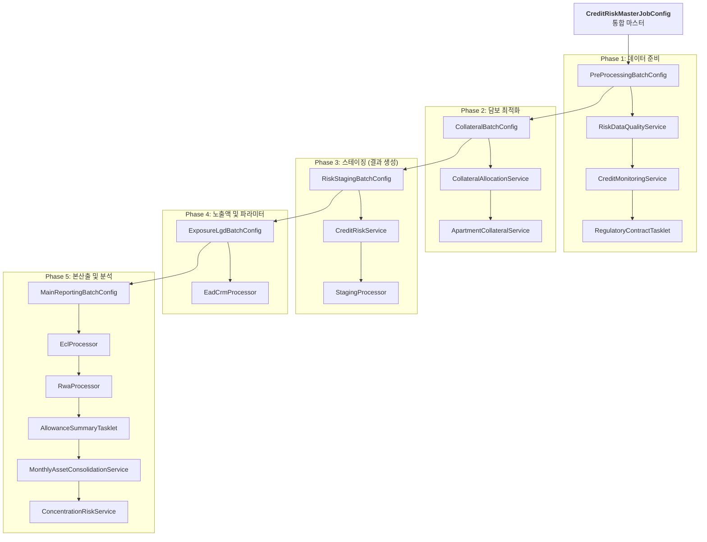

# 🌊 신용 리스크 배치 실행 흐름 상세 (Sequential Trace Flow)

이 문서는 `CreditRiskMasterJobConfig`를 시작으로 전사 신용 리스크 산출 파이프라인이 어떤 클래스들을 거쳐 순차적으로 실행되는지 상세히 추적합니다.

---

## 📌 전체 실행 개요 (High-Level flow)

---

## 🔍 단계별 상세 실행 추적 (Class Trace)

### [STEP 0] 통합 지휘소 (Orchestrator)
- **Class**: `CreditRiskMasterJobConfig`
- **Role**: 5개의 전문 Job을 `JobStep` 형태로 래핑하여 순차적으로 기동합니다.

---

### [STEP 1] 데이터 전처리 (Pre-Processing)
- **Config**: `PreProcessingBatchConfig`
- **실행 순서**:
    1.  **`dqStep`**: `RiskDataQualityService.java`
        - 원천 데이터(계좌, 고객)에 비어 있거나 잘못된 값(DQ Error)이 있는지 SQL 기반으로 검증합니다.
    2.  **`monitoringStep`**: `CreditMonitoringService.java`
        - 리스크 한도 관리 및 일일 변동성 체크를 수행합니다.
    3.  **`regulatoryContractStep`**: `RegulatoryContractTasklet.java`
        - 바젤 III 규제 기준에 따른 계약 분류 코드를 매핑합니다.

### [STEP 2] 담보 배분 및 최적화 (Collateral Optimization)
- **Config**: `CollateralBatchConfig`
- **실행 순서**:
    1.  **`collateralAllocationStep`**: `CollateralAllocationService.java`
        - 자본금을 최소화할 수 있도록 대출 건에 담보를 최적으로 배분(Optimization)합니다.
    2.  **`apartmentCollateralStep`**: `ApartmentCollateralService.java`
        - 부동산 담보물에 대해 실거래가 시세를 반영하여 담보 가치를 재계산합니다.

### [STEP 3] 리스크 스테이징 (Risk Staging)
- **Config**: `RiskStagingBatchConfig`
- **실행 순서**:
    1.  **`resultPreparationStep`**: `CreditRiskService.java`
        - 이번 달 산출을 시작하기 전, 기존 결과 테이블을 정리(Clean-up)합니다.
    2.  **`stagingManagerStep`**: `StagingProcessor.java` **[Parallel]**
        - **Reader**: `QuerydslPagingItemReader` (계좌 정보 로드)
        - **Processor**: IFRS 9 스테이지 판정 및 초기 부도 확률(PD) 매핑을 수행합니다.
        - **Writer**: `CrRiskResult` 레코드를 최초 생성하여 DB에 저장합니다.

### [STEP 4] 노출액 및 파라미터 확정 (Exposure & LGD)
- **Config**: `ExposureLgdBatchConfig`
- **실행 순서**:
    1.  **`eadCrmManagerStep`**: `EadCrmProcessor.java` **[Parallel]**
        - **Reader**: `QuerydslPagingItemReader` (생성된 결과 레코드 로드)
        - **Processor**: CCF를 적용한 부도시 노출액(EAD)과 담보 효과가 반영된 부도시 손실률(LGD)을 산출합니다.
        - **Writer**: 산출된 EAD, LGD 파라미터를 DB에 업데이트합니다.

### [STEP 5] 본산출 및 리포팅 (Main Calculation & Reporting)
- **Config**: `MainReportingBatchConfig`
- **실행 순서**:
    1.  **`eclManagerStep`**: `EclProcessor.java` **[Parallel]**
        - 미래전망 정보를 결합하여 기대신용손실(ECL)을 최종 산출합니다.
    2.  **`rwaManagerStep`**: `RwaProcessor.java` **[Parallel]**
        - 바젤 III 규제 수식을 적용하여 계좌별 위험가중자산(RWA)을 산출합니다.
    3.  **`allowanceSummaryStep`**: `AllowanceSummaryTasklet.java`
        - 완료된 ECL 결과를 `allowance_account_mappings`와 결합해 `allowance_summary`를 재생성합니다.
        - 이 결과는 `closing`의 대손충당금 전표 생성 입력으로 사용됩니다.
    4.  **`consolidationStep`**: `MonthlyAssetConsolidationService.java`
        - 미시적 건별 리스크 데이터를 월간 집계 데이터로 통합(Mart 생성)합니다.
    5.  **`concentrationAnalysisStep`**: `ConcentrationRiskService.java`
        - HHI 지수를 사용하여 특정 산업이나 고객에게 리스크가 쏠려 있는지 분석합니다.

---

[기획/팀장] -> [백엔드]: 리스크 산출의 모든 여정을 클래스 단위로 정리했습니다. 이 문서를 통해 개발자들은 특정 로직을 수정해야 할 때 어떤 Config에서 시작하여 어느 Service(또는 Processor)를 고쳐야 하는지 즉시 판단할 수 있습니다. 수고하셨습니다! _**YOLO!**_
