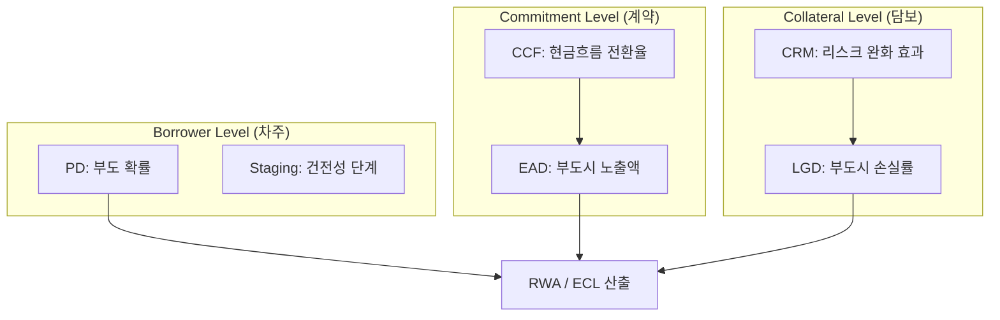
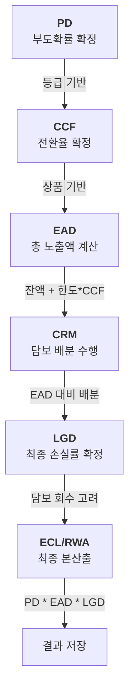

# 🏦 엔터프라이즈급 신용리스크 산출 프로세스 (Credit Risk Pipeline)

> 이 문서는 은행의 계정계 원장 데이터가 최종 위험가중자산(RWA) 및 리스크 결과로 변환되기까지의 **모듈형 멀티-Job 아키텍처**를 상세히 정의합니다.

---

## 🏗️ 모듈형 멀티-Job 오케스트레이션 (Multi-Job Architecture)
대규모 리스크 시스템의 유연한 운영을 위해, 전체 공정을 5개의 **독립 전문 Job**과 이를 통합하는 1개의 **Master Job**으로 구성하였습니다.

### 0. 통합 마스터 Job (Master Orchestration)
- **Job ID**: `creditRiskMasterJob`
- **역할**: 아래 정의된 5개의 전문 Job을 순차적으로 호출하여 전체 리스크 산출을 완결합니다.

---

### 1. 데이터 전처리 Job (Pre-Processing)
- **Job ID**: `preProcessingJob`
- **포함 단계**: 
    - `dqStep`: 데이터 품질 검증 (SQL 기반 집합 검증)
    - `monitoringStep`: 상시 신용 모니터링 및 한도 체크
    - `regulatoryContractStep`: 규제 계약 정보 로드 및 매핑
- **비즈니스 목적**: 산출에 투입될 기초 데이터(차주, 계좌, 신용등급)의 무결성을 확보합니다.

### 2. 담보 배분 및 최적화 Job (Collateral Optimization)
- **Job ID**: `collateralOptimizationJob`
- **포함 단계**:
    - `collateralAllocationStep`: RWA 절감을 위한 담보 우선 배분 (Greedy Algorithm)
    - `apartmentCollateralStep`: 부동산 특화 담보(아파트 시세 등) 정밀 처리
- **비즈니스 목적**: 리스크 완화 효과(CRM)를 극대화하여 은행의 자본 적정성을 개선합니다.

### 3. 리스크 스테이징 Job (Risk Staging)
- **Job ID**: `riskStagingJob`
- **포함 단계**:
    - `resultPreparationStep`: 기존 산출 결과 초기화 (재실행 가능성 확보)
    - `stagingManagerStep` (Phase 1): IFRS 9 스테이지 판정 및 기초 PD 매핑
- **비즈니스 목적**: 산출 대상 계좌를 확정하고 최초 리스크 산출 결과(`CrRiskResult`)를 생성합니다.

### 4. 노출액 및 파라미터 확정 Job (Exposure & LGD)
- **Job ID**: `exposureLgdJob`
- **포함 단계**:
    - `eadCrmManagerStep` (Phase 2): CCF 적용, EAD 산산 및 CRM 반영 LGD 확정
- **비즈니스 목적**: 계약 및 담보의 특성을 반영한 핵심 리스크 파라미터를 정밀 산출합니다.

### 5. 본산출 및 리포팅 Job (Main Calculation & Reporting)
- **Job ID**: `mainReportingJob`
- **포함 단계**:
    - `eclManagerStep` (Phase 3): 미래전망 기대신용손실(ECL) 산출
    - `rwaManagerStep` (Phase 4): 최종 위험가중자산(RWA) 및 K-Value 산출
    - `consolidationStep`: 차주/그룹 단위 자산 통합
    - `concentrationAnalysisStep`: 자산 집중도 분석 (HHI 지수)
- **비즈니스 목적**: 규제 보고를 위한 최종 지표를 생성하고 포트폴리오 리스크를 분석합니다.

---

## 📊 리스크 파라미터 논리적 그룹핑 및 종속성

---

## 🌊 리스크 산출의 논리적 폭포 (Calculation Cascade)

리스크 파라미터 산출은 앞 단계의 결과가 다음 단계의 필수 입력값이 되는 **연쇄적 종속 관계**를 가집니다. 따라서 아래의 순서를 엄격히 준수해야 정확한 리스크 지표가 산출됩니다.

### 1. 단계별 실행 논리 및 의존성

### 2. 왜 순서가 중요한가요? (초보자용 가이드)

| 산출 단계 | 핵심 이유 (Why?) | 순서가 바뀔 경우 발생하는 문제 |
|:---:|:---|:---|
| **CCF → EAD** | 빌려 갈 돈(CCF)을 알아야 총 빚(EAD)이 나옵니다. | EAD를 먼저 구하면 미사용 약정액의 리스크가 누락됩니다. |
| **EAD → CRM** | 빚(EAD) 규모를 알아야 담보를 얼마나 줄지 결정합니다. | 빚이 얼마인지 모르면 담보를 과도하거나 부족하게 배부하게 됩니다. |
| **CRM → LGD** | 담보(CRM)가 확실해야 손실률(LGD)이 낮아집니다. | 담보 배분 전에 LGD를 구하면 무조건 '무담보' 기준으로 높게 산출됩니다. |
| **All → ECL/RWA** | PD, EAD, LGD는 본산출의 3대 핵심 재료입니다. | 재료 중 하나라도 없으면 최종 곱셈(`PD * EAD * LGD`)이 불가능합니다. |

---

## 🏗️ 병렬 처리 및 운영 전략

### 1. 데이터 레벨 병렬화 (Partitioning)
- `Risk Staging`, `Exposure & LGD`, `Main Calculation` 단계는 전사 데이터를 구간별로 나누어 여러 워커 스레드가 동시 처리하는 **ColumnRangePartitioner**를 사용합니다.

### 2. 운영 유연성 (Operational Flexibility)
- **독립 실행 가능**: 특정 단계(예: 담보 재배분)만 다시 수행해야 할 경우, 마스터 Job 대신 해당하는 세부 Job만 골라서 실행할 수 있습니다.
- **오케스트레이션**: 외부 도구(Airflow, Control-M 등)를 통해 각 Job의 전후 관계를 제어하고 모니터링하기에 최적화된 구조입니다.

---

[백엔드] -> [QA]: 사용자 제안에 따라 거대 배치 공정을 5개의 전문 Job으로 모듈화 완료했습니다. 이제 각 기능 단위별로 독립적인 운영 및 테스트가 가능합니다.
