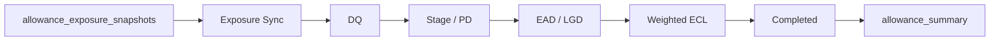

# 대손충당금(IFRS 9) 산출 프로세스

이 문서는 기존 링크 호환을 위한 빠른 요약입니다. 단계별 입력·출력·실패 기준은
[ALLOWANCE_PROCESS_FLOW.md](ALLOWANCE_PROCESS_FLOW.md), 실제 Job/Step 호출은
[BATCH_EXECUTION_FLOW.md](BATCH_EXECUTION_FLOW.md)에서 통합 관리합니다.

## 단계

1. Snapshot 동기화: mart snapshot을 `cr_customers`, `cr_accounts`로 upsert합니다.
2. DQ: 기준일 입력 누락과 산출 불가 상태를 차단합니다.
3. Stage/PD: IFRS 9 Stage 1/2/3과 기초 PD를 산출합니다.
4. EAD/LGD: CCF와 담보 회수 가능성을 반영합니다.
5. Weighted ECL: 미래전망 시나리오 가중치를 반영합니다.
6. 완료 확정: weighted ECL 산출 건을 `COMPLETED`로 표시합니다.
7. Summary: 회계 계정 매핑과 결합해 `allowance_summary`를 재생성합니다.

모델 비율은 `AllowanceModelParams`로 전달하며, EAD 계산 결과는 `EadCalculationResult`로 반환합니다.
필수 모델 정책이 누락되거나 비율이 0~1 범위를 벗어나면 임의 기본값으로 계산하지 않고 실패합니다.
