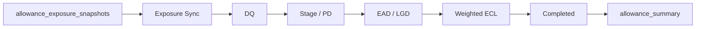

# 대손충당금(IFRS 9) 산출 프로세스

## 단계

1. Snapshot 동기화: mart snapshot을 `cr_customers`, `cr_accounts`로 upsert합니다.
2. DQ: 기준일 입력 누락과 산출 불가 상태를 차단합니다.
3. Stage/PD: IFRS 9 Stage 1/2/3과 기초 PD를 산출합니다.
4. EAD/LGD: CCF와 담보 회수 가능성을 반영합니다.
5. Weighted ECL: 미래전망 시나리오 가중치를 반영합니다.
6. 완료 확정: weighted ECL 산출 건을 `COMPLETED`로 표시합니다.
7. Summary: 회계 계정 매핑과 결합해 `allowance_summary`를 재생성합니다.
