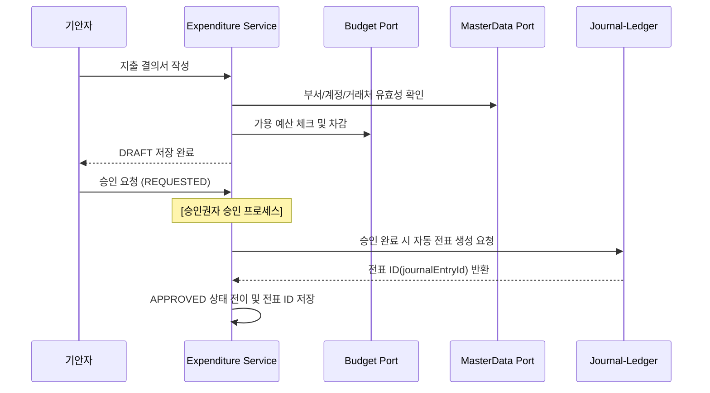
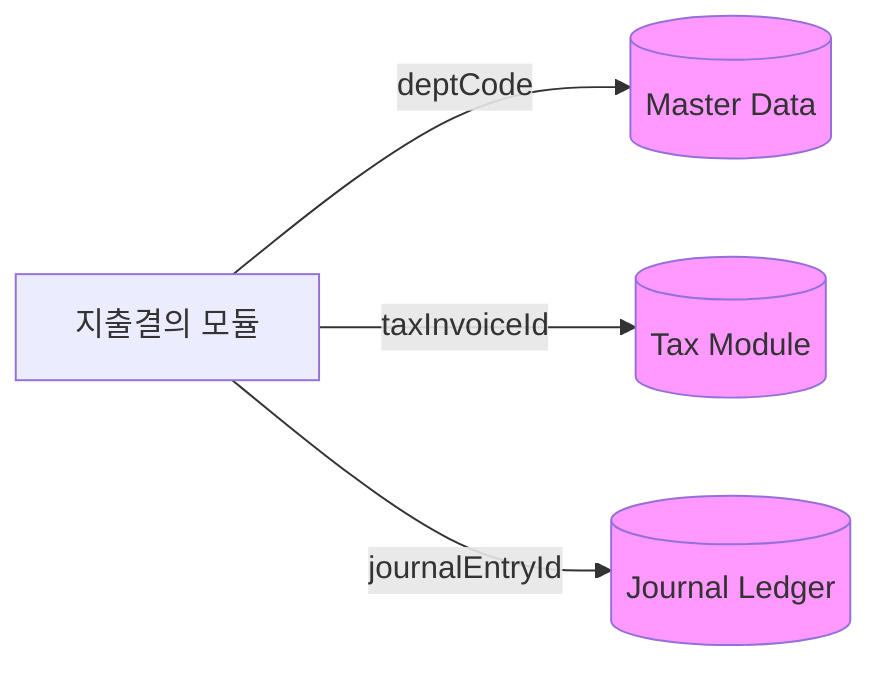
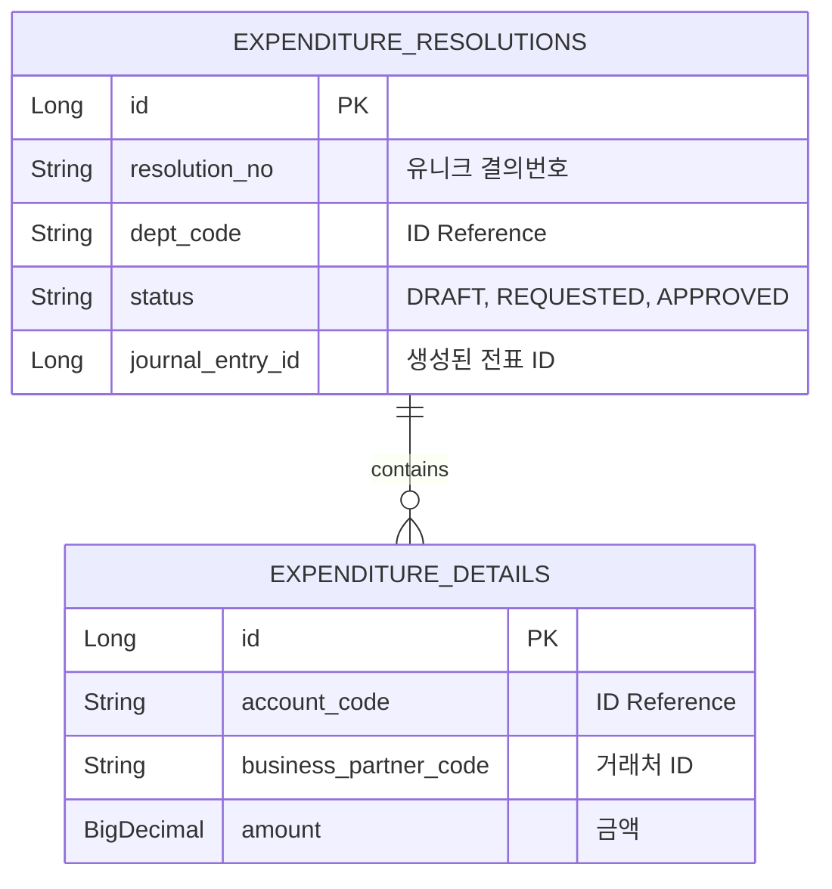

# 📑 Expenditure Resolution Service (지출 결의 관리)

`expenditure-resolution` 모듈은 회사의 비용 지출에 대한 내부 승인(결재)을 관리하고, 승인 완료 시 회계 전표 및 지급 처리로 안전하게 연결하는 '지출 컨트롤 타워'입니다.

---

## 1. 🐣 초보자를 위한 개념 설명 (Beginner Guide)

**지출 결의는 '회사 돈을 쓰기 전 사장님께 허락을 받는 보고서'와 같습니다.**
1. **지출 결의서:** "이 물건을 이 거래처에서 이만큼의 돈을 주고 사겠습니다"라고 미리 적어내는 문서입니다.
2. **상태 흐름:** 작성 중(`DRAFT`) → 승인 요청(`REQUESTED`) → 승인 완료(`APPROVED`).
3. **예산 통제:** 결의서를 쓰는 순간, 우리 부서가 이번 달에 쓸 수 있는 예산에서 그만큼을 미리 찜해둡니다. (한도 초과 시 경고)
4. **전표 연동:** 승인이 떨어지면 시스템이 자동으로 회계팀 장부(`journal-ledger`)에 "돈 나갈 예정!"이라고 전표를 넘겨줍니다.

---

## 2. 🔄 프로세스 흐름 (Process Flow)

### 📌 지출 결의 라이프사이클 및 연동
결의서 작성부터 예산 체크, 최종 전표 생성까지의 헥사고날 아키텍처 흐름입니다.



### 📌 헥사고날 아키텍처: 외부 연동
모든 외부 모듈과는 Port 인터페이스를 통해 **ID(String Code)** 기반으로 느슨하게 연결됩니다.



---

## 3. 📊 데이터 모델 (Schema)

지출 결의 헤더와 상세 분개 항목을 관리합니다.



---

## 4. 🧭 로컬 실행 및 연동 방법

`expenditure-resolution`은 `core/api/batch` 구조로 실행됩니다. `core`가 지출결의, 예산 통제, AP 지급 업무 규칙을 갖고, `api`와 `batch`는 Spring Boot 실행 진입점으로 `core`를 참조합니다.

**PowerShell 검증 명령:**
```powershell
.\gradlew :expenditure-resolution:core:test --console=plain --max-workers=1 --no-daemon
```

**H2 local 실행:**
```powershell
.\gradlew :expenditure-resolution:api:bootRun --console=plain --max-workers=1
.\gradlew :expenditure-resolution:batch:bootRun --console=plain --max-workers=1
```

**실제 Spring Batch Job 실행:**

```powershell
.\gradlew :expenditure-resolution:batch:bootRun --args="--spring.batch.job.enabled=true --spring.batch.job.name=expenditureResolutionApprovalJob startDate=2026-06-19 endDate=2026-06-19 paymentDueDate=2026-06-19" --console=plain --max-workers=1
```

**연동 주의사항:**
- 지출 승인 시 `JournalPostingPort`를 통해 전표가 생성되므로, 회계 엔진 모듈이 구동 중이어야 합니다.
- 예산 통제 규칙은 `BudgetControlPort` 구현체에 따라 달라질 수 있습니다.
- local profile에서는 master-data, tax, asset, journal 외부 경계를 local adapter가 대체하므로 외부 서버 없이 H2로 컨텍스트를 확인할 수 있습니다.
- `expenditureResolutionApprovalJob`은 REQUESTED 상태이고 지급 예정일이 `paymentDueDate` 이내인 결의서를 core 승인 유즈케이스로 넘깁니다.
- 상세 실행 순서는 [docs/local-run.md](./docs/local-run.md)를 참고합니다.
