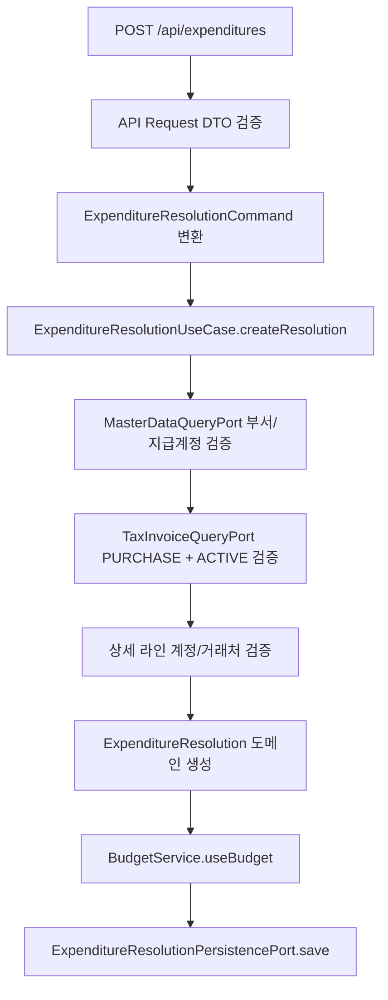
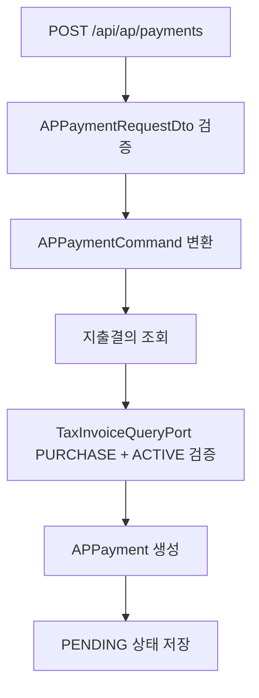

# expenditure-resolution process flow

## 생성 흐름



업무 정합성 포인트:

- 결의 헤더의 부서와 지급계정은 master-data 조회 포트로 확인한다.
- 상세 라인의 비용 계정과 거래처도 master-data 조회 포트로 확인한다.
- 세금계산서가 있으면 `PURCHASE + ACTIVE` 상태만 허용한다.
- 예산 차감은 `yearMonth + deptCode + accountCode` 기준으로 수행한다.

## 승인 흐름

```mermaid
flowchart TD
    A[POST /api/expenditures/{id}/approve] --> B[결의서 조회]
    B --> C[도메인 상태 확인]
    C --> D[전표 라인 생성]
    D --> E[JournalUseCase.createJournalEntry]
    E --> F[JournalUseCase.approveJournalEntry]
    F --> G[고정자산 계정이면 AssetRegistrationPort 호출]
    G --> H[리스 계약 연결 시 activateLeaseContract]
    H --> I[ExpenditureResolution.approve]
    I --> J[저장]
```

전표 생성 시 차변은 상세 비용 계정 라인이고, 대변은 지급 계정 라인이다. 이때 부서, 계정, 거래처 코드는 값으로 넘기며 외부 Aggregate를 직접 소유하지 않는다.

## AP 지급 흐름



AP 지급은 생성 시 아직 실제 지급 완료가 아니다. 기본 상태는 `PENDING`이고, 이후 지급 결과에 따라 상태를 변경한다.

## Batch 실행 경계

`ExpenditureResolutionApprovalBatchConfig`는 Job/Step/Tasklet 실행 흐름과 JobParameter 변환만 담당한다. 실제 승인 대상 처리와 전표 생성은 `ExpenditureResolutionBatchUseCase`와 core 서비스에 위임한다.

`ExpenditureResolutionBatchJobRegistryConfiguration`은 Spring Batch Job 등록 시점을 늦춰 로컬 실행 시 JobRegistry 조기 초기화 경고를 제거한다. 업무 로직은 포함하지 않는다.