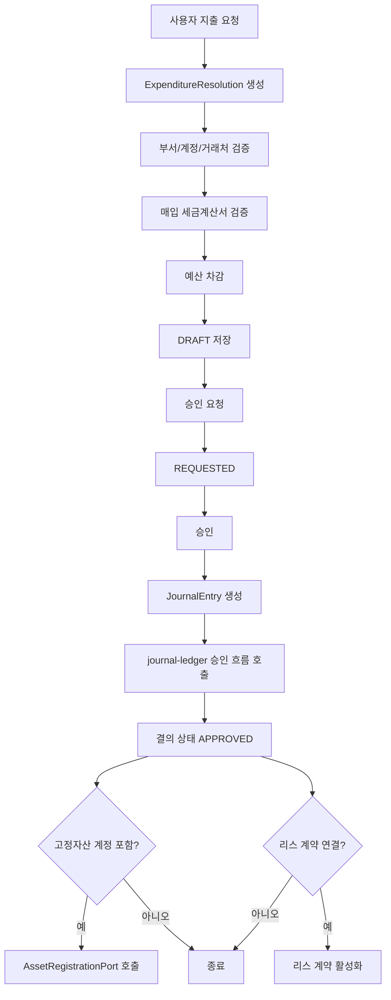
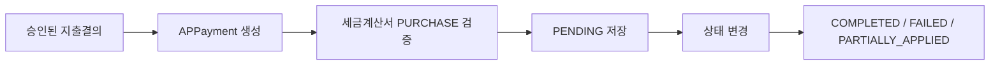

# expenditure-resolution process flow

## 1. 이 모듈이 하는 일

`expenditure-resolution`은 비용 지출 요청을 결의서로 만들고, 예산을 확인하고, 승인 후 회계 전표로 넘긴다.

핵심 책임:

- 지출결의서 생성/수정/승인
- 예산 차감
- 매입 세금계산서 검증
- AP 지급 기록
- 고정자산 취득 연계
- 리스 계약 활성화 연계

## 2. 전체 흐름도

## 3. AP 지급 흐름

## 4. 코드 기준 단계별 설명

### 4.1 지출결의 생성

- 진입점: `POST /api/expenditures`
- 서비스: `ExpenditureService.createResolution`
- 처리:
  - 부서 조회
  - 지급 계정 조회
  - 상세 라인의 비용 계정과 거래처 조회
  - 연결된 세금계산서가 있으면 `PURCHASE` 타입인지 검증
  - 상세 합계로 총액 계산
  - 각 상세 라인별 예산 사용 처리
  - 결의번호 생성 후 `DRAFT` 저장

### 4.2 지출결의 수정

- 진입점: `PUT /api/expenditures/{id}`
- 허용 상태:
  - `DRAFT`
  - `REJECTED`

주의:

- 수정 시에도 다시 예산 사용 로직을 호출한다
- 현재 구현은 기존 차감 예산을 되돌리는 로직 없이 재차 사용 처리하므로 운영 해석 시 주의가 필요하다

### 4.3 승인 요청과 승인

- 승인 요청: `POST /api/expenditures/{id}/request`
- 승인: `POST /api/expenditures/{id}/approve`
- 반려: `POST /api/expenditures/{id}/reject`

승인 시 실제로 일어나는 일:

1. 결의 상세를 기준으로 차변 라인 생성
2. 지급 계정으로 대변 라인 생성
3. `JournalService.createJournalEntry`
4. `JournalService.requestApproval`
5. `JournalService.approveJournalEntry`
6. 결의 상태를 `APPROVED`로 변경

즉, 이 모듈은 전표를 직접 저장하지만 실제 회계 생명주기는 `journal-ledger`에 위임한다.

### 4.4 고정자산 연계

- 상세 계정이 `fixedAsset = true`이면 `AssetRegistrationPort.registerAcquiredAsset` 호출
- 자산번호는 `FA-{resolutionNo}-{detailId}` 형식

### 4.5 리스 연계

- 결의서에 `leaseContract`가 연결되어 있으면
- `AssetRegistrationPort.activateLeaseContract` 호출

### 4.6 AP 지급

- 진입점: `POST /api/ap/payments`
- 서비스: `APPaymentService.createAPPayment`
- 처리:
  - 지출결의 존재 여부 확인
  - 세금계산서가 있으면 `PURCHASE` 타입인지 검증
  - 미적용 금액을 지급금액과 동일하게 시작
  - 상태를 `PENDING`으로 저장

## 5. 초보자가 꼭 기억할 포인트

- 이 모듈은 최종 회계 전표 엔진이 아니라 지출 의사결정과 해소 흐름의 앞단이다.
- 승인 시점에 `journal-ledger`로 전표를 넘긴다.
- 예산 검증/차감이 매우 중요하다.
- 세금계산서는 `PURCHASE` 타입만 허용된다.
- 고정자산/리스는 직접 처리하지 않고 포트로 다른 모듈에 위임한다.
