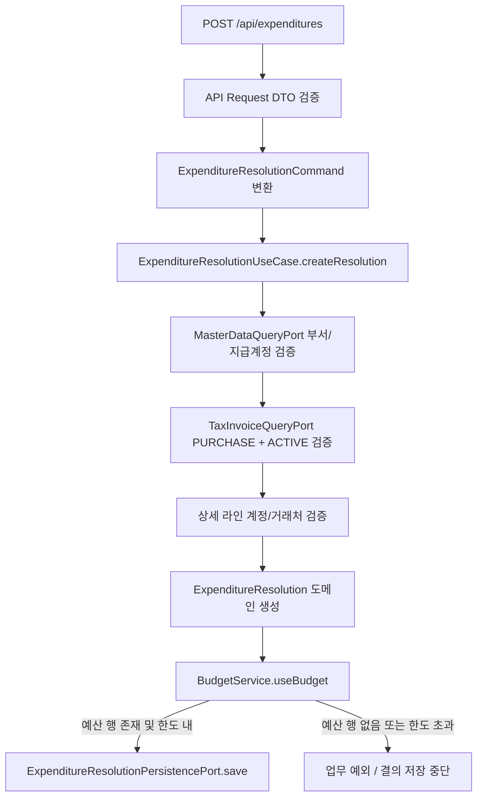
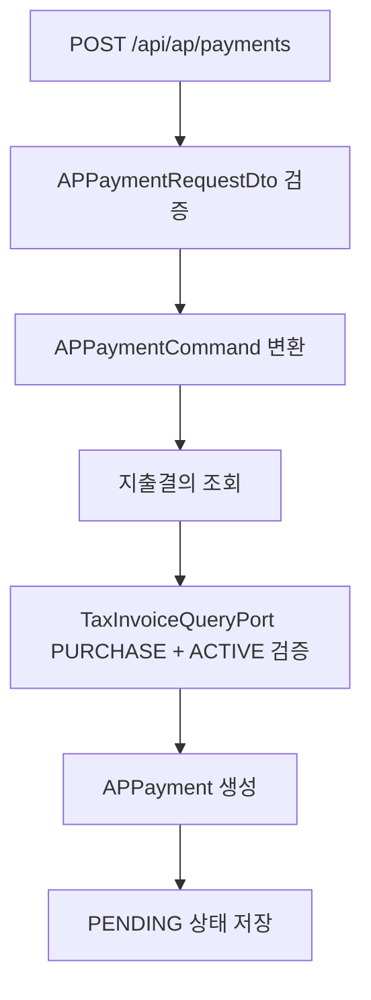

# expenditure-resolution process flow

## 생성 흐름



업무 정합성 포인트:

- 결의 헤더의 부서와 지급계정은 master-data 조회 포트로 확인한다.
- 상세 라인의 비용 계정과 거래처도 master-data 조회 포트로 확인한다.
- 세금계산서가 있으면 `PURCHASE + ACTIVE` 상태만 허용한다.
- 예산 차감은 `yearMonth + deptCode + accountCode` 기준으로 수행한다.
- 상세 라인마다 해당 연월·부서·계정의 `budgets` 행이 있어야 한다. 예산을 배정하지 않았거나 한도를 초과하면 업무 예외가 발생해 결의서가 저장되지 않는다. 예산 미설정은 사용 가능 금액이 무제한이라는 뜻이 아니다.
- 생성과 증액 수정은 예산 차감 후 결의서를 저장한다. 수정은 기존 `DRAFT` 결의의 차감액을 먼저 복원하고 새 상세 금액을 다시 차감한다. `REJECTED` 결의는 반려 시 이미 복원했으므로 수정할 때 다시 복원하지 않는다. 기존 결의의 복원 대상 예산 행이 사라진 경우도 예외로 중단한다.
- 이 흐름은 서비스의 트랜잭션 안에서 실행된다. 수정 도중 새 예산이 없거나 한도를 넘으면 예외로 트랜잭션이 롤백되어 기존 결의 및 예산 변경이 저장되지 않는다. 새 결의라면 누락된 예산을 올바른 조합으로 배정한 뒤 재시도할 수 있다.
- 이전 정책에서 예산 행 없이 저장된 결의는 차감 이력이 없으므로, 행만 새로 배정해도 기존 결의의 수정·반려에서 복원할 사용액이 없어 실패할 수 있다. 해당 결의는 예산 배정과 기존 사용액·결의 상태를 대조해 정합성을 복구한 뒤 재시도해야 한다. 확인 없이 사용액을 임의로 올리거나 복원 예외를 무시하지 않는다.

로컬 검증은 저장소 루트에서 `./gradlew :expenditure-resolution:core:test --offline --no-daemon --console=plain`을 실행한다. `BudgetServiceTest`는 미설정 행의 사용·가용성 검사·복원 거부를, `ExpenditureResolutionBudgetIntegrationTest`는 생성·수정·반려의 저장 차단과 정상 차감·한도 초과를 확인한다. 같은 파일의 `ExpenditureResolutionJpaRollbackTest`는 H2/JPA에서 증액 수정 실패 후 기존 결의와 사용액이 롤백되는지 확인한다. 성공 시 `BUILD SUCCESSFUL`이 출력된다. 병렬 결의 생성의 예산 행 잠금·원자성은 이 검증 범위에 포함되지 않는다.

## 승인 흐름

```mermaid
flowchart TD
    A[POST /api/expenditures/{id}/approve] --> B[결의서 조회]
    B --> C[도메인 상태 확인]
    C --> D[전표 라인 생성]
    D --> E[JournalUseCase.createJournalEntry]
    E --> F[JournalUseCase.approveJournalEntry]
    F --> G[고정자산 계정이면 AssetRegistrationPort 호출]
    G --> H[리스 계약 연결 시 activateLeaseContract]
    H --> I[ExpenditureResolution.approve]
    I --> J[저장]
```

전표 생성 시 차변은 상세 비용 계정 라인이고, 대변은 지급 계정 라인이다. 이때 부서, 계정, 거래처 코드는 값으로 넘기며 외부 Aggregate를 직접 소유하지 않는다.

## AP 지급 흐름



AP 지급은 생성 시 아직 실제 지급 완료가 아니다. 기본 상태는 `PENDING`이고, 이후 지급 결과에 따라 상태를 변경한다.

## Batch 실행 경계

`ExpenditureResolutionApprovalBatchConfig`는 Job/Step/Tasklet 실행 흐름과 JobParameter 변환만 담당한다. 실제 승인 대상 처리와 전표 생성은 `ExpenditureResolutionBatchUseCase`와 core 서비스에 위임한다.

`ExpenditureResolutionBatchJobRegistryConfiguration`은 Spring Batch Job 등록 시점을 늦춰 로컬 실행 시 JobRegistry 조기 초기화 경고를 제거한다. 업무 로직은 포함하지 않는다.
