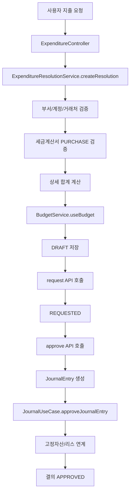
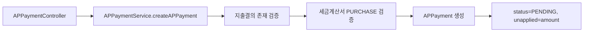

# expenditure-resolution process flow

## 1. 이 모듈이 하는 일

`expenditure-resolution` 모듈은 비용 집행 승인 흐름을 관리하고,
승인 완료 시 전표/지급/자산/리스 연계 작업을 오케스트레이션합니다.

핵심 책임:

- 지출결의서 생성/수정/승인/반려
- 예산 사용 반영
- 매입 세금계산서(`PURCHASE`) 검증
- AP 지급 기록 생성/상태 변경
- 고정자산 취득 연계
- 리스 계약 활성화 연계

## 2. 지출결의 전체 흐름

## 3. 단계별 코드 포인트

### 3.1 결의 생성

- 진입점: `POST /api/expenditures`
- 서비스: `ExpenditureResolutionService.createResolution`
- API 응답: 엔티티 직접 노출 대신 `ExpenditureResolutionDto` 반환(순환 참조/과다 직렬화 방지)
- 주요 처리:
  - 부서/지급계정 조회
  - 상세 계정/거래처 조회
  - `validatePurchaseTaxInvoice(...)`
  - 상세 합계(`BigDecimal`) 계산
  - 월 기준 예산 사용 반영
  - 결의번호(`REQ-yyyyMMdd-###`) 생성

### 3.2 결의 수정

- 진입점: `PUT /api/expenditures/{id}`
- 서비스: `ExpenditureResolutionService.updateResolution`
- 제한 상태:
  - `DRAFT`
  - `REJECTED`

### 3.3 승인 요청/승인/반려

- 승인 요청: `POST /api/expenditures/{id}/request`
  - `requestApproval()`로 상태 전이
- 승인: `POST /api/expenditures/{id}/approve`
  - 분개 라인 생성 후 `JournalUseCase.createJournalEntry`
  - `JournalUseCase.approveJournalEntry(..., "SYSTEM")`
  - 고정자산 계정이면 `AssetRegistrationPort.registerAcquiredAsset`
  - 리스 계약 연결 시 `AssetRegistrationPort.activateLeaseContract`
  - 결의 `approve(savedEntry)` 호출
- 반려: `POST /api/expenditures/{id}/reject`

## 4. AP 지급 흐름

상태 변경은 `PATCH /api/ap/payments/{id}/status`에서 수행하며,
문자열을 `APPaymentStatus` enum으로 변환해 반영합니다.

## 5. 초보자가 꼭 기억할 포인트

- 이 모듈은 "승인 오케스트레이터"이고, 회계 도메인 세부는 별도 모듈에 위임합니다.
- 세금계산서 검증은 결의/AP 지급 모두에서 동일하게 `PURCHASE` 규칙을 사용합니다.
- 예산 반영과 상태 전이는 운영 통제의 핵심이므로, 변경 시 테스트/문서를 함께 갱신해야 합니다.
