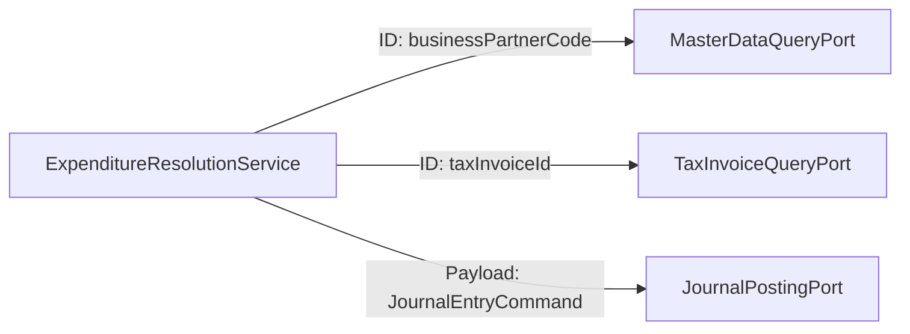
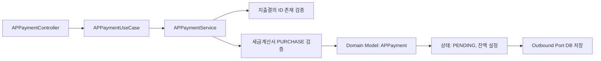

# expenditure-resolution 프로세스 흐름 (Process Flow)

## 1. 이 모듈이 하는 일

`expenditure-resolution` 모듈은 헥사고날 아키텍처를 기반으로 지출결의부터 전표 및 지급 연계까지의 전체 생명주기를 조율(Orchestration)합니다.

핵심 책임:
- 지출결의서 생성/수정/승인/반려 (Inbound Port)
- 예산 사용 내역 반영 및 차감
- AP 지급 기록 생성 및 상태 관리
- 전표 생성, 자산 취득 연계, 리스 활성화 연계 (Outbound Ports)

## 2. 지출결의 전체 흐름 (헥사고날 아키텍처 적용)

```mermaid
flowchart TD
    A[사용자 지출 요청] --> B[Inbound Adapter\nExpenditureController]
    B --> C[Application Service\nExpenditureResolutionService]
    C --> D{도메인 규칙 및 포트 검증}
    D --> E[MasterDataQueryPort (ID 참조)]
    D --> F[TaxInvoiceQueryPort]
    D --> G[BudgetControlPort]
    G --> H[Outbound Adapter\nDRAFT 상태 DB 저장]

    H --> I[request API 호출]
    I --> J[REQUESTED 상태 전이]

    J --> K[approve API 호출]
    K --> L[JournalLedgerPort 호출\n(전표 생성 요청)]
    L --> M[AssetRegistrationPort 호출\n(고정자산/리스 연계)]
    M --> N[Outbound Adapter\n결의 APPROVED DB 반영]
```

## 3. ID 기반 참조를 통한 연계 흐름


`expenditure-resolution`은 다른 도메인의 데이터베이스를 직접 읽거나 외래키를 맺지 않습니다. 멀티 스테이지 Docker 환경에서 독립적인 스케일링이 가능하도록 반드시 Port를 통해 통신합니다.

## 4. AP 지급 흐름



상태 변경은 `PATCH /api/ap/payments/{id}/status`에서 수행하며 도메인 로직에 따라 잔액 차감 처리를 수행합니다.