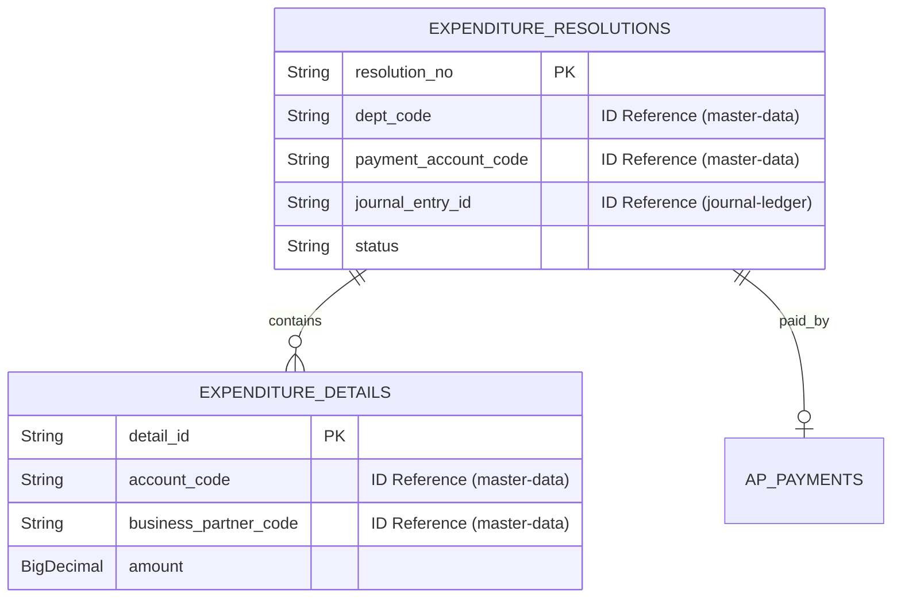

# expenditure-resolution 스키마 (Schema)

## 엔티티 및 ID 기반 설계 철학

헥사고날 아키텍처의 철학에 맞게 다른 바운디드 컨텍스트(master-data 등)와의 물리적인 DB 결합을 피합니다. 부서, 계정, 거래처 정보는 철저히 ID(문자열)로만 기록하며 변경 이력 관리는 해당 모듈의 SCD2에 맡깁니다.

## 핵심 테이블 설계

### `expenditure_resolutions` (지출결의 헤더)
지출결의의 메타정보와 진행 상태를 관리합니다.
- `id` (PK)
- `resolution_no` (결의 번호)
- `dept_code` (마스터 데이터 부서 ID)
- `payment_account_code` (대변에 쓰일 마스터 데이터 계정 ID)
- `status` (DRAFT, REQUESTED, APPROVED, REJECTED)
- `journal_entry_id` (승인 완료 시 발급된 전표 ID)
- `lease_contract_id` (연계된 리스 계약 ID)

### `expenditure_details` (지출결의 상세)
차변 분개를 위한 상세 항목입니다.
- `id` (PK)
- `expenditure_resolution_id` (FK)
- `account_code` (마스터 데이터 계정 ID)
- `business_partner_code` (마스터 데이터 거래처 ID)
- `amount`

### `ap_payments` (AP 지급 관리)
승인된 지출결의의 실제 돈의 흐름을 관리합니다.
- `id` (PK)
- `expenditure_resolution_id` (FK)
- `tax_invoice_id` (세금계산서 ID)
- `status` (PENDING, COMPLETED 등)
- `unapplied_amount` (미지급 잔여 금액)

멀티 스테이지 환경에서는 이 모듈만의 단독 DB 인스턴스를 사용하도록 Docker Compose가 구성됩니다.