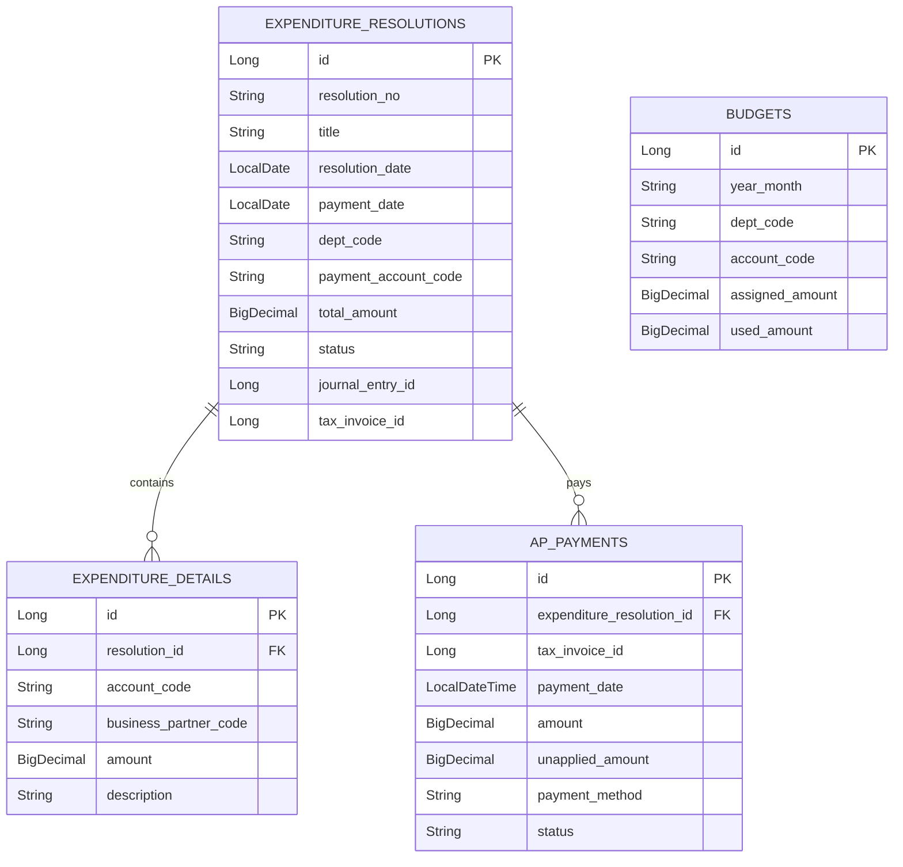

# expenditure-resolution schema

## 핵심 테이블

## 코드 기반 참조

`deptCode`, `accountCode`, `businessPartnerCode`, `taxInvoiceId`, `journalEntryId`는 외부 Aggregate를 직접 JPA 연관으로 소유하지 않는 값 참조다.

- 부서/계정/거래처: `MasterDataQueryPort`로 존재와 활성 여부를 확인한다.
- 세금계산서: `TaxInvoiceQueryPort`로 `PURCHASE + ACTIVE` 정책을 확인한다.
- 전표: `JournalUseCase` 결과의 ID를 값으로 보관한다.
- 예산: `yearMonth + deptCode + accountCode` 기준으로 조회하고 사용액을 증가시킨다.

## 상태

| Aggregate | 상태 | 의미 |
| --- | --- | --- |
| ExpenditureResolution | `DRAFT` | 작성 중 |
| ExpenditureResolution | `REQUESTED` | 승인 요청됨 |
| ExpenditureResolution | `APPROVED` | 승인 완료, 전표 연결됨 |
| ExpenditureResolution | `REJECTED` | 반려됨 |
| APPayment | `PENDING` | 지급 생성됨, 아직 완료 전 |
| APPayment | `COMPLETED` | 지급 완료 |
| APPayment | `FAILED` | 지급 실패 |
| APPayment | `PARTIALLY_APPLIED` | 일부 반제/적용 |

## AP Invoice 레거시 엔티티

`Invoice`는 AP 미지급 송장 표현을 위해 남아 있지만 현재 주요 API 흐름은 tax 모듈의 `TaxInvoiceRef`를 사용한다. `Invoice`도 master-data 엔티티 직접 연관 대신 `vendorCode`, `currencyCode` 값을 저장한다.