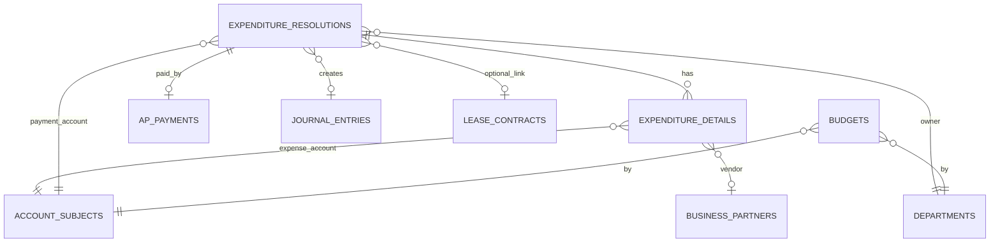
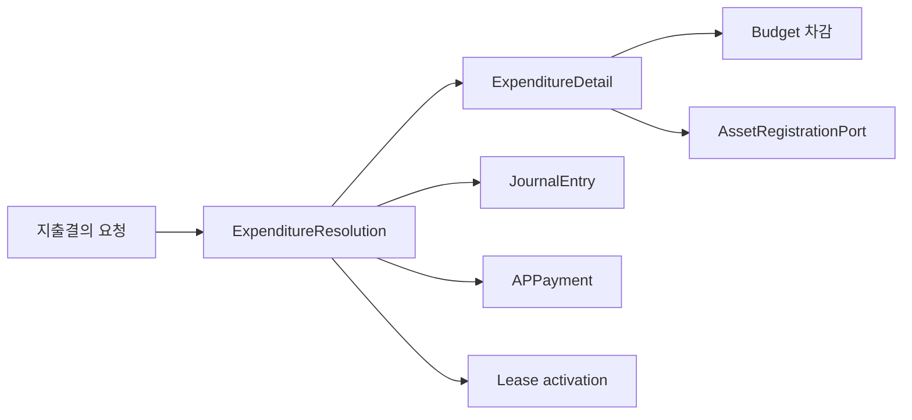

# expenditure-resolution schema

## 1. 한눈에 보는 구조

## 2. 핵심 엔티티

### 2.1 `expenditure_resolutions`

지출결의 헤더다.

주요 컬럼:

- `id`
- `resolution_no`
- `title`
- `resolution_date`
- `payment_date`
- `dept_code`
- `payment_account_code`
- `total_amount`
- `status`
- `rejection_reason`
- `journal_entry_id`
- `lease_contract_id`
- `tax_invoice_id`

상태값:

- `DRAFT`
- `REQUESTED`
- `APPROVED`
- `REJECTED`

### 2.2 `expenditure_details`

지출결의 상세 라인이다.

주요 컬럼:

- `expenditure_resolution_id`
- `account_code`
- `amount`
- `business_partner_code`
- `description`

의미:

- 각 라인이 승인 시 차변 분개 라인으로 연결된다

### 2.3 `budgets`

예산 통제 테이블이다.

주요 컬럼:

- `year_month`
- `dept_code`
- `account_code`
- `assigned_amount`
- `used_amount`

유니크 키:

- `yearMonth + dept_code + account_code`

### 2.4 `ap_payments`

AP 지급 이력이다.

주요 컬럼:

- `expenditure_resolution_id`
- `tax_invoice_id`
- `payment_date`
- `amount`
- `unapplied_amount`
- `payment_method`
- `status`

상태 예시:

- `PENDING`
- `COMPLETED`
- `FAILED`
- `PARTIALLY_APPLIED`

### 2.5 `ap_invoices`

매입 인보이스 오픈아이템 엔티티다.

주요 컬럼:

- `invoice_no`
- `vendor_code`
- `invoice_date`
- `due_date`
- `currency_code`
- `supply_amount`
- `tax_amount`
- `total_amount`
- `remaining_amount`
- `status`
- `tax_invoice_id`

주의:

- 현재 코드상 서비스/API 중심 운영 흐름은 `ExpenditureResolution`과 `APPayment` 쪽이다
- `Invoice` 엔티티는 존재하지만 현재 주 흐름 문맥에서는 상대적으로 덜 사용된다

## 3. 데이터 흐름 관점

## 4. 초보자용 해석

- `ExpenditureResolution`은 "왜 이 돈을 써야 하는가"에 대한 승인 문서다.
- `ExpenditureDetail`은 돈이 어떤 비용 계정으로 가는지 적는 줄이다.
- `Budget`은 그 지출이 허용 범위 안인지 보는 통제 장치다.
- `APPayment`는 실제 지급 실행 이력이다.
- `Invoice`는 AP 오픈아이템 모델이지만 현재 메인 흐름의 중심 서비스는 아니다.
