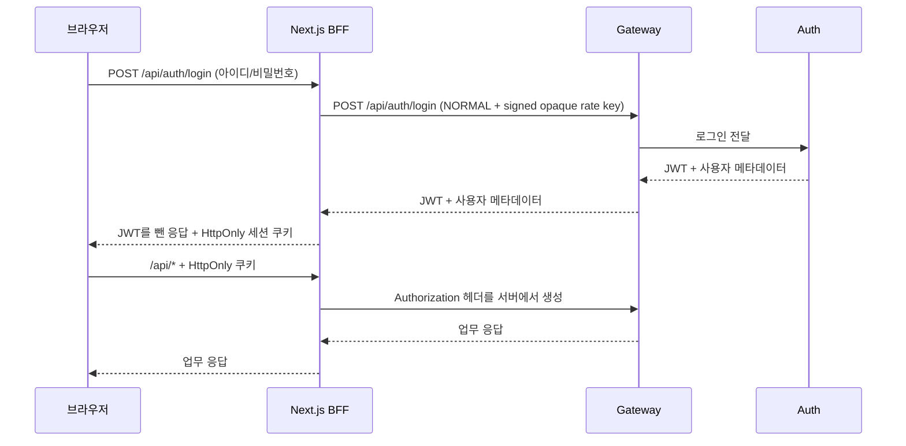

# HttpOnly BFF 인증 세션 가이드

이 문서는 Frontend가 로그인 JWT를 브라우저 JavaScript에 노출하지 않고 사용하는 방법을
초보자 기준으로 설명합니다. 실제 아이디, 비밀번호, JWT 값은 명령 기록이나 문서에 남기지
마세요.

## 1. 무엇이 바뀌었나요?

예전 방식은 로그인 응답의 JWT를 `localStorage.auth_token`에 저장한 뒤 화면 코드가
`Authorization: Bearer ...` 헤더를 직접 만들었습니다. 같은 페이지에서 악성 JavaScript가
실행되면 토큰 원문을 읽을 수 있다는 문제가 있었습니다.

현재는 브라우저와 Gateway 사이에 Next.js BFF(Backend for Frontend)가 있습니다.



브라우저 개발자 도구에는 쿠키의 존재가 보일 수 있지만 `HttpOnly`이므로 화면 JavaScript의
`document.cookie`에서는 읽을 수 없습니다. 로그인 응답 JSON에도 `token`과 `tokenType`이
없습니다.

## 2. 쿠키 보안 계약

| 항목 | 개발(`next dev`, HTTP loopback) | 운영(`next start`) |
|---|---|---|
| 이름 | `account_session` | `__Host-account_session` |
| `HttpOnly` | 켬 | 켬 |
| `SameSite` | `Strict` | `Strict` |
| `Secure` | HTTP 테스트를 위해 끔 | 켬(HTTPS 필수) |
| `Path` | `/` | `/` |
| 만료 | Auth의 `expiresIn`과 연동, 최대 8시간 | 동일 |

운영 쿠키의 `__Host-` 접두사는 `Secure`, 루트 경로, Domain 미지정을 브라우저가 추가로
검사하게 합니다. 운영 Frontend를 일반 HTTP로 열면 브라우저가 Secure 쿠키를 저장하지 않는
것이 정상입니다. 실제 운영은 반드시 HTTPS reverse proxy/ingress 뒤에서 실행하세요.

## 3. 요청별 보안 동작

- 로그인: BFF가 입력 크기와 형식을 검사하고 `loginType=NORMAL`을 서버에서 고정합니다.
  사용자명 원문 대신 SHA-256 해시에 30초 HMAC 서명을 붙여 Gateway rate-limit 식별자로
  보냅니다. 브라우저가 보낸 `X-Bff-Rate-*`와 `X-Forwarded-For`는 사용하지 않습니다.
- 보호 API: 브라우저가 보낸 `Authorization`, `Cookie`, `X-User-ID` 같은 신원 헤더를
  Gateway로 전달하지 않습니다. BFF가 HttpOnly 쿠키의 JWT로 새 Bearer 헤더를 만듭니다.
- 상태 변경(`POST`, `PUT`, `PATCH`, `DELETE`): `Origin`과 `Sec-Fetch-Site`가 동일 출처인지
  검사합니다. 교차 출처 요청은 Gateway에 도달하기 전에 HTTP 403으로 끝납니다.
- 멱등성 키: 인증된 동일 출처 상태 변경 요청의 `X-Idempotency-Key`는 아래 형식을
  검증한 후 한 값 그대로 Gateway에 전달합니다. 키가 없는 요청은 기존처럼 전달됩니다.
- 만료: Gateway가 HTTP 401을 반환하면 BFF도 세션 쿠키를 즉시 만료시킵니다.
- 로그아웃: `POST /api/auth/logout`이 쿠키를 `Max-Age=0`으로 만료시킵니다.
- 응답: 인증 응답과 보호 API 응답에는 `Cache-Control: no-store`가 적용됩니다. Gateway의
  `Set-Cookie`는 브라우저로 전달하지 않습니다.

### 내부감사 명령 재시도

내부감사 명령을 보낼 때 클라이언트는 명령마다 예측하기 어려운 새 키를 하나 생성하고,
타임아웃 등으로 **같은 명령을 재시도할 때만** 그 키를 다시 사용합니다. 예를 들어
`X-Idempotency-Key: 839-retry_01`을 `POST /api/v1/internalaudit/rcms/processes`에
보냅니다. 키는 ASCII 영문자·숫자·점(`.`)·밑줄(`_`)·물결표(`~`)·하이픈(`-`)만
포함하는 1~255자 값입니다. 쉼표, 값 내부의 공백, 비ASCII 문자, 빈 값,
256자 이상 또는 중복 헤더는 BFF가 HTTP 400으로 거절하며 Gateway에 보내지
않습니다. 헤더 값 양끝의 공백은 BFF 검증 전에 HTTP 계층에서 제거될 수 있습니다.
BFF는 자신이 받은 값을 추가로 다듬지 않고 검증한 그대로 전달하며 키를 생성하지
않습니다. `GET`·`HEAD`의 키는 전달하지 않습니다.

내부감사 서비스는 같은 키와 같은 인증 사용자·명령·대상·payload의 재시도에 저장된
최초 결과를 재생합니다. 같은 키를 다른 payload나 명령에 재사용하면 HTTP 409가
발생합니다. 이 재생 계약은 내부감사의 receipt를 사용하는 명령에 해당하며, 모든
업무 API에 공통으로 적용된다는 뜻은 아닙니다. 키가 없으면 내부감사는 receipt
재생 보호 없이 명령을 실행할 수 있으므로, 응답을 잃은 뒤 안전하게 재시도할
명령에는 처음부터 키를 지정해야 합니다.

## 4. 개발 환경에서 실행

Gateway와 Auth가 호스트에서 실행 중이면:

```powershell
cd frontend
$env:GATEWAY_INTERNAL_URL = "http://localhost:8000"
$bffBytes = New-Object byte[] 32
[System.Security.Cryptography.RandomNumberGenerator]::Fill($bffBytes)
$env:BFF_GATEWAY_SHARED_SECRET = [Convert]::ToBase64String($bffBytes)
# Gateway 프로세스에도 같은 BFF_GATEWAY_SHARED_SECRET을 안전한 Run Configuration으로 주입합니다.
npm run dev
```

컨테이너 최소 external-dev 스택에서는 Compose가
`GATEWAY_INTERNAL_URL=http://minimal-gateway:8000`을 이미 Frontend에 주입합니다.

```bash
python3 tools/run-minimal-auth-external-dev.py build \
  --env-file .env.external-dev --engine podman
python3 tools/run-minimal-auth-external-dev.py up \
  --env-file .env.external-dev --engine podman
python3 tools/run-minimal-auth-external-dev.py smoke \
  --env-file .env.external-dev --engine podman
```

환경 파일이나 로그인 응답 본문을 출력하지 마세요. 기존 컨테이너 전체 중지, `down -v`,
volume 삭제, `prune`도 필요하지 않습니다.

## 5. 운영 이미지 빌드와 실행

Gateway 주소는 더 이상 이미지 빌드 인자가 아닙니다. BFF 서버가 요청 시점에 읽는 런타임
환경변수입니다. 따라서 같은 image digest를 개발/검증/운영 환경에서 재사용할 수 있습니다.

```powershell
docker build -f frontend/Containerfile -t account/frontend:local frontend
docker run --rm -p 3000:3000 `
  -e GATEWAY_INTERNAL_URL=http://gateway:8000 `
  -e BFF_GATEWAY_SHARED_SECRET=$env:BFF_GATEWAY_SHARED_SECRET `
  account/frontend:local
```

`compose.prod.yml`과 저장소 개발 Compose는 이 값을 서비스 이름으로 자동 설정합니다.
`BFF_GATEWAY_SHARED_SECRET`은 BFF와 Gateway만 공유하는 별도 32~512-byte 런타임 secret입니다.
JWT 서명 키나 Auth 내부 API token을 재사용하지 말고 두 서비스에 같은 값을 주입하세요. 값이
없거나 길이가 잘못되면 BFF 로그인은 503으로 실패하며, Gateway는 잘못된 BFF 키를 신뢰하지
않고 직접 peer bucket으로 되돌아갑니다. 유효한 로그인 키도 사용자별 bucket과 BFF peer
aggregate bucket을 함께 소모하므로 사용자명을 계속 바꿔 제한을 무한히 우회할 수 없습니다.
외부 reverse proxy 때문에 브라우저의 공개 Origin과 Next가 인식한 Origin이 다르면 서버 전용
`FRONTEND_PUBLIC_ORIGIN=https://frontend.example`을 런타임에 정확히 한 개 지정합니다. 경로,
query, 사용자정보가 포함된 값은 거부됩니다.

## 6. 검증 방법

### 자동 검증

패키지를 추가하지 않고 Node 20 내장 test runner와 mock Gateway를 사용합니다.

```powershell
cd frontend
npm run test:auth-bff
npm run lint
npx tsc --noEmit
npm run build
```

`test:auth-bff`는 다음을 실제 HTTP로 검사합니다.

1. 교차 출처 로그인/변경 요청 403
2. 로그인 응답에서 JWT 제거
3. HttpOnly/SameSite/만료 쿠키
4. 브라우저가 위조한 Authorization/사용자/BFF/forwarding 헤더 제거와 HMAC 계약
5. 쿠키가 없으면 Gateway 호출 없이 401
6. Gateway 401 시 쿠키 만료
7. same-origin 로그아웃
8. 보호 API 쓰기의 멱등성 키 보존, 길이·문자·중복 오류 400과 Gateway 미전달
9. mock Gateway가 재생·payload 충돌을 흉내 낼 때 BFF의 결과/409 전달

9번은 BFF 응답 경로만 확인합니다. 실제 Gateway·내부감사 receipt 저장소까지의
재시도 검증은 별도 통합 환경에서 수행해야 합니다.

### 브라우저에서 눈으로 확인

1. 로그인 전에 개발자 도구의 Application → Local Storage에서 `auth_token`, `user_info`가
   사라졌는지 확인합니다. 기존 값은 첫 화면 진입 시 제거됩니다.
2. Network → `/api/auth/login` → Response에 `token`이 없는지 확인합니다.
3. Application → Cookies에서 개발은 `account_session`, 운영은
   `__Host-account_session`을 확인합니다. HttpOnly가 체크되어야 합니다.
4. 업무 `/api/*`의 브라우저 요청 헤더에는 Bearer가 없어야 합니다. Bearer 주입은 BFF와
   Gateway 사이에서만 일어납니다.
5. 우측 상단의 로그아웃을 누르고 세션 쿠키가 사라지는지 확인합니다.

## 7. 장애 해결

| 증상 | 확인할 것 |
|---|---|
| 로그인/업무 API가 502 | Frontend 컨테이너의 `GATEWAY_INTERNAL_URL`과 Gateway health |
| 로그인 API가 503 | 두 서비스의 `BFF_GATEWAY_SHARED_SECRET` 존재·동일성·32~512-byte 길이 |
| 상태 변경이 403 | 브라우저 Origin, reverse proxy Host 보존, 필요 시 `FRONTEND_PUBLIC_ORIGIN` |
| 운영 로그인 직후 세션 없음 | HTTPS 접속인지 확인(`Secure` 쿠키는 일반 HTTP에서 저장되지 않음) |
| 업무 API가 401 | 세션 만료 또는 역할 버전 변경. 다시 로그인 |
| 예전 토큰이 Local Storage에 남음 | 새 Frontend 코드가 배포됐는지 확인 후 새로고침; 직접 삭제해도 안전 |

## 8. 롤백

코드 롤백은 해당 PR을 revert하고 이전 Frontend image digest로 되돌리는 방식으로 합니다.
다만 HttpOnly 쿠키를 localStorage JWT로 자동 변환하지 않습니다. 보안상 역변환 경로를 만들지
않았으므로 롤백 뒤 사용자는 다시 로그인해야 합니다. 새 쿠키는 `/api/auth/logout` 또는
브라우저 사이트 데이터 삭제로 제거할 수 있습니다. 실제 JWT 값을 복사하거나 보존하지 마세요.

## 9. 남은 보안 한계

HttpOnly는 XSS가 JWT 원문을 훔치는 것을 막지만, 이미 실행 중인 악성 스크립트의 same-origin
요청 자체까지 막지는 못합니다. CSP 강화, 입력값 정제, 의존성 점검은 계속 필요합니다. 현재
구현은 refresh token이나 서버 측 분산 세션 저장소를 추가하지 않으며 Auth가 발급한 짧은 수명
JWT를 BFF 전용 쿠키로 보관합니다. 현재 rate limiter는 Gateway 인스턴스별 메모리 bucket이므로
여러 Gateway 인스턴스 간 전역 quota가 필요하면 Redis 같은 분산 저장소를 별도 이슈로 도입해야
합니다.
