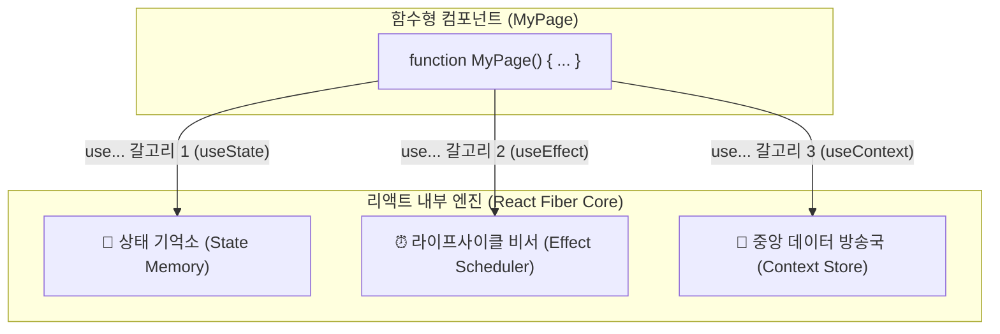
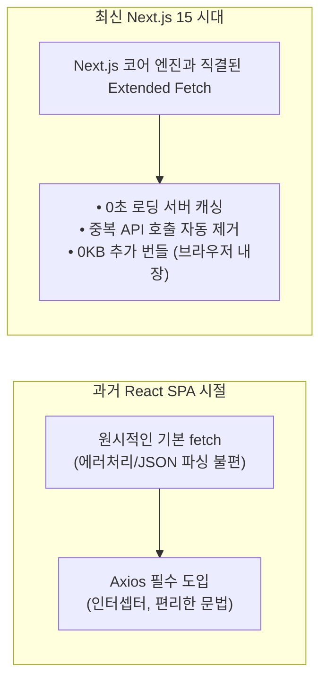
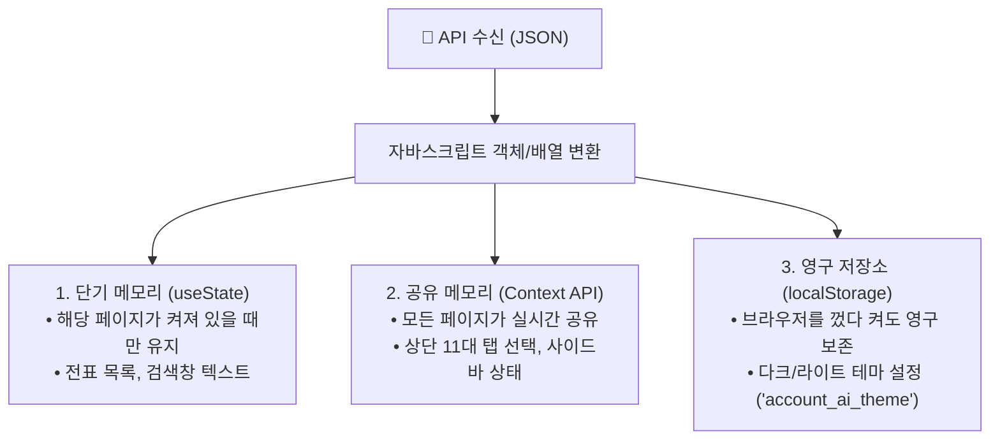

# 🎓 프론트엔드 핵심 개념 & 실전 교육 가이드 (React 19 & Next.js 15)

본 문서는 프론트엔드에 입문하는 신입 개발자, 백엔드 엔지니어 및 기획자가 **React의 핵심 동작 원리(Hook, State, Context API), API 통신 메커니즘(Fetch vs Axios), 그리고 Account.AI 시스템의 아키텍처**를 가장 쉽고 체계적으로 이해할 수 있도록 정리한 마스터 교육 문서입니다.

---

## 1. 🪝 리액트 훅(Hook)의 본질과 동작 원리

### ① 훅(Hook)은 왜 탄생했나요?
* **과거의 리액트 (클래스형 컴포넌트)**:
  * 예전에는 상태를 저장하려면 `class MyPage extends React.Component`처럼 복잡한 클래스를 만들고, `this.state`, `this.setState`, `componentDidMount` 같은 어려운 문법을 써야 했습니다. 코드가 길어지고 재사용이 매우 어려웠습니다.
* **현재의 리액트 (함수형 컴포넌트 + Hook)**:
  * 리액트 팀은 단순한 함수(`function MyPage()`) 안에서 리액트 내부 엔진의 기억장치와 알람에 **"갈고리(Hook)를 걸어 간편하게 가져다 쓰도록"** 훅(Hook) 시스템을 도입했습니다.
  * 규칙: 훅은 항상 **`use...`**로 시작합니다 (`useState`, `useEffect`, `useContext`, `useTheme` 등).



---

### ② 핵심 훅 3총사의 상세 역할

#### 1) `useState` : "화면의 기억 상자 & 자동 렌더링 리모컨"
컴포넌트가 기억해야 할 데이터를 보관하며, 값이 바뀌면 리액트가 **바뀐 부분만 화면을 알아서 다시 그려줍니다(Re-render).**

```tsx
// 1. 상태 선언: [현재값, 값을바꾸는함수] = useState(초기값);
const [amount, setAmount] = useState<number>(10000000);

// 2. 값 변경: setAmount를 호출하면 화면의 숫자도 즉시 바뀝니다.
<button onClick={() => setAmount(20000000)}>
  2,000만원으로 증액
</button>
```

#### 2) `useEffect` : "화면 생명주기 자동 알람 비서"
화면이 브라우저에 **처음 떴을 때(Mount)**, 혹은 **특정 값이 바뀌었을 때** 백엔드 API를 호출하거나 타이머를 맞추는 부가 작업을 수행합니다.

```tsx
useEffect(() => {
  // ⏰ [실행할 작업] 화면이 처음 켜질 때 백엔드 API에서 전표 목록을 조회
  console.log("화면이 로드되었습니다!");
  fetchJournals();

  // 🧹 [정리 작업] 화면에서 벗어날 때 실행 (메모리 누수 방지)
  return () => console.log("화면이 닫혔습니다.");
}, []); // 👈 빈 배열 []: 화면이 처음 켜질 때 딱 1번만 실행됨!
```

#### 3) `useContext` : "중앙 무전기 수신기"
부모에서 자식으로 5단계, 10단계씩 데이터를 번거롭게 전달(Props Drilling)하지 않고, **중앙 방송국에서 송출하는 데이터를 모든 화면이 즉시 수신**합니다.

```tsx
// 상단 헤더, 사이드바, 푸터 어디서든 한 줄로 테마 정보를 꺼내 씁니다.
const { resolvedTheme, toggleTheme } = useTheme();
```

---

## 2. ⚡ Context API vs Axios / Fetch 비교 분석

두 기술은 완전히 다른 목적과 영역에서 작동합니다.

```
┌────────────────────────────────────────────────────────┐
│ 🏢 프론트엔드 내부 (브라우저 화면들)                   │
│                                                        │
│  [TopHeader] ─── (📢 Context API: 사내 무전기) ─── [Sidebar]│
│      │                                                 │
│      │ 🌙 다크모드로 변경! (컴포넌트 간 전역 상태 공유)  │
└──────┼─────────────────────────────────────────────────┘
       │
       │ 🚚 (Fetch API: 외부 배달원 / 통신선)
       │    HTTP GET/POST 네트워크 통신 (데이터 주문 & 수령)
       ▼
┌────────────────────────────────────────────────────────┐
│ 🍳 백엔드 마이크로서비스 (Spring Boot & PostgreSQL)     │
│      "journal-ledger 모듈에서 전표 100건 조회"          │
└────────────────────────────────────────────────────────┘
```

| 구분 | **Context API (컨텍스트 API)** | **Fetch / Axios (네트워크 통신)** |
| :--- | :--- | :--- |
| **핵심 역할** | **"사내 무전기 / 중앙 방송국"** | **"외부 배달원 / 우체부"** |
| **통신 대상** | **프론트엔드 컴포넌트 ↔ 프론트엔드 컴포넌트** | **프론트엔드 ↔ 백엔드 서버(API/DB)** |
| **다루는 데이터** | 다크모드(`ThemeContext`), 메뉴선택(`NavContext`) | 전표 데이터, 계정과목 목록, 결산 결과 |
| **작동 위치** | 브라우저 메모리 내부 | 네트워크 인터넷 망 (HTTP/HTTPS) |

---

## 3. 🔍 왜 Axios 대신 `fetch`를 사용하나요? (Next.js 15 표준)

과거(2018~2022) 순수 React SPA에서는 Axios가 사실상의 표준이었으나, **Next.js 14/15 모던 풀스택 시대에는 공식 표준인 `fetch`가 압도적으로 권장**됩니다.



1. **Next.js 15 캐시 파이프라인 직결**:
   * Next.js의 정적 빌드(122개 라우트 0초 렌더링)와 서버 캐싱(`revalidate`)은 `fetch`를 기반으로 동작합니다.
2. **요청 중복 제거 (Request Deduplication)**:
   * 화면 내 3개의 서로 다른 컴포넌트가 동시에 `fetch('/api/user')`를 호출해도, Next.js가 알아서 백엔드에는 1번만 요청하고 결과를 공유합니다.
3. **가벼운 번들 용량 (0 KB)**:
   * 브라우저와 Node.js에 기본 내장되어 있어 불필요한 외부 라이브러리 설치가 필요 없습니다.

---

## 4. 🗄️ 받아온 데이터는 어디에 저장되나요? (저장소 3단계)



---

## 5. 📚 프론트엔드 핵심 교육 문서 목록

| 문서명 | 파일 경로 | 대상 및 핵심 내용 |
| :--- | :--- | :--- |
| **🎓 프론트엔드 핵심 개념 & 교육 가이드** | [`frontend/docs/frontend-core-education-guide.md`](file:///c:/dev/account/frontend/docs/frontend-core-education-guide.md) | **[본 문서]** 훅의 원리, Context vs Fetch, 상태 저장소 3단계, Next.js 아키텍처 |
| **🐣 프론트엔드 입문 가이드** | [`frontend/docs/beginner-guide.md`](file:///c:/dev/account/frontend/docs/beginner-guide.md) | KBank 디자인 시스템, 폴더 구조, 금융 정밀 타이포그래피 규칙 |
| **📐 종합 레이아웃 & 화면 설계서** | [`frontend/docs/ui-layout-and-screen-specification.md`](file:///c:/dev/account/frontend/docs/ui-layout-and-screen-specification.md) | 4단 레이아웃 규격, 11대 백엔드 모듈 직결 대메뉴, 122개 전체 화면 명세 |
| **🛠️ 실전 개발 가이드** | [`frontend/docs/development-guide.md`](file:///c:/dev/account/frontend/docs/development-guide.md) | 새 화면 추가(Step-by-step), 공통 UI 컴포넌트 사용법, Tailwind 다크모드 |
| **🚀 빌드 & 배포 완전 정복 가이드** | [`frontend/docs/build-deploy-guide.md`](file:///c:/dev/account/frontend/docs/build-deploy-guide.md) | 로컬 `npm run dev`, `npm run build`, Docker 컨테이너 배포, 트러블슈팅 |
| **🚒 런북 (장애 해결 매뉴얼)** | [`frontend/docs/runbook.md`](file:///c:/dev/account/frontend/docs/runbook.md) | 캐시 404, 포트 충돌, Hydration 오류 대처법 |
