# 📐 Account.AI 종합 화면 레이아웃 & 백엔드 MSA 모듈 1:1 완전 직결 화면 설계서

본 문서는 **Account.AI 재무회계 및 자산운용 시스템**의 4단 반응형 레이아웃 구조와 **백엔드 16개 마이크로서비스(MSA) 모듈 경계와 1:1로 완전 분리된 16대 대메뉴 및 122개 화면 상세 명세서**입니다.

---

## 1. 🏛️ 전체 페이지 레이아웃 구조 설계 (Global Page Layout)

전체 화면은 **K-Bank 핀테크 디자인 시스템**을 기반으로 상단 글로벌 헤더, 좌측 반응형 사이드바, 중앙 메인 워크스페이스, 하단 미니멀 푸터의 4단 구조로 구성됩니다.

```
┌───────────────────────────────────────────────────────────────────────────────────┐
│ 1. [TopHeader] (72px 고정, z-index: 90)                                            │
│   • 백엔드 MSA 모듈 1:1 완전 분리 16대 대메뉴 바 (가로 스크롤 & 퀵 필터링)               │
│     [대시보드] [분개·원장] [결산관리] [재무보고서] [지출·지급] [예산관리] [세무회계] ...     │
│   • 🔍 빠른 검색 │ 🌙/☀️ 다크·라이트 토글 버튼 │ 👤 사용자 프로필 & 세션                   │
├──────────────┬────────────────────────────────────────────────────────────────────┤
│ 2. [Sidebar] │ 3. [Main Workspace] (최대 폭: 1600px, 반응형 그리드)                │
│ (280px/80px) │                                                                    │
│              │ ① [PageHeader]                                                     │
│ 🏢 로고      │    • 빵부스러기(Breadcrumb): 대시보드 > 자금운영 > 선급금 관리     │
│ Account.AI   │    • 화면 타이틀, 업무 설명문, 화면 전용 액션 버튼                   │
│              │                                                                    │
│ 📂 업무 메뉴 │ ② [Summary KPI Metric Cards] (3~4열 그리드)                        │
│ • 메뉴 1     │    • KBank 화이트 카드 (다크: 슬레이트 네이비 카드)                 │
│ • 메뉴 2     │    • 핵심 재무 수치, 미결 잔액, 상태 뱃지                           │
│ • 메뉴 3     │                                                                    │
│              │ ③ [Main Data Area]                                                 │
│ ⚙️ 시스템설정 │    • 검색/필터 바 (Tabs, Search Input, Date Picker)                 │
│              │    • 금융 데이터 그리드 테이블 또는 Recharts 시각화 차트             │
├──────────────┴────────────────────────────────────────────────────────────────────┤
│ 4. [Footer] (44px, 시스템 저작권 및 런타임 환경 상태 뱃지)                         │
└───────────────────────────────────────────────────────────────────────────────────┘
```

---

## 2. 🗂️ 백엔드 MSA 모듈 1:1 완전 분리 16대 대메뉴 & 화면 리스트 (122 Static Screens)

```mermaid
graph TD
    Root["🌐 Account.AI (122개 정적 화면)"]
    Root --> M1["1. 대시보드 (DASHBOARD) - BFF"]
    Root --> M2["2. 분개·원장 (JOURNAL) - journal-ledger"]
    Root --> M3["3. 결산관리 (CLOSING) - closing"]
    Root --> M4["4. 재무보고서 (REPORTING) - reporting"]
    Root --> M5["5. 지출·지급 (EXPENDITURE) - expenditure, payable, receivable"]
    Root --> M6["6. 예산관리 (BUDGET) - budget"]
    Root --> M7["7. 세무회계 (TAX) - tax"]
    Root --> M8["8. 여신관리 (LOAN) - loan"]
    Root --> M9["9. 수신관리 (DEPOSIT) - deposit"]
    Root --> M10["10. 고정자산·리스 (ASSET_LEASE) - asset-lease"]
    Root --> M11["11. 대손충당(ECL) (ECL) - ecl"]
    Root --> M12["12. 회계대사 (RECONCILIATION) - reconciliation"]
    Root --> M13["13. 데이터마트 (ACCOUNT_MART) - account-mart"]
    Root --> M14["14. 기준정보 (MASTER) - master-data"]
    Root --> M15["15. 내부통제·감사 (INTERNAL_AUDIT) - internal-audit"]
    Root --> M16["16. 시스템·보안 (SYSTEM_SECURITY) - auth, admin"]
```



---

### 📋 16대 완전 분리 대메뉴 세부 화면 매핑

| 대메뉴 ID | 대메뉴 명칭 | 매핑 백엔드 모듈 | 포함 화면 URL 경로 | 주요 기능 |
| :--- | :--- | :--- | :--- | :--- |
| **`DASHBOARD`** | **대시보드** | `BFF` | `/`, `/login`, `/profile/pat` | 통합 재무 현황, SSO/MFA 로그인, PAT 토큰 발급 |
| **`JOURNAL`** | **분개·원장** | `journal-ledger` | `/ledger/entry`, `/ledger/list`, `/ledger/gl`, `/ledger/sl`, `/ledger/rules`, `/ledger/unsettled` | 전표입력, 전표조회, 총계정원장(GL), 보조원장(SL), 자동분개, 미결정산 |
| **`CLOSING`** | **결산관리** | `closing` | `/closing/calendar`, `/closing/tasks`, `/closing/gates`, `/closing/period-lock`, `/closing/valuation`, `/closing/adjustment`, `/closing/annual` | 결산일정, 태스크, 게이트검증, 마감잠금, 외화평가, 결산조정, 연차결산 |
| **`REPORTING`** | **재무보고서** | `reporting` | `/reports/statements`, `/reports/export`, `/reports/disclosure-notes`, `/reports/regulatory` | 재무제표(BS/PL/CF), 비동기 엑셀내보내기, IFRS 주석마트, 금감원 규제보고서 |
| **`EXPENDITURE`**| **지출·지급** | `expenditure-resolution`, `payable`, `receivable` | `/expenditure/resolution`, `/expenditure/approval`, `/expenditure/payment`, `/expenditure/advance`, `/expenditure/payable`, `/expenditure/receivable`, `/expenditure/collection` | 지출결의서, 전자승인, 지급실행, 선급금, 매입채무(AP), 매출채권(AR), 수금 |
| **`BUDGET`** | **예산관리** | `budget` | `/expenditure/budget`, `/expenditure/cashflow` | 부서별 연간 예산 편성 및 집행 통제, 일일 자금수지 계획표 |
| **`TAX`** | **세무회계** | `tax` | `/tax/purchase`, `/tax/sales`, `/tax/vat`, `/tax/nts-verification` | 매입/매출 세금계산서, 부가세 신고서, 국세청 홈택스 진위확인 |
| **`LOAN`** | **여신관리** | `loan` | `/loan/contracts`, `/loan/disbursal`, `/loan/deferred`, `/loan/amortization`, `/loan/events` | 대출 계약 원장, 대출 실행, 이연수수료, EIR 상환 스케줄러, 이벤트 처리 |
| **`DEPOSIT`** | **수신관리** | `deposit` | `/loan/deposit` | 법인 정기예금/MMF 계좌 원장 및 만기 해지 |
| **`ASSET_LEASE`**| **고정자산·리스** | `asset-lease` | `/fair-value/assets`, `/fair-value/depreciation`, `/fair-value/disposal`, `/fair-value/revaluation`, `/fair-value/lease`, `/fair-value/lease-monthly`, `/fair-value/lease-remeasure` | 유형/무형 고정자산, 감가상각, 처분/재평가, IFRS 16 리스계약 및 월차결산 |
| **`ECL`** | **대손충당(ECL)** | `ecl` | `/ecl/batch`, `/ecl/exposures`, `/ecl/parameters`, `/ecl/results`, `/ecl/ead` | IFRS 9 ECL 대손충당금 산출 관제탑, 익스포저, PD/LGD 파라미터, EAD 엔진 |
| **`RECONCILIATION`**| **회계대사** | `reconciliation` | `/mart/reconciliation-setup`, `/mart/reconciliation-run`, `/mart/reconciliation-diff` | 원장-보조원장 일일 자동 대사 규칙 설정, 대사 실행, 차이 원인 해소 |
| **`ACCOUNT_MART`**| **데이터마트** | `account-mart` | `/mart/explorer`, `/mart/dq-audit`, `/mart/exchange-rates`, `/mart/market-rates`, `/mart/yield-curves` | 재무 데이터마트 탐색기, DQ 품질 감사, 실시간 환율, 시장금리, 수익률곡선 |
| **`MASTER`** | **기준정보** | `master-data` | `/account-code/tree`, `/account-code/manage`, `/account-code/products`, `/partner/list`, `/master-data/partner`, `/system/departments` | 계정과목 Tree, 상품코드, 거래처 원장/승인, 조직/부서 관리 |
| **`INTERNAL_AUDIT`**| **내부통제·감사**| `internal-audit` | `/governance/audit-logs`, `/governance/rbac`, `/governance/controls` | 감사 추적 로그, 역할/권한 매트릭스(RBAC), 내부회계 K-SOX 통제 체크리스트 |
| **`SYSTEM_SECURITY`**| **시스템·보안** | `auth`, `admin` | `/system/users`, `/system/menus`, `/system/tokens`, `/system/logs` | 사용자 계정 관리, 메뉴 권한 관리, PAT 토큰 거버넌스, 시스템 로그 |
