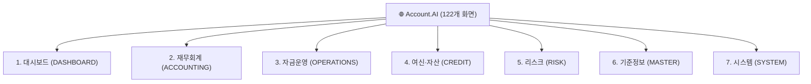

# 📐 Account.AI 종합 화면 레이아웃 & 화면 리스트 설계서 (UI Specification)

본 문서는 **Account.AI 재무회계 및 자산운용 시스템**의 전체적인 페이지 레이아웃 구조, 네비게이션 체계, 7대 업무 도메인별 **122개 화면 리스트 명세**를 총정리한 표준 화면 설계서입니다.

---

## 1. 🏛️ 전체 페이지 레이아웃 구조 설계 (Global Page Layout)

전체 화면은 **K-Bank 핀테크 디자인 시스템**을 기반으로 상단 글로벌 헤더, 좌측 반응형 사이드바, 중앙 메인 워크스페이스, 하단 미니멀 푸터의 4단 구조로 구성됩니다.

```
┌───────────────────────────────────────────────────────────────────────────────────┐
│ [TopHeader] (72px 고정, z-index: 90)                                              │
│ [7대 업무 도메인 탭]  DASHBOARD │ ACCOUNTING │ OPERATIONS │ ...  │ 🔍검색 │ 🌙테마 │ 👤세션 │
├──────────────┬────────────────────────────────────────────────────────────────────┤
│ [Sidebar]    │ [Main Workspace] (최대 폭: 1600px, 반응형 그리드)                   │
│ (280px/80px) │                                                                    │
│              │ 1. [PageHeader]                                                    │
│ 🏢 로고      │    • 빵부스러기(Breadcrumb): 대시보드 > 통합 재무 현황              │
│ Account.AI   │    • 화면 타이틀, 서브 설명, 페이지 전용 액션 버튼                   │
│              │                                                                    │
│ 📂 업무 메뉴 │ 2. [Summary KPI Metric Cards] (3~4열 그리드)                        │
│ • 메뉴 1     │    • KBank 퓨어 화이트 카드 (다크: 슬레이트 네이비 카드)              │
│ • 메뉴 2     │    • 핵심 재무 지표, 전표 수치, 상태 뱃지                           │
│ • 메뉴 3     │                                                                    │
│              │ 3. [Main Data Table / Charts / Forms]                              │
│ ⚙️ 시스템설정 │    • 검색/필터 바 (Tabs, Search Input, Date Picker)                 │
│              │    • 금융 데이터 그리드 테이블 또는 Recharts 시각화 차트             │
├──────────────┴────────────────────────────────────────────────────────────────────┤
│ [Footer] (44px, 저작권 표시 및 Runtime 실행 환경 상태 뱃지)                         │
└───────────────────────────────────────────────────────────────────────────────────┘
```

### 주요 레이아웃 규격
* **사이드바(Sidebar)**: 기본 `280px`, 접힘 모드(Collapsed) 시 `80px`로 부드럽게 애니메이션(`transition-all 500ms`)
* **상단 헤더(TopHeader)**: `h-[72px]`, 스크롤 시 상단 고정(`fixed top-0`), 프로스트 글래스 효과(`backdrop-blur-md`)
* **메인 콘텐츠 영역(Main Workspace)**:
  * 사이드바 상태에 따라 `ml-[280px]` ↔ `ml-20` 자동 여백 조정
  * 최대 너비 `max-w-[1600px]`, 상단 패딩 `pt-[105px]`
* **테마 토큰**:
  * **라이트**: 캔버스 `#f7f8fb` + 화이트 카드 `#ffffff` + 테두리 `#eaedf4` + 메인 텍스트 `#17191e`
  * **다크**: 딥 네이비 `#0b0f19` + 다크 카드 `#131b2e` + 테두리 `#1e293b` + 메인 텍스트 `#f8fafc`

---

## 2. 🗂️ 7대 비즈니스 도메인별 화면 리스트 설계서 (122 Static Screens)

우리 시스템의 모든 122개 화면은 상단 7개 카테고리 탭과 연동되어 있습니다.



---

### ① 대시보드 (DASHBOARD)
| 화면명 | URL 경로 | 주요 기능 및 컴포넌트 |
| :--- | :--- | :--- |
| **통합 재무 현황** | `/` | 3대 재무 KPI 카드, 6개월 자산/부채 추이 AreaChart, 최근 발생 전표 리스트 |
| **통합 로그인/인증** | `/login` | SSO 원클릭 로그인, LDAP + OTP (2단계 MFA) 다중 인증, 데모 세션 발급 |
| **개인 액세스 토큰** | `/profile/pat` | 개발자/운영자용 PAT 토큰 발급, 만료일 관리, 폐기(Revoke) |

---

### ② 재무회계 (ACCOUNTING)
| 그룹 | 화면명 | URL 경로 | 주요 기능 명세 |
| :--- | :--- | :--- | :--- |
| **전표 & 분개** | 전표 등록 | `/journal/entry` | 차/대변 자동 대차평형 검증, 계정코드 검색, 적요 입력 |
| | 전표 조회 | `/journal/list` | 기간별/상태별(확정/승인/대기) 전표 필터링 및 상세 검토 |
| | 자동 분개 규칙 | `/journal/rules` | 거래 유형별(매출/매입/비용) 자동 분개 템플릿 매핑 |
| **원장 관리** | 총계정원장(GL) | `/ledger/gl` | 계정별 총괄 시산표, 전기/당기 잔액 비교 |
| | 보조원장(SL) | `/ledger/sl` | 거래처별/부서별 세부 보조원장 원면 조회 |
| | 미결 정산 | `/ledger/unsettled` | 미결 전표 및 가수금/가지급금 반제 정산 |
| **결산 관리** | 결산 대시보드 | `/closing` | 월차/분기/연차 결산 진행률 파이프라인 및 단계별 상태 |
| | 결산 일정 캘린더 | `/closing/calendar` | D-Day 기반 결산 태스크 스케줄러 |
| | 결산 게이트 점검 | `/closing/gates` | 사전 검증 게이트(대차불일치 0건, 미결정산 0건) 통과 여부 |
| | 기말 평가 및 감가상각 | `/closing/valuation` | 외화 환산손익 평가 및 유형자산 감가상각 전표 자동 생성 |
| | 결산 마감 및 잠금 | `/closing/period-lock` | 회계 기수별 전표 입력 통제 및 마감 잠금(Lock) |
| **재무제표 & 보고서** | 재무제표 출력 | `/reports/statements` | 재무상태표(BS), 손익계산서(PL), 현금흐름표(CF) |
| | 주석 공시 명세 | `/reports/disclosure-notes` | IFRS 기준 주석 데이터 추출 및 검증 |
| | 금융감독원 규제보고서 | `/reports/regulatory` | 업무보고서 및 건전성 규제 보고 데이터 생성 |
| | 엑셀/PDF 내보내기 | `/reports/export` | 대용량 보고서 비동기 다운로드 |

---

### ③ 자금운영 (OPERATIONS)
| 그룹 | 화면명 | URL 경로 | 주요 기능 명세 |
| :--- | :--- | :--- | :--- |
| **지출 및 집행** | 지출결의서 작성 | `/expenditure/resolution` | 다단계 결재선 지정, 공급가액/부가세 자동 분리 계산 |
| | 지출 승인 워크플로 | `/expenditure/approval` | 결재 대기건 전자 서명 승인/반려 및 코멘트 |
| | 지급 실행 (Payment Run)| `/expenditure/payment` | 출금 계좌 선택, 지출결의/매입채무 일괄 펌뱅킹 이체 |
| | 선급금 관리 | `/expenditure/advance` | 사전 선급금 등록 및 매입채무(AP) 발생 시 맞교환 상계 |
| **채권/채무** | 매입채무(AP) 관리 | `/expenditure/payable` | 세금계산서 기반 지급 기일 및 연체 관리 |
| | 매출채권(AR) 관리 | `/expenditure/receivable` | 외상매출금 회수 기일 및 미수금 연령 분석 |
| | 수금/회수 처리 | `/expenditure/collection` | 가상계좌/펌뱅킹 입금 내역 수금 대사 |
| **예산 & 수지** | 예산 편성 및 통제 | `/expenditure/budget` | 부서별/계정별 연간 예산 배정액 및 집행률 모니터링 |
| | 일일 자금수지표 | `/expenditure/cashflow` | 일별 자금 유입/유출 추이 및 가용 잔액 예측 |
| **세무 관리** | 전자세금계산서(매출) | `/tax/sales` | 홈택스 연동 매출 세금계산서 발행 및 국세청 전송 |
| | 전자세금계산서(매입) | `/tax/purchase` | 매입 세금계산서 불공제 처리 및 매입세액 공제 검증 |
| | 부가세 신고서 | `/tax/vat` | 과세표준 명세서 및 예정/확정 부가세 신고 |
| | 국세청 홈택스 진위확인 | `/tax/nts-verification` | 국세청 발급번호 24자리 스크래핑 진위 검증 |

---

### ④ 여신·자산 (CREDIT)
| 그룹 | 화면명 | URL 경로 | 주요 기능 명세 |
| :--- | :--- | :--- | :--- |
| **여신 및 대출** | 여신 계약 원장 | `/loan/contracts` | 대출 원금, 약정 이자율, 상환 방식(원리금균등/만기일시) |
| | 상환 스케줄러 | `/loan/amortization` | 회차별 원금/이자 상환 스케줄 및 중도상환 수수료 계산 |
| | 수신/예적금 관리 | `/loan/deposit` | 법인 정기예금/MMF 이자수익 계산 및 만기 해지 |
| | 대출 집행 처리 | `/loan/disbursal` | 심사 완료 대출 건 실시간 계좌 입금 실행 |
| **고정자산 & IFRS 16** | 유형/무형자산 원장 | `/fair-value/assets` | 자산 취득가액, 내용연수, 잔존가치, 상각방법(정액/정률) |
| | IFRS 16 리스 계약 | `/fair-value/lease` | 사용권자산(ROU) 및 리스부채 최초 측정 및 현재가치 할인 |
| | 리스 월차 결산 | `/fair-value/lease-monthly` | 리스료 지급, 이자비용 인식 및 감가상각비 전표 생성 |
| | 리스 조건변경/재측정 | `/fair-value/lease-remeasure` | 리스기간 연장/리스료 변동에 따른 자산/부채 재측정 |
| | 자산 재평가 | `/fair-value/revaluation` | 공정가치 모델에 따른 재평가잉여금 인식 |
| | 자산 처분/폐기 | `/fair-value/disposal` | 자산 매각/폐기 시 처분손익 자동 계산 |

---

### ⑤ 리스크 (RISK)
| 그룹 | 화면명 | URL 경로 | 주요 기능 명세 |
| :--- | :--- | :--- | :--- |
| **대손충당금 (ECL)** | IFRS 9 ECL 산출 실행 | `/ecl/results` | Stage 1 (12개월), Stage 2/3 (전체기간) 대손충당금 계산 |
| | 부도율(PD)/손실률(LGD) | `/ecl/parameters` | 거시경제 시나리오별 가중치 및 리스크 파라미터 관리 |
| | 익스포저(EAD) 분석 | `/ecl/ead` | 차주별/상품별 신용 익스포저 한도 분석 |
| | 스테이지 전이 분석 | `/ecl/stage-transition` | 신용등급 변동 및 연체일에 따른 Stage 1 ➡ 2 ➡ 3 전이 모니터링 |
| | ECL 배치 스케줄러 | `/ecl/batch` | 대용량 여신 데이터 배치 연동 |
| **재무 마트 & 대사** | 원장-보조원장 대사 | `/mart/reconciliation-run` | GL과 SL 간 잔액 불일치 건 1초 자동 대사 |
| | 대사 차이 분석기 | `/mart/reconciliation-diff` | 원인 불명 차이 건 추적 및 조정 전표 연계 |
| | 시장금리/수익률곡선 | `/mart/yield-curves` | 한국은행/금융투자협회 무위험 국고채 수익률 곡선 |
| | 데이터 품질(DQ) 감사 | `/mart/dq-audit` | Null 체크, 코드 유효성, 무결성 제약조건 DQ 점검 |

---

### ⑥ 기준정보 (MASTER)
| 그룹 | 화면명 | URL 경로 | 주요 기능 명세 |
| :--- | :--- | :--- | :--- |
| **계정 & 거래처** | 표준 계정과목 체계 | `/master/account` | 5대 계정(자산, 부채, 자본, 수익, 비용) 계층형 Tree 조회 |
| | 거래처(Partner) 원장 | `/master/partner` | 사업자등록번호, 대표자, 업태/종목, 지급 계좌 관리 |
| | 거래처 승인 워크플로 | `/partner/approval` | 신규 거래처 등록 심사 및 휴폐업 조회 |
| | 조직/부서 관리 | `/master/dept` | 본부/실/팀 조직도 및 코스트센터(Cost Center) 매핑 |
| | 결재선 마스터 | `/master/approval` | 금액별(1천만/5천만/1억) 전결 규정 매트릭스 |

---

### ⑦ 시스템 (SYSTEM)
| 그룹 | 화면명 | URL 경로 | 주요 기능 명세 |
| :--- | :--- | :--- | :--- |
| **보안 & 거버넌스** | 사용자 및 계정 관리 | `/system/users` | 사용자 생성, 부서 발령, 계정 잠금/해제 |
| | 역할(Role) & 메뉴 권한 | `/system/menus` | RBAC 매트릭스(Admin, Manager, User별 메뉴 접근 제어) |
| | 직무분리(SoD) 매트릭스 | `/system/sod-matrix` | 전표 작성자와 승인자 겸직 금지 SoD 충돌 감사 |
| | 감사 추적 로그(Audit) | `/system/logs` | 모든 사용자 행위(조회, 수정, 승인, 엑셀다운) 감사 로그 |
| | PAT 토큰 거버넌스 | `/system/tokens` | 시스템 간 통신용 토큰 만료 관리 및 강제 회수 |

---

## 3. 🧩 공통 UI 컴포넌트 표준 명세

| 컴포넌트명 | 파일 경로 | 주요 Props & 역할 |
| :--- | :--- | :--- |
| **`PageHeader`** | `src/components/ui/PageHeader.tsx` | `title`, `description`, `breadcrumbs`, `icon`, `actions` |
| **`StatusBadge`** | `src/components/ui/StatusBadge.tsx` | `status`, `variant` (`success`\|`warning`\|`error`\|`info`\|`neutral`) |
| **`AmountDisplay`** | `src/components/ui/AmountDisplay.tsx` | `amount`, `currency`, `showSign` (금융 정밀 금액 렌더러) |
| **`Tabs`** | `src/components/ui/Tabs.tsx` | `tabs`, `activeTab`, `onChange` (세그먼트 탭 컨트롤) |
| **`EmptyState`** | `src/components/ui/EmptyState.tsx` | `icon`, `title`, `description`, `action` (데이터 없음 안내) |
| **`LoadingSkeleton`**| `src/components/ui/LoadingSkeleton.tsx` | `rows`, `height` (부드러운 스켈레톤 로딩 애니메이션) |

---

## 4. 📚 관련 문서 링크
* [🐣 프론트엔드 초보자 가이드](./beginner-guide.md)
* [🛠️ 실전 개발 가이드](./development-guide.md)
* [🚀 빌드 & 배포 완전 정복 가이드](./build-deploy-guide.md)
* [🖥️ 화면 인벤토리 명세](./screen-inventory.md)
