# 📐 Account.AI 종합 화면 레이아웃 & 6대 메가 그룹 16대 모듈 화면 설계서

본 문서는 **Account.AI 재무회계 및 자산운용 시스템**의 4단 반응형 레이아웃 구조와 **상단 6대 메가 비즈니스 그룹 + 사이드바 16개 마이크로서비스(MSA) 모듈 분리 체계 및 122개 화면 상세 명세서**입니다.

---

## 1. 🏛️ 전체 페이지 레이아웃 구조 설계 (Global Page Layout)

전체 화면은 **K-Bank 핀테크 디자인 시스템**을 기반으로 상단 글로벌 헤더, 좌측 반응형 사이드바, 중앙 메인 워크스페이스, 하단 미니멀 푸터의 4단 구조로 구성됩니다.

```
┌───────────────────────────────────────────────────────────────────────────────────┐
│ 1. [TopHeader] (72px 고정, z-index: 90)                                            │
│   • 스크롤바 제로! 한눈에 들어오는 6대 메가 그룹 바                                   │
│     [📊 대시보드] [📝 회계·결산] [💳 자금·세무] [🏦 금융·자산] [📉 리스크·데이터] [⚙️ 거버넌스·시스템] │
│   • 🔍 빠른 검색 │ 🌙/☀️ 다크·라이트 토글 버튼 │ 👤 사용자 프로필 & 세션                   │
├──────────────┬────────────────────────────────────────────────────────────────────┤
│ 2. [Sidebar] │ 3. [Main Workspace] (최대 폭: 1600px, 반응형 그리드)                │
│ (280px/80px) │                                                                    │
│              │ ① [PageHeader]                                                     │
│ 🏢 로고      │    • 빵부스러기(Breadcrumb): 회계·결산 > 결산 마감 > 결산 캘린더     │
│ Account.AI   │    • 화면 타이틀, 업무 설명문, 화면 전용 액션 버튼                   │
│              │                                                                    │
│ 📂 16대 모듈 │ ② [Summary KPI Metric Cards] (3~4열 그리드)                        │
│ 🏷️ [closing] │    • KBank 화이트 카드 (다크: 슬레이트 네이비 카드)                 │
│ • 결산 캘린더 │    • 핵심 재무 수치, 미결 잔액, 상태 뱃지                           │
│ • 게이트 점검 │                                                                    │
│              │ ③ [Main Data Area]                                                 │
│ 🏷️ [reports] │    • 검색/필터 바 (Tabs, Search Input, Date Picker)                 │
│ • 재무제표    │    • 금융 데이터 그리드 테이블 또는 Recharts 시각화 차트             │
├──────────────┴────────────────────────────────────────────────────────────────────┤
│ 4. [Footer] (44px, 시스템 저작권 및 런타임 환경 상태 뱃지)                         │
└───────────────────────────────────────────────────────────────────────────────────┘
```

---

## 2. 🗂️ 6대 메가 그룹 ↔ 16대 MSA 모듈 1:1 매핑 명세

```mermaid
graph TD
    Root["🌐 Account.AI 6대 메가 그룹"]
    Root --> G1["1. 대시보드 (DASHBOARD) - BFF"]
    Root --> G2["2. 회계·결산 (ACCOUNTING)"]
    Root --> G3["3. 자금·세무 (OPERATIONS)"]
    Root --> G4["4. 금융·자산 (BANKING_ASSET)"]
    Root --> G5["5. 리스크·데이터 (RISK_DATA)"]
    Root --> G6["6. 거버넌스·시스템 (GOVERNANCE_SYSTEM)"]

    G2 --> M1["🏷️ journal-ledger (분개 및 원장)"]
    G2 --> M2["🏷️ closing (결산 마감)"]
    G2 --> M3["🏷️ reporting (재무제표 및 보고서)"]

    G3 --> M4["🏷️ expenditure-resolution / payable (지출 및 지급)"]
    G3 --> M5["🏷️ budget (예산 및 자금수지)"]
    G3 --> M6["🏷️ tax (세무 및 세금계산서)"]

    G4 --> M7["🏷️ loan (여신 및 대출)"]
    G4 --> M8["🏷️ deposit (수신 및 법인계좌)"]
    G4 --> M9["🏷️ asset-lease (고정자산 및 리스회계)"]

    G5 --> M10["🏷️ ecl (IFRS 9 대손충당금)"]
    G5 --> M11["🏷️ reconciliation (원장 자동 대사)"]
    G5 --> M12["🏷️ account-mart (재무 데이터마트)"]

    G6 --> M13["🏷️ master-data (계정과목 & 거래처)"]
    G6 --> M14["🏷️ internal-audit (내부통제 & 감사)"]
    G6 --> M15["🏷️ admin / auth (시스템 & 보안)"]
```



---

### 📋 6대 그룹별 16개 마이크로서비스 상세 화면 목록

#### ① 대시보드 (`DASHBOARD`)
* **매핑 모듈**: `BFF (Frontend)`
* **화면 목록**:
  * `/`: 통합 재무 현황 (KPI 카드, 자산/부채 추이 차트, 최근 전표)
  * `/login`: 통합 로그인/인증 (SSO, LDAP + OTP 2단계 MFA)
  * `/profile/pat`: 개발자/운영자용 PAT 토큰 발급 및 거버넌스

#### ② 회계·결산 (`ACCOUNTING`)
* **포함 백엔드 모듈**: `journal-ledger`, `closing`, `reporting`
* **사이드바 독립 섹션 & 화면**:
  * **[journal-ledger] 분개 및 원장 관리**:
    * `/ledger/entry`: 전표 입력 (대차평형 자동 검증)
    * `/ledger/list`: 전표 조회 및 라인 검토
    * `/ledger/gl`: 총계정원장(GL) 총괄 시산표
    * `/ledger/sl`: 보조원장(SL) 세부 원면
    * `/ledger/rules`: 자동 분개 규칙 템플릿
    * `/ledger/unsettled`: 미결항목 정리 및 반제
  * **[closing] 결산 마감 프로세스**:
    * `/closing/calendar`: 결산 일정 캘린더
    * `/closing/tasks`: 결산 태스크 진행 관리
    * `/closing/gates`: 결산 사전 검증 게이트
    * `/closing/period-lock`: 회계 기수별 전표 마감 잠금
    * `/closing/valuation`: 외화 환산손익 평가 배치
    * `/closing/adjustment`: 결산 조정 전표 발행
    * `/closing/annual`: 연차 결산 및 이월
  * **[reporting] 재무제표 및 공시 보고서**:
    * `/reports/statements`: 재무제표(BS/PL/CF) 조회
    * `/reports/export`: 보고서 비동기 내보내기
    * `/reports/disclosure-notes`: IFRS 주석 정보 마트
    * `/reports/regulatory`: 금감원 규제 보고 제출

#### ③ 자금·세무 (`OPERATIONS`)
* **포함 백엔드 모듈**: `expenditure-resolution`, `payable`, `receivable`, `budget`, `tax`
* **사이드바 독립 섹션 & 화면**:
  * **[expenditure-resolution / payable] 지출 및 지급 집행**:
    * `/expenditure/resolution`: 지출결의서 작성
    * `/expenditure/approval`: 지출 전자 결재 승인
    * `/expenditure/payment`: 지급 실행 (Payment Run)
    * `/expenditure/advance`: 선급금 관리 및 AP 상계
    * `/expenditure/payable`: 매입채무(AP) 만기 관리
    * `/expenditure/receivable`: 매출채권(AR) 연령 분석
    * `/expenditure/collection`: 수금 관리 및 가상계좌 대사
  * **[budget] 예산 및 자금수지**:
    * `/expenditure/budget`: 부서별 연간 예산 편성 및 집행 통제
    * `/expenditure/cashflow`: 일일 자금수지 계획표
  * **[tax] 세무 및 세금계산서**:
    * `/tax/purchase`: 매입 세금계산서 관리
    * `/tax/sales`: 매출 전자세금계산서 발행
    * `/tax/vat`: 부가세 신고서
    * `/tax/nts-verification`: 국세청 홈택스 진위확인

#### ④ 금융·자산 (`BANKING_ASSET`)
* **포함 백엔드 모듈**: `loan`, `deposit`, `asset-lease`
* **사이드바 독립 섹션 & 화면**:
  * **[loan] 여신 및 대출 관리**:
    * `/loan/contracts`: 대출 계약 원장
    * `/loan/disbursal`: 대출 실행 및 계좌 입금
    * `/loan/deferred`: 이연 대출 수수료/원가
    * `/loan/amortization`: EIR 상환 스케줄러
    * `/loan/events`: 대출 중도상환/만기연장 이벤트
  * **[deposit] 수신 및 법인 예적금**:
    * `/loan/deposit`: 법인 정기예금/MMF 계좌 원장
  * **[asset-lease] 고정자산 및 IFRS 16 리스**:
    * `/fair-value/assets`: 유형/무형 고정자산 대장
    * `/fair-value/depreciation`: 감가상각 실행
    * `/fair-value/disposal`: 자산 매각/처분/폐기
    * `/fair-value/revaluation`: 공정가치 재평가/손상
    * `/fair-value/lease`: IFRS 16 리스 계약
    * `/fair-value/lease-monthly`: 리스 월차 결산
    * `/fair-value/lease-remeasure`: 리스 재측정

#### ⑤ 리스크·데이터 (`RISK_DATA`)
* **포함 백엔드 모듈**: `ecl`, `reconciliation`, `account-mart`
* **사이드바 독립 섹션 & 화면**:
  * **[ecl] IFRS 9 대손충당금**:
    * `/ecl/batch`: ECL 대량 산출 관제탑
    * `/ecl/exposures`: 여신 신용 익스포저(EAD) 분석
    * `/ecl/parameters`: PD/LGD 모델 파라미터
    * `/ecl/results`: IFRS 9 기대신용손실 산출 결과
    * `/ecl/ead`: EAD 엔진 검증 및 스트레스 테스트
  * **[reconciliation] 원장·보조원장 자동 대사**:
    * `/mart/reconciliation-setup`: 대사 규칙 설정
    * `/mart/reconciliation-run`: 대사 배치 실행
    * `/mart/reconciliation-diff`: 차이 원인 분석 및 해소
  * **[account-mart] 재무 데이터 마트 & 시장정보**:
    * `/mart/explorer`: 마트 탐색기
    * `/mart/dq-audit`: DQ 품질 감사
    * `/mart/exchange-rates`: 실시간 환율 관리
    * `/mart/market-rates`: 시장금리 관리
    * `/mart/yield-curves`: 국고채 무위험 수익률곡선

#### ⑥ 거버넌스·시스템 (`GOVERNANCE_SYSTEM`)
* **포함 백엔드 모듈**: `master-data`, `internal-audit`, `admin`, `auth`
* **사이드바 독립 섹션 & 화면**:
  * **[master-data] 기준정보 관리**:
    * `/account-code/tree`: 표준 계정과목 Tree
    * `/account-code/manage`: 계정과목 등록/수정
    * `/account-code/products`: 상품 코드 관리
    * `/partner/list`: 거래처 조회/등록
    * `/master-data/partner`: 거래처 변경 승인
    * `/system/departments`: 조직 및 부서 관리
  * **[internal-audit] 내부통제 & 감사**:
    * `/governance/audit-logs`: 감사 추적 로그 탐색기
    * `/governance/rbac`: 역할/권한 매트릭스(RBAC)
    * `/governance/controls`: 내부회계 K-SOX 점검 체크리스트
  * **[admin/auth] 시스템 계정 & 보안**:
    * `/system/users`: 사용자 계정 관리
    * `/system/menus`: 메뉴 권한 관리
    * `/system/tokens`: PAT 토큰 거버넌스
    * `/system/logs`: 시스템 실행 로그
