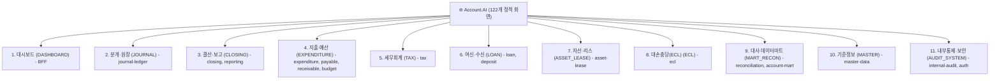

# 📐 Account.AI 종합 화면 레이아웃 & 백엔드 MSA 모듈 직결 화면 리스트 설계서

본 문서는 **Account.AI 재무회계 및 자산운용 시스템**의 4단 반응형 레이아웃 구조와 **백엔드 16개 마이크로서비스(MSA) 모듈 경계와 1:1로 직결되는 11대 대메뉴 및 122개 화면 상세 명세서**입니다.

---

## 1. 🏛️ 전체 페이지 레이아웃 구조 설계 (Global Page Layout)

전체 화면은 **K-Bank 핀테크 디자인 시스템**을 기반으로 상단 글로벌 헤더, 좌측 반응형 사이드바, 중앙 메인 워크스페이스, 하단 미니멀 푸터의 4단 구조로 구성됩니다.

```
┌───────────────────────────────────────────────────────────────────────────────────┐
│ 1. [TopHeader] (72px 고정, z-index: 90)                                            │
│   • 백엔드 MSA 모듈 직결 11대 대메뉴 바 (가로 스크롤 & 퀵 필터링)                       │
│     [대시보드] [분개·원장] [결산·보고] [지출·예산] [세무회계] [여신·수신] [자산·리스] ...    │
│   • 🔍 빠른 검색 │ 🌙/☀️ 다크·라이트 토글 버튼 │ 👤 사용자 프로필 & 세션                   │
├──────────────┬────────────────────────────────────────────────────────────────────┤
│ 2. [Sidebar] │ 3. [Main Workspace] (최대 폭: 1600px, 반응형 그리드)                │
│ (280px/80px) │                                                                    │
│              │ ① [PageHeader]                                                     │
│ 🏢 로고      │    • 빵부스러기(Breadcrumb): 대시보드 > 자금운영 > 선급금 관리     │
│ Account.AI   │    • 화면 타이틀, 업무 설명문, 화면 전용 액션 버튼                   │
│              │                                                                    │
│ 📂 업무 메뉴 │ ② [Summary KPI Metric Cards] (3~4열 그리드)                        │
│ • 메뉴 1     │    • KBank 화이트 카드 (다크: 슬레이트 네이비 카드)                 │
│ • 메뉴 2     │    • 핵심 재무 수치, 미결 잔액, 상태 뱃지                           │
│ • 메뉴 3     │                                                                    │
│              │ ③ [Main Data Area]                                                 │
│ ⚙️ 시스템설정 │    • 검색/필터 바 (Tabs, Search Input, Date Picker)                 │
│              │    • 금융 데이터 그리드 테이블 또는 Recharts 시각화 차트             │
├──────────────┴────────────────────────────────────────────────────────────────────┤
│ 4. [Footer] (44px, 시스템 저작권 및 런타임 환경 상태 뱃지)                         │
└───────────────────────────────────────────────────────────────────────────────────┘
```

---

## 2. 🗂️ 백엔드 MSA 모듈 직결 11대 대메뉴 & 화면 리스트 (122 Static Screens)

프론트엔드 상단 11개 탭은 백엔드 16대 마이크로서비스 모듈과 1:1로 직접 매핑됩니다.



---

### ① 대시보드 (`DASHBOARD`)
* **매핑 백엔드 모듈**: `frontend (BFF)`
* **화면 목록**:
  * `/`: 통합 재무 현황 (KPI 카드, 자산/부채 추이 차트, 최근 전표)
  * `/login`: 통합 로그인/인증 (SSO, LDAP + OTP 2단계 MFA)
  * `/profile/pat`: 개발자/운영자용 PAT 토큰 발급 및 거버넌스

---

### ② 분개·원장 (`JOURNAL`)
* **매핑 백엔드 모듈**: `journal-ledger:core`, `journal-ledger:api`, `journal-ledger:batch`
* **화면 목록**:
  * `/ledger/entry`: 전표 입력 (차/대변 자동 대차평형 검증)
  * `/ledger/list`: 전표 조회 및 상세 전표 라인 검토
  * `/ledger/gl`: 총계정원장(GL) 총괄 시산표
  * `/ledger/sl`: 보조원장(SL) 거래처/부서별 세부 원면
  * `/ledger/rules`: 자동 분개 규칙 템플릿 매핑
  * `/ledger/unsettled`: 미결항목 정리 및 반제 정산

---

### ③ 결산·보고 (`CLOSING`)
* **매핑 백엔드 모듈**: `closing:*`, `reporting:*`
* **화면 목록**:
  * `/closing/calendar`: 결산 일정 캘린더
  * `/closing/tasks`: 단계별 결산 태스크 진행 현황
  * `/closing/gates`: 결산 사전 검증 게이트(대차불일치 0건 등)
  * `/closing/period-lock`: 회계 기수별 전표 마감 잠금(Lock)
  * `/closing/valuation`: 외화 환산손익 평가 배치
  * `/closing/adjustment`: 결산 조정 전표 발행
  * `/closing/annual`: 연차 결산 및 이월
  * `/reports/statements`: 재무제표(BS, PL, CF) 조회
  * `/reports/export`: 대용량 보고서 비동기 내보내기
  * `/reports/disclosure-notes`: IFRS 주석 공시 정보 마트
  * `/reports/regulatory`: 금융감독원 규제 보고 제출

---

### ④ 지출·예산 (`EXPENDITURE`)
* **매핑 백엔드 모듈**: `expenditure-resolution:*`, `payable:*`, `receivable:*`, `budget:*`
* **화면 목록**:
  * `/expenditure/resolution`: 지출결의서 작성
  * `/expenditure/approval`: 지출 전자 결재 승인/반려
  * `/expenditure/payment`: 지급 실행 (Payment Run, 펌뱅킹 이체)
  * `/expenditure/advance`: 선급금 관리 및 AP 맞교환 상계
  * `/expenditure/payable`: 매입채무(AP) 만기 관리
  * `/expenditure/receivable`: 매출채권(AR) 연령 분석
  * `/expenditure/collection`: 수금 관리 및 가상계좌 대사
  * `/expenditure/budget`: 부서별 연간 예산 편성 및 집행 통제
  * `/expenditure/cashflow`: 일일 자금수지 계획 및 현금흐름 예측

---

### ⑤ 세무회계 (`TAX`)
* **매핑 백엔드 모듈**: `tax:*`
* **화면 목록**:
  * `/tax/purchase`: 매입 세금계산서 관리 및 불공제 처리
  * `/tax/sales`: 매출 전자세금계산서 발행 및 국세청 전송
  * `/tax/vat`: 부가세 신고서 및 과세표준 명세서
  * `/tax/nts-verification`: 국세청 홈택스 24자리 발급번호 진위 검증

---

### ⑥ 여신·수신 (`LOAN`)
* **매핑 백엔드 모듈**: `loan:*`, `deposit:*`
* **화면 목록**:
  * `/loan/contracts`: 대출 계약 원장 (원금, 이자율, 상환 방식)
  * `/loan/disbursal`: 대출 실행 및 실시간 계좌 입금
  * `/loan/deferred`: 이연 대출 수수료/부대원가 관리
  * `/loan/amortization`: 유효이자율(EIR) 원리금 상환 스케줄러
  * `/loan/events`: 대출 중도상환/만기연장 이벤트 처리
  * `/loan/deposit`: 법인 정기예금/MMF 계좌 원장

---

### ⑦ 자산·리스 (`ASSET_LEASE`)
* **매핑 백엔드 모듈**: `asset-lease:*`
* **화면 목록**:
  * `/fair-value/assets`: 유형 및 무형 고정자산 대장
  * `/fair-value/depreciation`: 월차 감가상각비 계산 및 전표 생성
  * `/fair-value/disposal`: 자산 매각/처분/폐기 손익 계산
  * `/fair-value/revaluation`: 공정가치 재평가 및 손상차손
  * `/fair-value/lease`: IFRS 16 사용권자산(ROU) 및 리스부채 계약
  * `/fair-value/lease-monthly`: 리스 월차 결산 (이자/상각 인식)
  * `/fair-value/lease-remeasure`: 리스 조건변경 및 재측정

---

### ⑧ 대손충당(ECL) (`ECL`)
* **매핑 백엔드 모듈**: `ecl:ecl-*`
* **화면 목록**:
  * `/ecl/batch`: ECL 대량 산출 배치 관제탑
  * `/ecl/exposures`: 여신 신용 익스포저(EAD) 한도 분석
  * `/ecl/parameters`: 부도율(PD), 손실률(LGD) 거시경제 모델 파라미터
  * `/ecl/results`: IFRS 9 Stage 1, 2, 3 기대신용손실 산출 결과
  * `/ecl/ead`: EAD 엔진 검증 및 스트레스 테스트

---

### ⑨ 대사·데이터마트 (`MART_RECON`)
* **매핑 백엔드 모듈**: `reconciliation:*`, `account-mart:mart-*`
* **화면 목록**:
  * `/mart/reconciliation-setup`: 원장-보조원장 일일 대사 규칙 설정
  * `/mart/reconciliation-run`: 대사 배치 실행 및 실시간 검증
  * `/mart/reconciliation-diff`: 차이 원인 분석 및 조정 전표 연계
  * `/mart/explorer`: 재무 데이터 마트 탐색기
  * `/mart/dq-audit`: 데이터 품질(DQ) 무결성 감사
  * `/mart/exchange-rates`: 실시간 매매기준율 환율 관리
  * `/mart/market-rates`: 한국은행/금융투자협회 시장금리
  * `/mart/yield-curves`: 국고채 무위험 수익률 곡선

---

### ⑩ 기준정보 (`MASTER`)
* **매핑 백엔드 모듈**: `master-data:*`
* **화면 목록**:
  * `/account-code/tree`: 5대 표준 계정과목 계층형 Tree
  * `/account-code/manage`: 계정과목 등록/수정
  * `/account-code/products`: 금융 상품 코드 매핑
  * `/partner/list`: 거래처(Partner) 조회 및 사업자등록번호 관리
  * `/master-data/partner`: 거래처 기준정보 변경 승인
  * `/system/departments`: 본부/실/팀 조직도 및 코스트센터

---

### ⑪ 내부통제·보안 (`AUDIT_SYSTEM`)
* **매핑 백엔드 모듈**: `internal-audit:*`, `auth:*`
* **화면 목록**:
  * `/governance/audit-logs`: 전표/마스터 변경 감사 로그 탐색기
  * `/governance/rbac`: 역할/권한 매트릭스 (RBAC)
  * `/governance/controls`: 내부회계관리제도(K-SOX) 통제 체크리스트
  * `/system/users`: 시스템 사용자 계정 관리 및 부서 발령
  * `/system/menus`: 메뉴별 접근 권한 설정
  * `/system/tokens`: PAT 및 시스템 통신용 토큰 거버넌스
  * `/system/logs`: 애플리케이션 시스템 로그

---

## 3. 🧩 공통 UI 컴포넌트 표준 명세

| 컴포넌트명 | 파일 경로 | 주요 역할 |
| :--- | :--- | :--- |
| **`PageHeader`** | `src/components/ui/PageHeader.tsx` | 타이틀, 빵부스러기 네비게이션, 액션 버튼 |
| **`StatusBadge`** | `src/components/ui/StatusBadge.tsx` | 승인 상태, 결재 단계 뱃지 (`success`, `warning`, `error`, `info`) |
| **`AmountDisplay`** | `src/components/ui/AmountDisplay.tsx` | 정밀 금액 렌더러 (`₩`, 천단위 콤마, 음수 빨강) |
| **`Tabs`** | `src/components/ui/Tabs.tsx` | KBank 스타일 소프트-필 탭 컨트롤 |
| **`EmptyState`** | `src/components/ui/EmptyState.tsx` | 데이터 없음 안내 |
| **`LoadingSkeleton`**| `src/components/ui/LoadingSkeleton.tsx` | 스켈레톤 로딩 애니메이션 |
