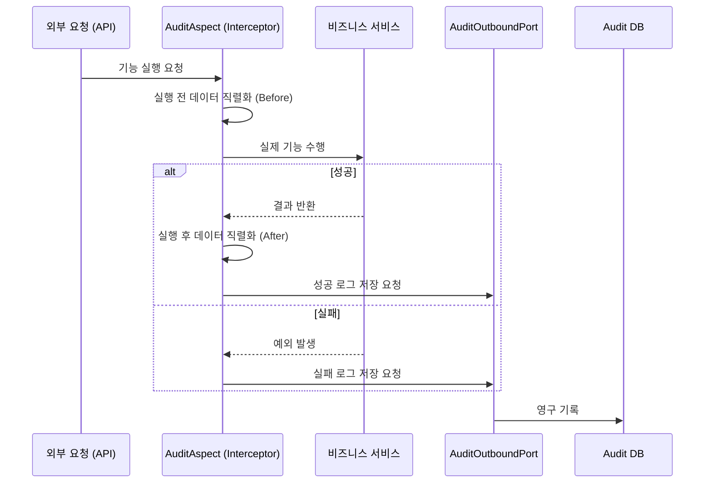
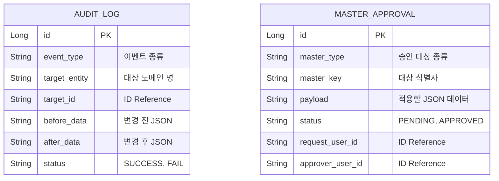

# 🛡️ Governance Service (감사 및 승인 통제)

`governance` 모듈은 회계 플랫폼의 "감사, 통제, 승인"을 담당합니다. "누가 무엇을 했는지 남기고, 누가 무엇을 할 수 있는지 통제하고, 중요한 변경은 승인받게 만드는" 역할을 합니다.

---

## 1. 🐣 초보자를 위한 개념 설명 (Beginner Guide)

**시스템의 블랙박스이자 깐깐한 문지기입니다.**
1. **감사 로그 (Audit Log):** 비행기의 블랙박스입니다. 누가 언제 어떤 화면에서 어떤 버튼을 눌렀고, 그 결과 데이터가 어떻게 변했는지 빠짐없이 기록합니다. 나중에 문제가 생겼을 때 원인을 찾는 핵심 자료가 됩니다.
2. **마스터 승인 (Master Approval):** 계정과목이나 거래처 같은 중요한 기준정보를 바꿀 때, 즉시 반영되지 않고 누군가의 허락을 받도록 중간에 안전장치를 두는 것입니다.
3. **직무 분리 (SOD, Segregation of Duties):** "내가 기안하고 내가 결재할 수 없다"는 원칙입니다. 돈과 관련된 중요한 권한이 한 사람에게 집중되어 사고가 나는 것을 막기 위한 통제 장치입니다.

---

## 2. 🔄 프로세스 흐름 (Process Flow)

### 📌 감사로그 자동 기록 과정 (AOP 및 헥사고날)
주요 기능 호출 시 AOP를 통해 변경 전/후 데이터를 자동으로 가로채어 기록합니다.



### 📌 마스터 승인 흐름 (직무 분리 통제)
변경 요청자와 승인자가 동일한지 검사(SOD)하여 권한 남용을 방지합니다.

```mermaid
flowchart TD
    A[데이터 변경 요청] --> B[승인 요청 (PENDING) 저장]
    B --> C[승인권자의 승인 시도]
    C --> D{요청자 == 승인자?}
    D -->|Yes| E[SOD 위반 거절]
    D -->|No| F[승인 완료 (APPROVED)]
    F --> G[해당 모듈로 데이터 변경 지시]
```

### 📌 역할/권한 변경 흐름
역할 생성과 권한 부여는 즉시 DB에 반영하지 않고 `MasterApproval` 요청으로 먼저 등록합니다. 승인자가 승인하면 `SystemRoleApprovalApplyAdapter`가 역할 또는 권한 변경을 반영합니다. 권한 부여 전에는 `AuthorizationPolicy`가 WRITE/EXECUTE 충돌, 데이터 범위 기본값, 중복 권한을 검증합니다.

권한 회수도 즉시 삭제하지 않습니다. `DELETE /api/audit/authorizations/{authorizationId}`는 `AUTHORIZATION / DELETE` 승인 요청을 만들고 `202 Accepted`를 반환하며, 승인 완료 시 실제 권한이 삭제됩니다. 지원하지 않는 역할 수정/삭제 또는 권한 수정은 결재 상태와 실제 데이터 불일치를 막기 위해 fail-closed 예외로 중단합니다.

### 📌 사용자 역할 변경 승인 후 Auth 반영
사용자에게 부여된 Auth 역할 변경은 `AUTH_USER_ROLE` 승인 요청으로 관리합니다. 승인 완료 시 `AuthUserRoleApprovalApplyAdapter`가 payload의 `username`과 `role/roleCode/roles`를 해석하고, `RestClientAuthUserRoleAssignmentAdapter`가 Auth 내부 API(`/api/auth/internal/users/{username}/role-assignments`)를 호출합니다.

Auth는 기존 역할 할당을 승인된 목록으로 교체하고 `roleVersion`을 증가시켜 기존 JWT 재사용을 차단합니다. 이 호출은 `X-Internal-Auth-Token` 헤더를 포함하며, 값은 `GOVERNANCE_AUTH_INTERNAL_TOKEN`으로 설정합니다.

---

## 3. 📊 데이터 모델 (Schema)

느슨한 결합(Loose Coupling)을 위해 타 모듈 테이블과 외래키(FK)를 맺지 않고 **문자열 ID 기반(Target ID)**으로만 데이터를 참조합니다.



---

## 4. 🧭 실행 및 연동 방법

상세 문서는 [docs/README.md](./docs/README.md)에서 `beginner-guide`, `process-flow`, `schema`, `local-run` 순서로 확인합니다.

**IntelliJ H2 단독 실행:**
1. Gradle JVM을 JDK 17로 설정하고 Gradle Reload를 실행합니다.
2. `Governance bootRun`을 실행합니다.
3. Config Server, Eureka, PostgreSQL 없이 내장 WAS가 `8083` 포트에서 시작됩니다.

**통합 실행 순서:**
1. `Config Server bootRun`을 먼저 실행합니다.
2. Eureka 등록까지 확인하려면 `Discovery bootRun`을 실행합니다.
3. Auth 역할 반영까지 확인하려면 `Auth bootRun`을 실행합니다.
4. 통합 DB와 토큰을 설정한 뒤 `Governance bootRun`을 실행합니다.

**PowerShell 검증 명령:**
```powershell
.\gradlew :governance:test :governance:bootJar --console=plain --max-workers=1
```

**H2 API 실행 명령:**
```powershell
.\gradlew :governance:bootRun --args="--spring.profiles.active=local --server.port=8083 --spring.cloud.config.enabled=false --spring.cloud.discovery.enabled=false --spring.cloud.loadbalancer.enabled=false --spring.cloud.vault.enabled=false --eureka.client.enabled=false --management.tracing.enabled=false --spring.jpa.hibernate.ddl-auto=create-drop --spring.flyway.enabled=false" --console=plain --max-workers=1
```

PostgreSQL 로컬 실행과 H2 콘솔 설정은 [local-run.md](./docs/local-run.md)를 따릅니다.

**연동 주의사항:**
- 다른 모듈에서 `@AuditLoggable` 어노테이션을 사용하여 감사 로그 작성을 트리거할 수 있습니다.
- `AuditController`의 웹 어댑터는 도메인 엔티티를 직접 노출하지 않고 전용 DTO로 변환하여 응답합니다.
- Auth 연동 기본 주소는 `GOVERNANCE_AUTH_BASE_URL` 환경변수로 조정합니다. 기본값은 `http://localhost:8081`입니다.
- Auth 내부 역할 반영 API 호출 토큰은 `GOVERNANCE_AUTH_INTERNAL_TOKEN`으로 조정합니다. Auth의 `AUTH_INTERNAL_API_TOKEN`과 같은 값을 사용해야 합니다.
- 외부 Auth 반영과 Governance DB 승인은 아직 단일 원자 트랜잭션이 아니므로 outbox/inbox 후속 `@todo`를 확인합니다.
