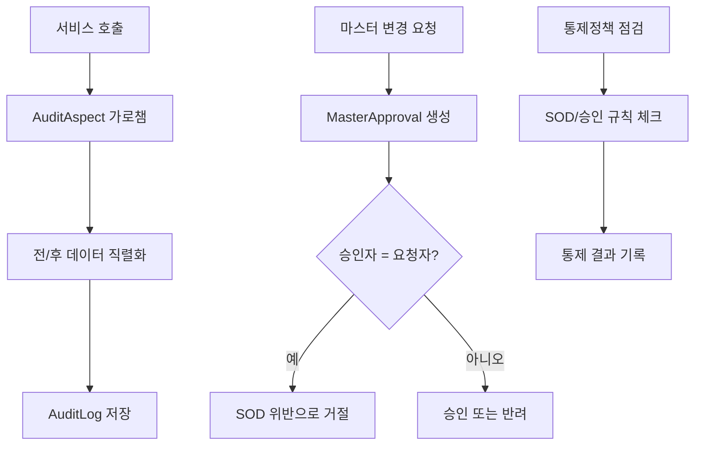
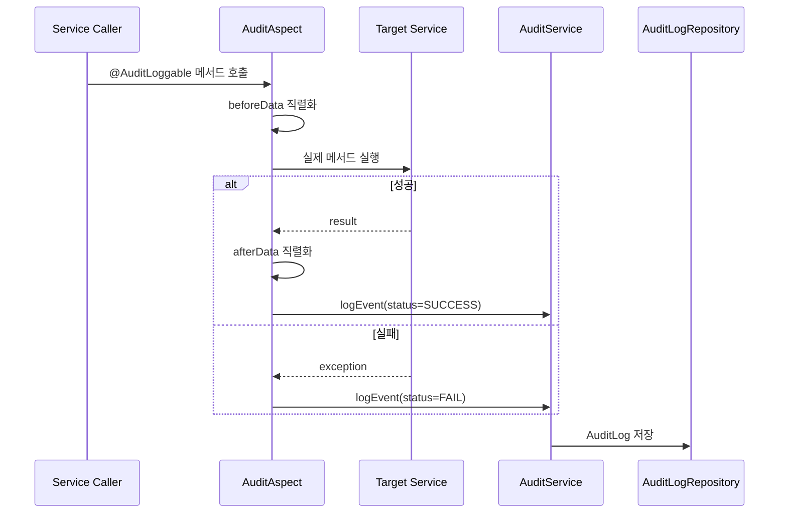
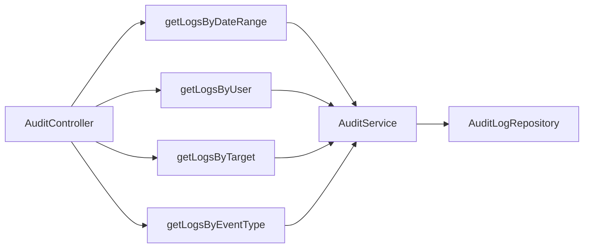
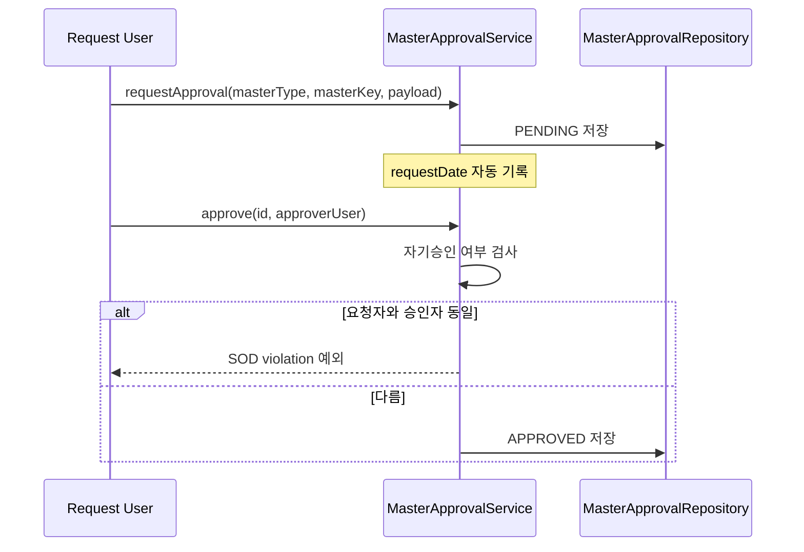
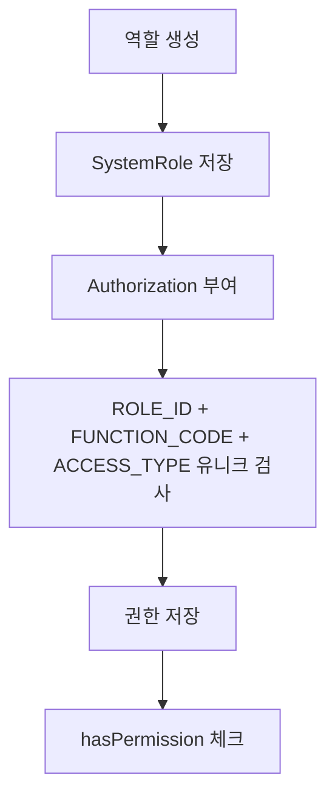
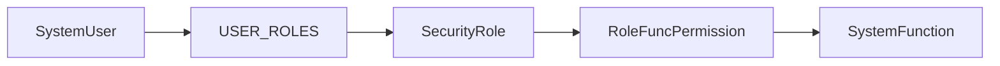
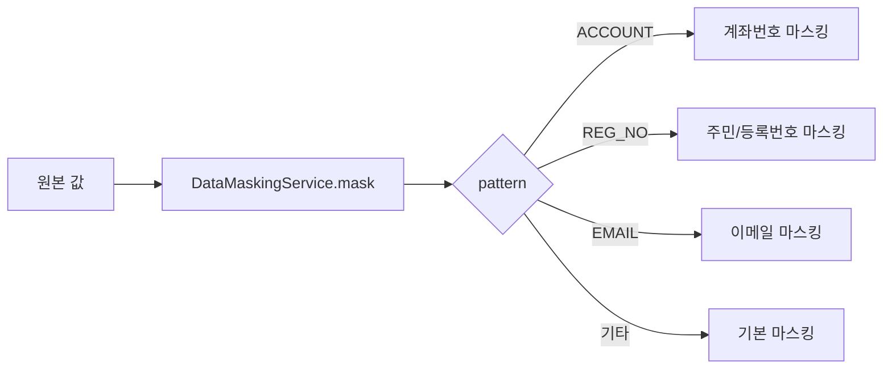

# Governance Process Flow

## 1. 전체 흐름

## 2. 감사로그 자동 기록

설명:
- AOP가 메서드 호출 전후를 감쌉니다.
- 현재 `targetEntity`는 `SERVICE_METHOD`로 기록합니다.
- 사용자 식별은 `X-User-ID` -> `remoteUser` -> `principal` -> `SYSTEM` 순으로 해석합니다.
- IP는 `X-Forwarded-For` 우선, 없으면 `remoteAddr`, 요청 컨텍스트가 없으면 `0.0.0.0`입니다.

## 3. 감사로그 조회 흐름

설명:
- 날짜, 사용자, 대상 엔티티, 이벤트 타입 기준으로 조회할 수 있습니다.
- 추적 패키지는 `TracingService.extractTraceabilityPackage()`로 대상 엔티티 로그를 모읍니다.

## 4. 마스터 승인 흐름

설명:
- 승인요청은 `PENDING`으로 시작합니다.
- 승인자는 요청자와 같을 수 없습니다.
- 승인 시 `master-data` 변경요청을 생성하고 승인/적용까지 연계합니다.

## 5. 역할과 권한 흐름 (Legacy)

설명:
- `AuditService`는 `SystemRole` 기준으로 권한을 관리합니다.
- 하나의 역할에 같은 기능코드와 접근유형 조합을 중복 부여할 수 없습니다.
- 목표 경계에서는 사용자/메뉴/권한(IAM) 마스터를 `auth` 모듈로 이관합니다.

## 6. 보안 모델 흐름 (Legacy)

설명:
- `security` 패키지에는 사용자, 기능, 역할, 권한 매트릭스 모델이 별도로 존재합니다.
- 하지만 내부회계 통제 책임 기준에서는 이 영역을 `auth`로 이관하는 것이 권장됩니다.

## 7. 데이터 마스킹 흐름

## 8. 현재 구현상 주의점

- 역할/권한 모델이 이원화되어 있습니다.
- `security` 패키지는 legacy 경계로 분류되어 신규 IAM 확장은 `auth` 모듈에서 진행하는 것이 권장됩니다.
