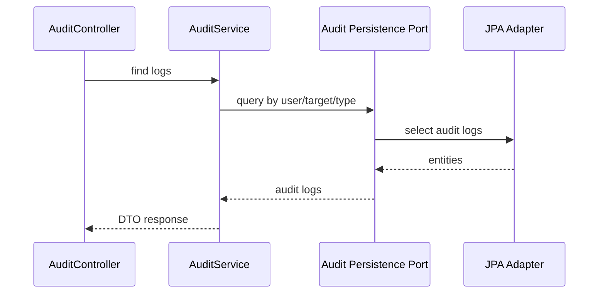
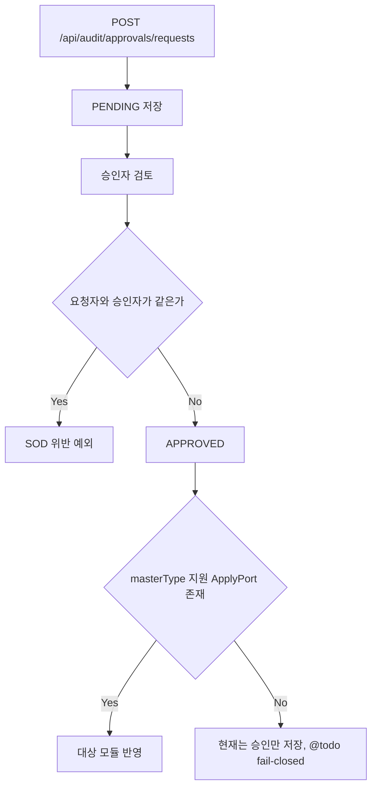
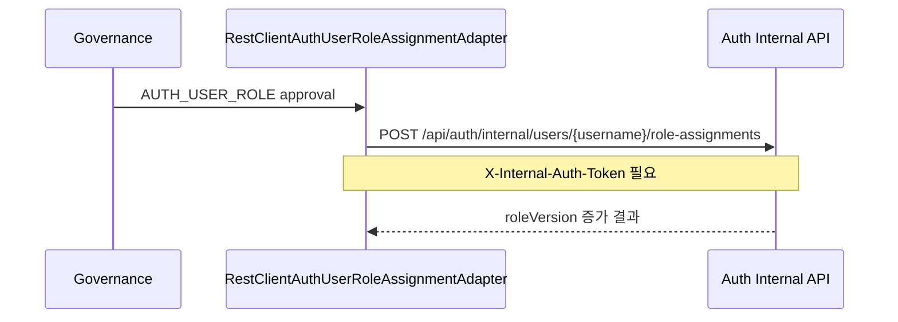

# governance process flow

## 감사 로그 조회 흐름

감사 로그는 회계 추적성의 출발점입니다. API 응답은 도메인 엔티티를 그대로 노출하지 않고 DTO로 변환합니다.

## 승인 요청과 반영 흐름

`MasterApprovalService`는 승인 후 `MasterDataChangeApplyPort` 구현체를 찾아 대상 모듈에 반영합니다. 지원 포트가 없는 masterType이 조용히 승인되는 문제는 운영 리스크라 코드에 `@todo`로 남겼습니다.

## Auth 역할 승인 흐름

토큰 값은 `GOVERNANCE_AUTH_INTERNAL_TOKEN`과 Auth의 `AUTH_INTERNAL_API_TOKEN`이 같아야 합니다.

## 주요 API

- `GET /api/audit/logs`
- `GET /api/audit/logs/user/{userId}`
- `GET /api/audit/logs/target`
- `GET /api/audit/logs/type/{eventType}`
- `GET /api/audit/roles`
- `POST /api/audit/roles`
- `GET /api/audit/permissions/check`
- `GET /api/audit/approvals/pending`
- `POST /api/audit/approvals/requests`
- `POST /api/audit/approvals/{approvalId}/approve`
- `POST /api/audit/approvals/{approvalId}/reject`
