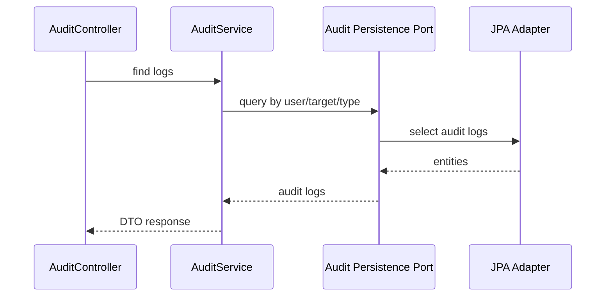
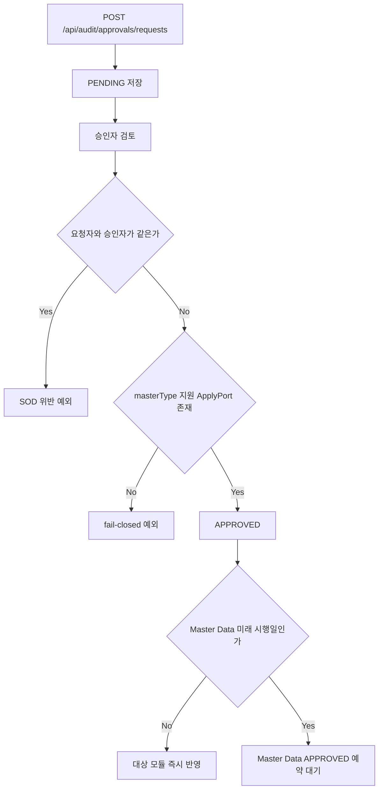
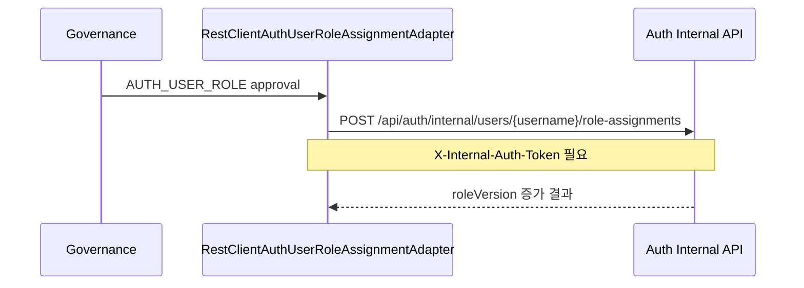
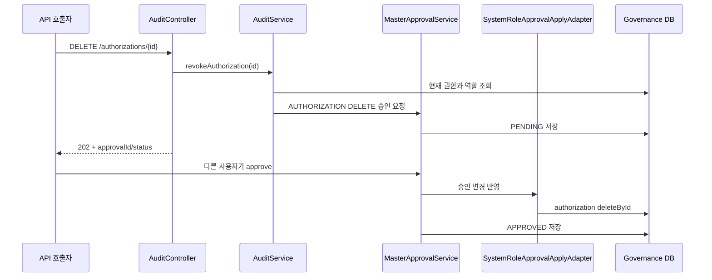

# governance process flow

## 감사 로그 조회 흐름

감사 로그는 회계 추적성의 출발점입니다. API 응답은 도메인 엔티티를 그대로 노출하지 않고 DTO로 변환합니다.

## 승인 요청과 반영 흐름

`MasterApprovalService`는 승인 상태로 전이하기 전에 `MasterDataChangeApplyPort` 구현체를 찾습니다. 지원 포트가 없는 `masterType`은 조용히 승인하지 않고 fail-closed 예외로 중단합니다. 즉시 반영 대상에서 "결재 도장은 찍었는데 실제 기준정보는 안 바뀐" 상태를 만들지 않기 위한 안전장치입니다. 미래 시행일의 예약 대기는 승인된 날짜 정책에 따른 의도적인 상태입니다.

Master Data 연동은 Governance `approvalId`를 `sourceReference`로 전달합니다. 동일 승인 재시도는
기존 변경 요청의 상태를 이어가며, 이미 반영됐으면 아무 작업도 반복하지 않습니다. 미래
`effectiveDate`는 Master Data의 `APPROVED` 상태로 저장되고 `/apply-due` 경로가 시행일 도래 후 반영합니다.

## Auth 역할 승인 흐름

토큰 값은 `GOVERNANCE_AUTH_INTERNAL_TOKEN`과 Auth의 `AUTH_INTERNAL_API_TOKEN`이 같아야 합니다.

## 주요 API

- `GET /api/audit/logs`
- `GET /api/audit/logs/user/{userId}`
- `GET /api/audit/logs/target`
- `GET /api/audit/logs/type/{eventType}`
- `GET /api/audit/roles`
- `POST /api/audit/roles`
- `GET /api/audit/permissions/check`
- `GET /api/audit/approvals/pending`
- `POST /api/audit/approvals/requests`
- `POST /api/audit/approvals/{approvalId}/approve`
- `POST /api/audit/approvals/{approvalId}/reject`
## 역할/권한 승인 반영 표

| masterType | requestType | 실제 반영 | 정책 |
| --- | --- | --- | --- |
| `SYSTEM_ROLE` | `CREATE` | 역할 저장 | 지원 |
| `SYSTEM_ROLE` | `UPDATE`, `DELETE` | 반영하지 않음 | fail-closed 예외 |
| `AUTHORIZATION` | `CREATE` | 역할·충돌·중복 확인 후 권한 저장 | 지원 |
| `AUTHORIZATION` | `DELETE` | 승인 payload의 권한 ID로 삭제 | 지원 |
| `AUTHORIZATION` | `UPDATE` | 반영하지 않음 | fail-closed 예외 |

## 권한 회수 데이터 흐름

`DELETE` API 호출 시점에는 권한이 유지됩니다. 승인 완료 시점에만 실제 삭제되므로, 요청자는 반환된 승인 ID로 처리 상태를 추적해야 합니다.
