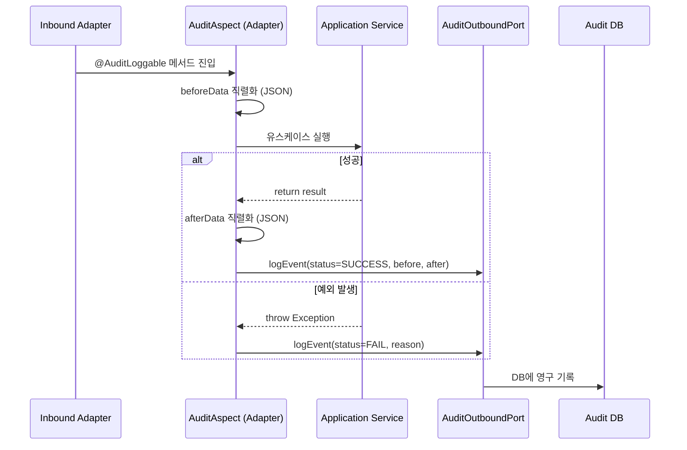
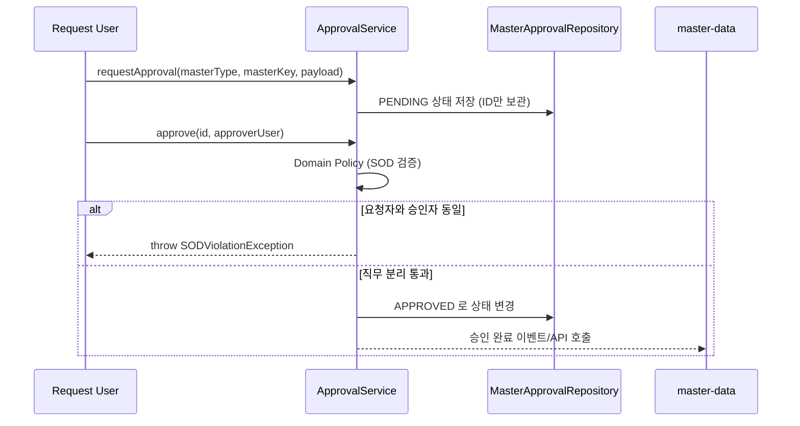

# governance 프로세스 흐름 (Process Flow)

## 1. 전체 통제 및 감사 로그 흐름

```mermaid
flowchart TD
    A[사용자의 서비스 호출\nREST API] --> B[AuditAdapter\nAOP Interceptor]
    B --> C[전/후 데이터 직렬화]
    C --> D[AuditOutboundPort 경유\n로그 저장]

    E[마스터 데이터 변경 요청] --> F[ApprovalUseCase\n승인 생성]
    F --> G{승인자 == 요청자?}
    G -- 예 --> H[SOD 위반으로 거절\n(직무 분리 위반)]
    G -- 아니오 --> I[승인 또는 반려 상태 전이]

    J[통제 정책 점검 (Policy)] --> K[SOD / 내부통제 규칙 평가]
    K --> L[평가 결과 기록]
```

## 2. 감사로그 자동 기록 과정 (헥사고날/이벤트 기반)



**설명:**
- AOP가 Application Service의 유스케이스 호출 전후를 감싸서 변경 이력을 직렬화합니다.
- 멀티 스테이지 Docker 환경이나 MSA 구조에서는 이 Audit Log 기록이 비동기 이벤트(Kafka 등)로 발행되어 Audit 전용 컨테이너에서 적재될 수도 있습니다 (결합도 최소화).
- 감사 조회 API는 도메인 엔티티를 그대로 반환하지 않고 `AuditLogResponse` 등 전용 DTO로 변환합니다.
- 추적성 패키지 조회는 `AuditLogPersistencePort`를 통해 수행하며 JPA Repository를 서비스에서 직접 호출하지 않습니다.

## 3. 마스터 승인 흐름 (ID 기반 참조)



**설명:**
- `governance`는 승인 대상(`masterKey`)이 무엇인지 구체적인 엔티티 구조를 알지 못하며 알 필요도 없습니다. 단지 승인 파이프라인과 통제 정책만 책임집니다.
