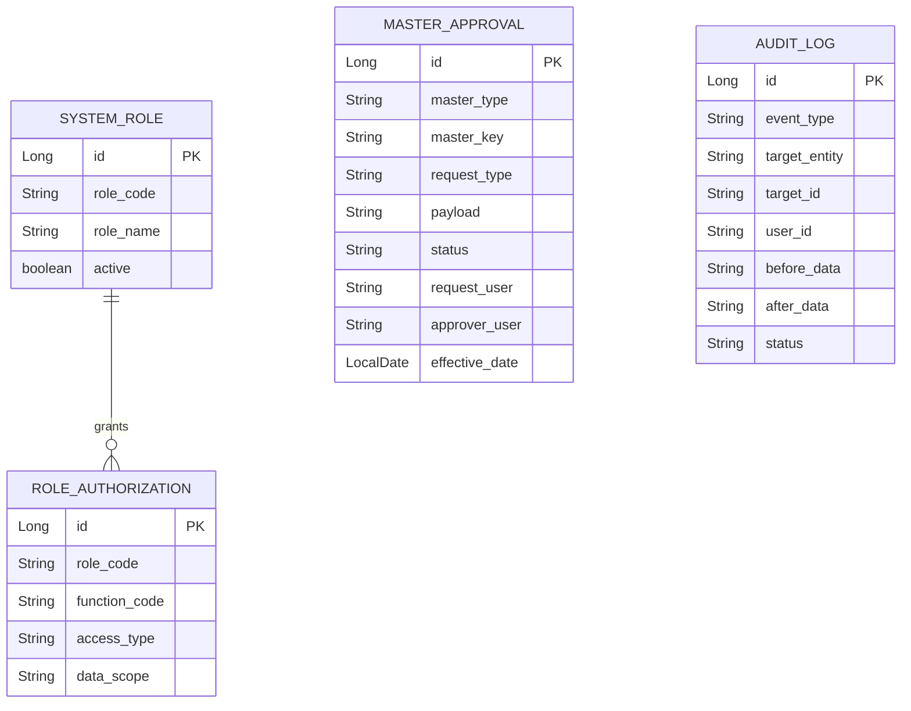

# governance schema

## 핵심 ERD

## 승인 상태

| 상태 | 의미 |
| --- | --- |
| `PENDING` | 승인 대기 |
| `APPROVED` | 승인 완료 |
| `REJECTED` | 반려 |

Master Data로 전달할 때는 `MASTER_APPROVAL.id`를 `governance-approval-id={id}` 형식의
`sourceReference`로 사용합니다. 이 값은 Governance 재시도와 Master Data 변경 계보를 연결합니다.

## 감사 actor 우선순위

`RequestAuditActorAdapter`는 사용자 식별자를 아래 순서로 해석합니다.

1. `X-User-ID`
2. `request.getRemoteUser()`
3. `request.getUserPrincipal()`
4. `SYSTEM`

## 외부 연동 설정

| 설정 | 기본값 | 의미 |
| --- | --- | --- |
| `GOVERNANCE_AUTH_BASE_URL` | `http://localhost:8081` | Auth 내부 API base URL |
| `GOVERNANCE_AUTH_INTERNAL_TOKEN` | `local-internal-auth-token` | Auth 내부 API 호출 토큰 |

운영에서는 토큰을 환경변수나 secret manager로 주입해야 합니다.
