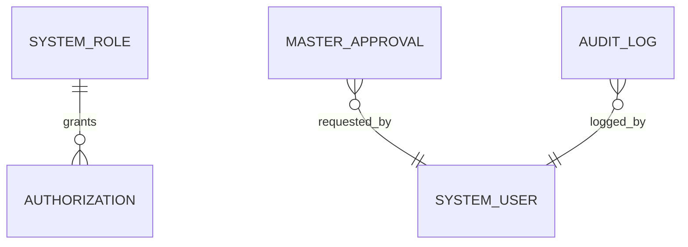
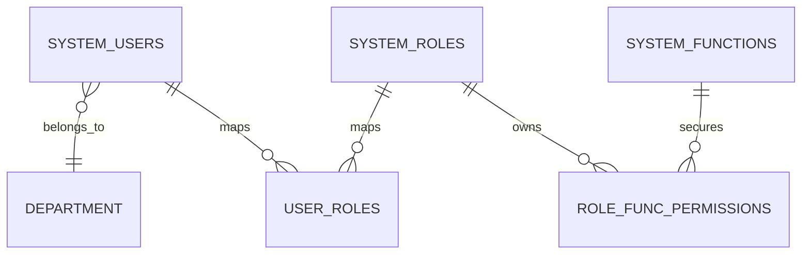

# Governance Schema

## 1. Audit 영역

### `AUDIT_LOG`

주요 컬럼:
- `id`
- `EVENT_TYPE`
- `EVENT_DATE_TIME`
- `USER_ID`
- `TARGET_ENTITY`
- `TARGET_ID`
- `BEFORE_DATA`
- `AFTER_DATA`
- `STATUS`
- `REMARKS`
- `IP_ADDRESS`
- `CREATE_DATE`
- `UPDATE_DATE`
- `AUDIT_USER`

의미:
- 서비스 실행 전후 데이터와 결과 상태를 저장하는 감사로그입니다.

### `MASTER_APPROVAL`

주요 컬럼:
- `id`
- `masterType`
- `masterKey`
- `requestType`
- `payload`
- `requestUser`
- `requestDate`
- `approverUser`
- `approvalDate`
- `status`
- `remarks`
- `createdAt`
- `updatedAt`
- `auditUser`

의미:
- 마스터 생성/수정/삭제 요청을 승인 대상으로 관리합니다.

상태:
- `PENDING`
- `APPROVED`
- `REJECTED`

### `SYSTEM_ROLE`

주요 컬럼:
- `id`
- `ROLE_CODE`
- `ROLE_NAME`
- `DESCRIPTION`
- `CREATE_DATE`
- `UPDATE_DATE`
- `AUDIT_USER`

의미:
- `audit` 패키지 기준의 역할 마스터입니다.

### `audit_authorizations`

주요 컬럼:
- `id`
- `ROLE_ID`
- `FUNCTION_CODE`
- `ACCESS_TYPE`
- `DATA_SCOPE`
- `CREATE_DATE`
- `UPDATE_DATE`
- `AUDIT_USER`

의미:
- 역할별 기능 접근 권한을 저장합니다.

제약:
- `ROLE_ID + FUNCTION_CODE + ACCESS_TYPE` 유니크

## 2. Security 영역 (Legacy / 이관 대상)

### `SYSTEM_USERS`

주요 컬럼:
- `USER_ID`
- `USER_NAME`
- `PASSWORD`
- `DEPT_CODE`
- `EMAIL`
- `STATUS`
- `IS_LOCKED`
- `LAST_LOGIN_DATE`
- `CREATE_DATE`
- `UPDATE_DATE`
- `AUDIT_USER`

의미:
- 시스템 사용자 마스터입니다.
- `email`은 `@Masked(pattern = "EMAIL")` 대상입니다.
- 목표 경계에서는 사용자/메뉴/권한 마스터를 `auth` 모듈로 이관합니다.

### `SYSTEM_ROLES`

주요 컬럼:
- `ROLE_CODE`
- `ROLE_NAME`
- `DESCRIPTION`
- `IS_USED`
- `CREATE_DATE`
- `UPDATE_DATE`
- `AUDIT_USER`

의미:
- `security` 패키지 기준의 역할 마스터입니다.

### `SYSTEM_FUNCTIONS`

주요 컬럼:
- `FUNC_CODE`
- `FUNC_NAME`
- `PARENT_FUNC_CODE`
- `FUNC_TYPE`
- `CREATE_DATE`
- `AUDIT_USER`

의미:
- 화면, 메뉴, 기능 단위의 식별자를 저장합니다.

### `ROLE_FUNC_PERMISSIONS`

주요 컬럼:
- `ROLE_CODE`
- `FUNC_CODE`
- `CAN_READ`
- `CAN_WRITE`
- `CAN_DELETE`
- `CAN_APPROVE`
- `CREATE_DATE`
- `AUDIT_USER`

의미:
- 역할과 기능 간 CRUD/승인 권한 매트릭스입니다.

## 3. 읽을 때 중요한 점

- `audit.domain.SystemRole`과 `security.domain.SecurityRole`는 이름은 비슷하지만 다른 모델입니다.
- 현재 API와 서비스는 주로 `audit` 쪽 역할/권한 모델을 사용합니다.
- `security` 모델은 사용자-역할-기능 권한 구조를 담고 있으며, 운영 경계 정리 시 `auth`로 이동시키는 것이 권장됩니다.
