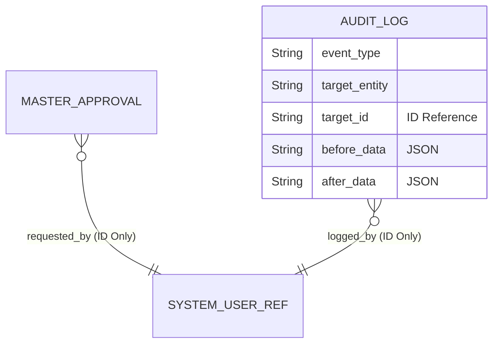

# governance 스키마 (Schema)

## 설계 원칙

`governance` 스키마의 가장 큰 특징은 **느슨한 결합(Loose Coupling)**과 **다형성 지원**입니다. 어떤 모듈의 어떤 테이블이 변경되더라도 감사 로그와 승인 결재가 가능하도록 타 모듈의 테이블을 외래키(FK)로 잡지 않고 `target_type`과 `target_id` 문자를 통해 ID 기반 참조합니다.

## 핵심 테이블 설계

### `audit_log` (감사 로그 보관)

시스템 전반의 모든 변경 이력을 영구 보존하는 원장과 같습니다. 향후 데이터가 방대해질 경우 Elasticsearch나 NoSQL로 이관될 수 있는 구조를 고려합니다.

- `id` (PK, UUID)
- `event_type` (예: CREATE_ACCOUNT, APPROVE_JOURNAL)
- `target_entity` (예: "ACCOUNT_SUBJECT")
- `target_id` (예: "101000")
- `before_data` (변경 전 데이터를 JSON 포맷으로 저장. SCD2 이력을 재현하는 기초 데이터)
- `after_data` (변경 후 데이터를 JSON 포맷으로 저장)
- `status` (성공/실패 여부)
- `user_id` (호출한 사용자 ID)
- `ip_address` (접근 IP)
- `event_date_time` (발생 일시)

### `master_approval` (통제 및 승인 파이프라인)

중요 데이터 변경 시의 승인 흐름을 통제하는 마스터 테이블입니다.

- `id` (PK, UUID)
- `master_type` (승인 대상 도메인 종류. 예: "BUSINESS_PARTNER")
- `master_key` (승인 대상의 ID)
- `payload` (승인 시점에 적용할 JSON 데이터 뭉치)
- `status` (PENDING, APPROVED, REJECTED)
- `request_user_id` (요청자 ID - ID 기반 참조)
- `approver_user_id` (승인자 ID - ID 기반 참조)
- `request_date`
- `approval_date`

**멀티 스테이지 환경:** 이 테이블들은 Flyway/Liquibase를 통해 `governance` 전용 데이터베이스 인스턴스 또는 스키마에 독립적으로 생성됩니다.