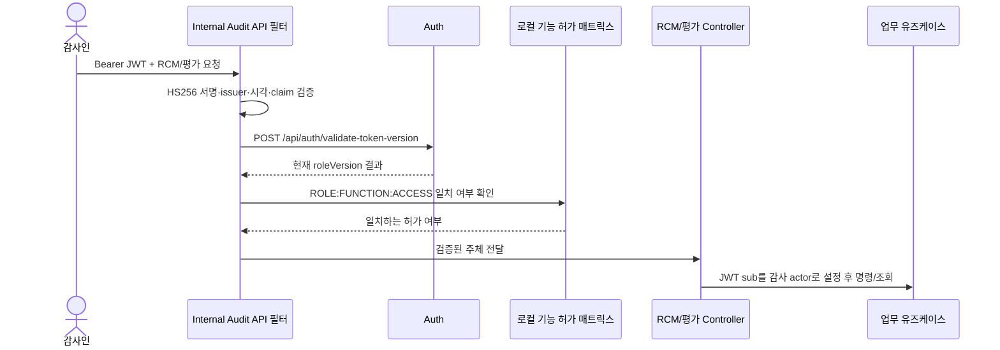
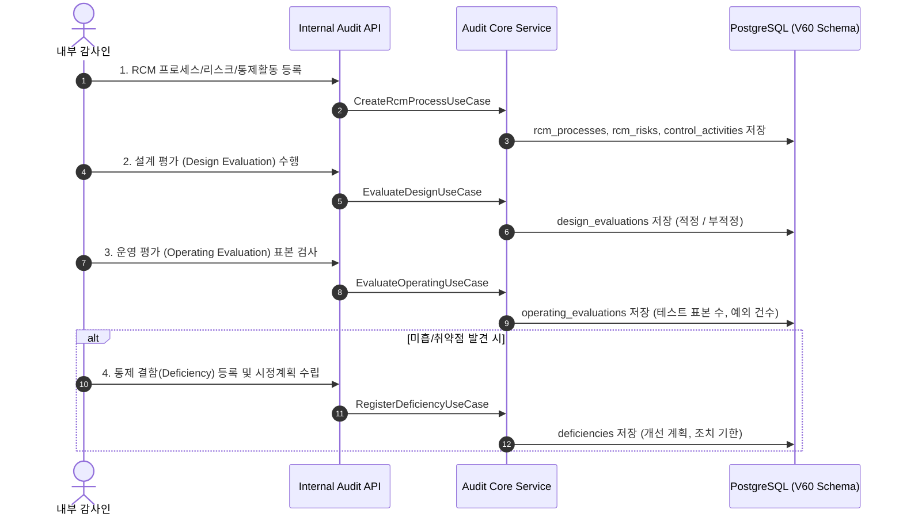

# 🔄 Internal Audit 프로세스 흐름 (Process Flow)

내부감사 모듈은 기업의 내부회계관리제도(K-SOX) 및 통제 적정성을 검증하는 4단계 생명주기를 가집니다.

## 요청 신원과 기능 권한 (GH-836)

초보자에게는 다음 순서가 핵심이다. Auth에서 발급한 Bearer JWT를 요청에 넣고, API가 JWT를 직접 검증한 다음 Auth의 현재 roleVersion과 모듈의 로컬 기능 허가 매트릭스를 확인한다. 모두 통과해야 Controller가 업무 유즈케이스를 호출한다. Gateway를 거쳐도 같은 절차를 따른다.



RCM 경로에는 기능 코드 `INTERNAL_AUDIT.RCM`, 평가 경로에는 `INTERNAL_AUDIT.EVALUATION`을 적용한다. GET은 `READ`, POST는 `WRITE`다. `internal-audit.identity.permission-grants` 설정을 `INTERNAL_AUDIT_PERMISSION_GRANTS` 환경변수로 주입하며, 허가는 `ROLE:FUNCTION:ACCESS` 형식이다. `X-Auth-User`, `X-Auth-Roles` 등 호출자가 보낸 신원 헤더는 검증된 주체를 대체할 수 없다. 헤더만 있는 직접 요청과 무효·회수된 토큰은 401, 일치하는 기능 허가 없음은 403, 신원 검증 설정 누락이나 Auth 이용 불가는 503으로 종료한다. 이 경우 업무 포트에 도달하지 않아야 한다.

두 기능의 필요한 READ/WRITE 허가는 배포 설정에 등록해야 한다. 로컬 매트릭스는 중앙 Governance의 권한 변경과 자동 동기화되지 않으므로 배포 시 별도 검토가 필요하다. Auth 버전 API는 활성 역할 배정이 하나라도 있는지 확인하므로, 만료된 감사인 역할과 다른 활성 역할이 공존할 때 만료된 역할만 식별하지 못한다. 역할별 활성 상태를 조회하는 Auth 계약이 생기기 전까지 잔여 보안 게이트로 관리한다. 설정과 테스트 명령은 [모듈 README](../README.md)를 따른다.

로컬 HTTP 스모크에서는 H2 API(18083), Auth 응답 스텁(18084), 단일 라우트 Gateway(18080)를 사용했다. 직접 호출의 헤더 전용 GET/POST는 401, 위조 헤더와 유효 JWT를 함께 보낸 GET/POST는 200이고 POST의 `ownerId`는 JWT `sub`였다. 잘못된 서명·roleVersion 2는 401, 로컬 허가 없는 ADMIN은 403이었다. Gateway 경유 GET도 헤더 전용 401, 유효 JWT와 위조 헤더 200, roleVersion 2는 401이었다. 이 검증에서는 API가 Auth 스텁을 매 요청 확인했고 Gateway 자체 버전 검사는 비활성화했다. 실제 Auth·Governance 연동과 배포망 접근 범위는 검증 범위 밖이다.



## 운영평가 표본·예외 수치 정책 (GH-666)

`sampleSize`는 검사한 표본 수, `exceptionCount`는 그중 예외 건수다. 기존
`Integer` 선택 필드와 V60의 nullable 컬럼 계약을 유지하며 다음 기준을 적용한다.
기존 문서에는 null/0의 의미가 없었으므로 이번 변경에서 호환성 기준으로 명시한다.

| 입력 | 의미와 처리 |
| --- | --- |
| 각각의 `null` 또는 JSON 필드 생략 | 해당 수치 미기재. 독립적으로 허용하고 그대로 보존하며 0으로 간주하지 않는다. |
| `sampleSize=0` | 검사 표본이 명시적으로 0건. `exceptionCount`는 null 또는 0만 허용한다. |
| 한쪽이 null이고 다른 쪽이 0 이상 | 허용. 알려지지 않은 수치를 추정하거나 상한 비교를 하지 않는다. |
| 두 값 모두 존재 | `0 <= exceptionCount <= sampleSize`여야 한다. 동일 건수도 허용한다. |
| 어느 한쪽이라도 음수 | 다른 값이 null이어도 거부한다. |

예를 들어 `(10, 2)`, `(10, 10)`, `(0, 0)`, `(null, null)`, `(null, 2)`,
`(10, null)`은 허용한다. `(-1, -2)`, `(10, 11)`, `(0, 1)`, `(null, -1)`은 거부한다.
미기재/0건만으로 평가 결과를 자동 판정하지 않으며 기존 `result` 정규화와 필수값,
인증 액터 및 통제 존재 검증을 유지한다.

HTTP JSON → `OperatingEvaluation` 생성자 → Controller → Service → 저장 포트 순서로
처리한다. 생성자에서 불변식을 검사하므로 직접 생성, Lombok builder, JSON 역직렬화에
같은 규칙이 적용된다. 검증된 Bearer JWT와 기능 허가를 사용한 잘못된 수치 요청은 HTTP 400이며
평가 저장과 감사 이력 저장을 호출하지 않는다. null을 0으로 자동 보정해서 재시도하지 말고
실제 검사 수치로 요청을 수정해야 한다.

기존 DB row나 스키마는 변경하지 않는다. 과거에 저장된 음수/초과 row를 조회해 도메인으로
복원할 때도 검증이 적용되므로 조회가 실패할 수 있다. 기존 데이터 조사·보정은 별도 범위다.

JDK 17과 Gradle 8.7 및 의존성 캐시가 있는 저장소 루트에서 회귀 검증을 실행한다.
Linux 명령은 아래와 같고 Windows에서는 `sh ./gradlew`를 `.\gradlew.bat`로 바꾼다.

```sh
sh ./gradlew :internal-audit:core:test :internal-audit:api:test --offline --no-daemon --console=plain --max-workers=1
```

기대 결과는 기존 테스트와 새 도메인·서비스·HTTP 수치 경계 테스트의 전체 통과다.
HTTP 회귀는 실제 Jackson/Controller/Service와 mock 저장 포트를 사용한다. 로컬 H2
구동은 상위 README를 따르며 실제 PostgreSQL·TLS·동시성 검증을 대신하지 않는다.


## 명령 멱등성과 감사 기록

여섯 쓰기 명령은 적용할 actor/path/default payload로 동일성을 계산하고 키 잠금을 획득한다.
완료 receipt가 있으면 최초 결과를 반환하고, 변경된 명령 또는 legacy audit-only key는 저장 전에 409로 거부한다.
새 키는 receipt 예약 → 업무 검증·저장 → 감사 append → 최초 결과 snapshot 완료를 하나의 트랜잭션으로 실행한다.
어느 단계든 실패하면 모두 rollback한다. 키가 없으면 receipt 없이 매 정상 변경에 감사 기록을 추가한다.
상세 오류·호환성·검증·롤백은 [GH-665 계약](issue-665-command-idempotency-plan.md)을 따른다.
