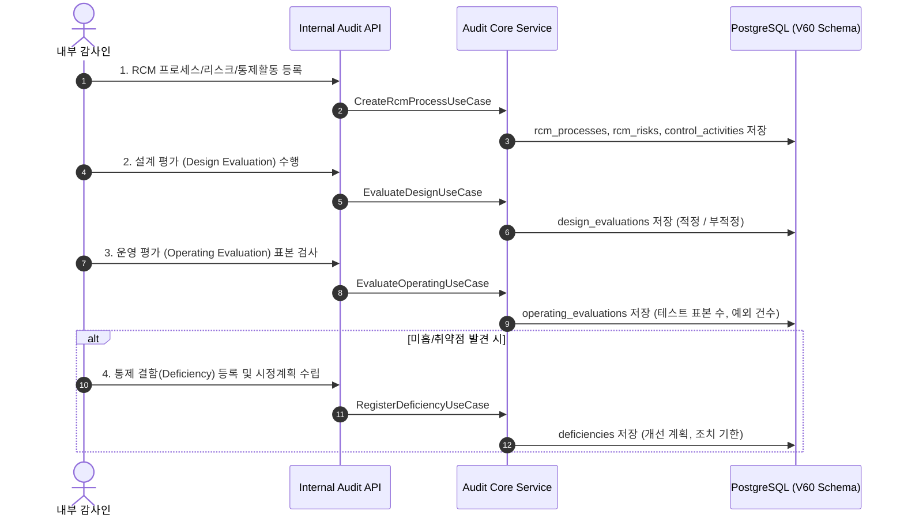

# 🔄 Internal Audit 프로세스 흐름 (Process Flow)

내부감사 모듈은 기업의 내부회계관리제도(K-SOX) 및 통제 적정성을 검증하는 4단계 생명주기를 가집니다.

```mermaid
sequenceDiagram
    autonumber
    actor Auditor as 내부 감사인
    participant API as Internal Audit API
    participant Core as Audit Core Service
    participant DB as PostgreSQL (V60 Schema)

    Auditor->>API: 1. RCM 프로세스/리스크/통제활동 등록
    API->>Core: CreateRcmProcessUseCase
    Core->>DB: rcm_processes, rcm_risks, control_activities 저장

    Auditor->>API: 2. 설계 평가 (Design Evaluation) 수행
    API->>Core: EvaluateDesignUseCase
    Core->>DB: design_evaluations 저장 (적정 / 부적정)

    Auditor->>API: 3. 운영 평가 (Operating Evaluation) 표본 검사
    API->>Core: EvaluateOperatingUseCase
    Core->>DB: operating_evaluations 저장 (테스트 표본 수, 예외 건수)

    alt 미흡/취약점 발견 시
        Auditor->>API: 4. 통제 결함(Deficiency) 등록 및 시정계획 수립
        API->>Core: RegisterDeficiencyUseCase
        Core->>DB: deficiencies 저장 (개선 계획, 조치 기한)
    end
```