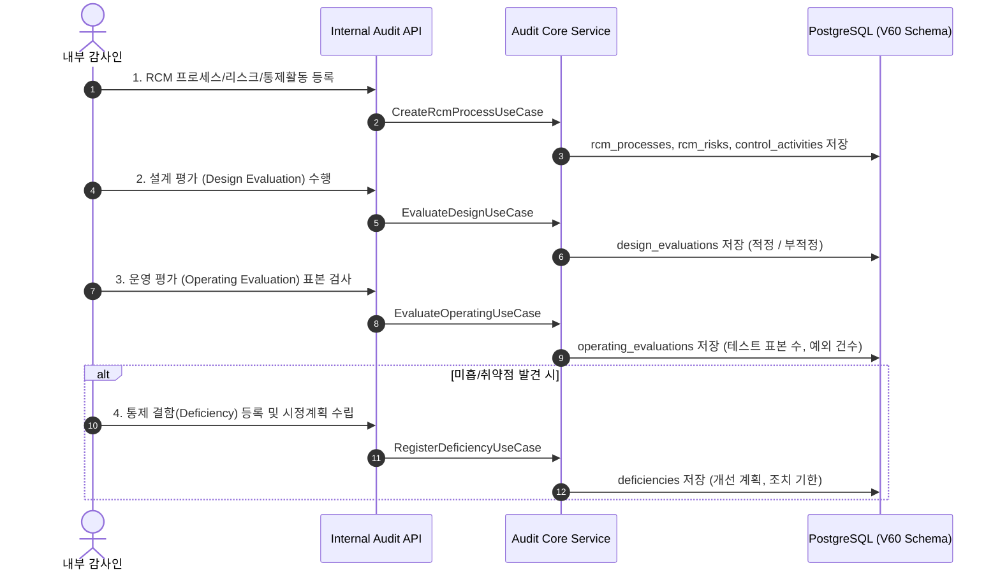

# 🔄 Internal Audit 프로세스 흐름 (Process Flow)

내부감사 모듈은 기업의 내부회계관리제도(K-SOX) 및 통제 적정성을 검증하는 4단계 생명주기를 가집니다.



## 운영평가 표본·예외 수치 정책 (GH-666)

`sampleSize`는 검사한 표본 수, `exceptionCount`는 그중 예외 건수다. 기존
`Integer` 선택 필드와 V60의 nullable 컬럼 계약을 유지하며 다음 기준을 적용한다.
기존 문서에는 null/0의 의미가 없었으므로 이번 변경에서 호환성 기준으로 명시한다.

| 입력 | 의미와 처리 |
| --- | --- |
| 각각의 `null` 또는 JSON 필드 생략 | 해당 수치 미기재. 독립적으로 허용하고 그대로 보존하며 0으로 간주하지 않는다. |
| `sampleSize=0` | 검사 표본이 명시적으로 0건. `exceptionCount`는 null 또는 0만 허용한다. |
| 한쪽이 null이고 다른 쪽이 0 이상 | 허용. 알려지지 않은 수치를 추정하거나 상한 비교를 하지 않는다. |
| 두 값 모두 존재 | `0 <= exceptionCount <= sampleSize`여야 한다. 동일 건수도 허용한다. |
| 어느 한쪽이라도 음수 | 다른 값이 null이어도 거부한다. |

예를 들어 `(10, 2)`, `(10, 10)`, `(0, 0)`, `(null, null)`, `(null, 2)`,
`(10, null)`은 허용한다. `(-1, -2)`, `(10, 11)`, `(0, 1)`, `(null, -1)`은 거부한다.
미기재/0건만으로 평가 결과를 자동 판정하지 않으며 기존 `result` 정규화와 필수값,
인증 액터 및 통제 존재 검증을 유지한다.

HTTP JSON → `OperatingEvaluation` 생성자 → Controller → Service → 저장 포트 순서로
처리한다. 생성자에서 불변식을 검사하므로 직접 생성, Lombok builder, JSON 역직렬화에
같은 규칙이 적용된다. 유효한 인증 헤더를 사용한 잘못된 수치 요청은 HTTP 400이며
평가 저장과 감사 이력 저장을 호출하지 않는다. null을 0으로 자동 보정해서 재시도하지 말고
실제 검사 수치로 요청을 수정해야 한다.

기존 DB row나 스키마는 변경하지 않는다. 과거에 저장된 음수/초과 row를 조회해 도메인으로
복원할 때도 검증이 적용되므로 조회가 실패할 수 있다. 기존 데이터 조사·보정은 별도 범위다.

JDK 17과 Gradle 8.7 및 의존성 캐시가 있는 저장소 루트에서 회귀 검증을 실행한다.
Linux 명령은 아래와 같고 Windows에서는 `sh ./gradlew`를 `.\gradlew.bat`로 바꾼다.

```sh
sh ./gradlew :internal-audit:core:test :internal-audit:api:test --offline --no-daemon --console=plain --max-workers=1
```

기대 결과는 기존 테스트와 새 도메인·서비스·HTTP 수치 경계 테스트의 전체 통과다.
HTTP 회귀는 실제 Jackson/Controller/Service와 mock 저장 포트를 사용한다. 로컬 H2
구동은 상위 README를 따르며 실제 PostgreSQL·TLS·동시성 검증을 대신하지 않는다.
