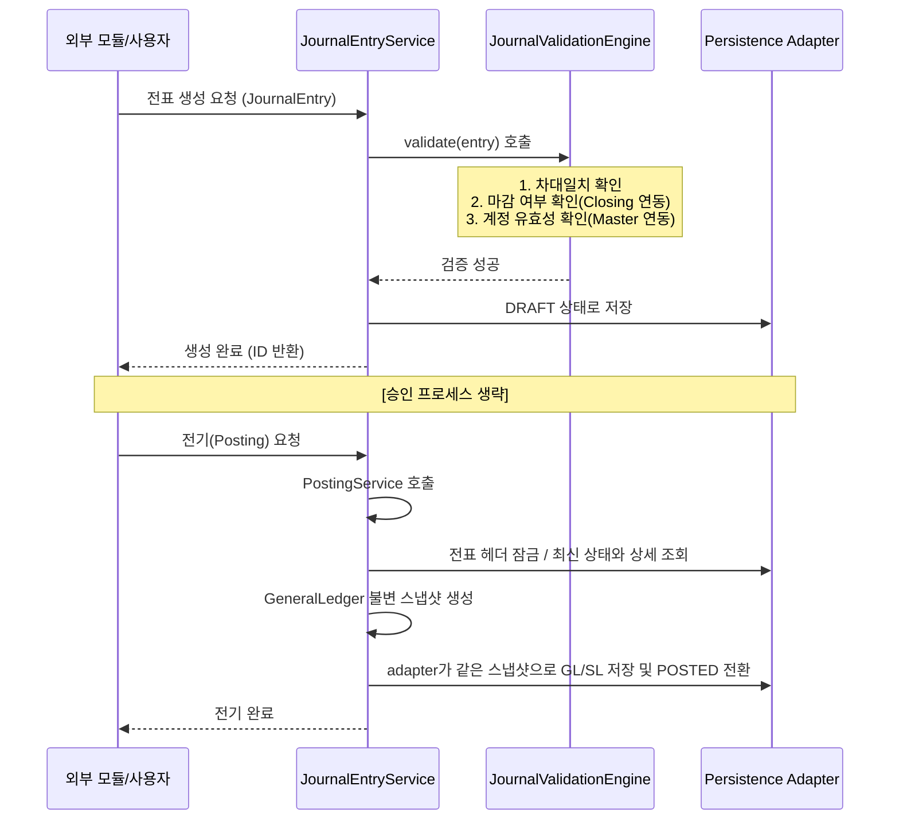
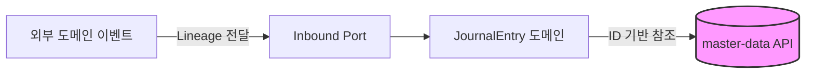
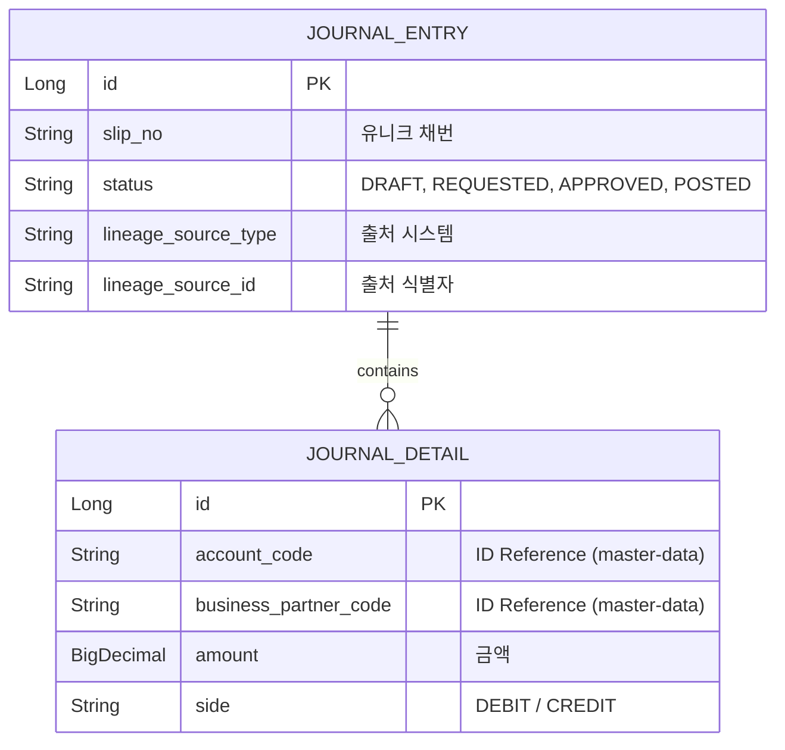

# 📝 Journal Ledger Service (전표 및 원장 관리)

`journal-ledger`는 회사에서 돈이 나가고 들어오는 모든 거래가 "차변/대변이 일치하는 복식부기 전표" 형태로 기록되는 회계 시스템의 가장 핵심적인 장부 기록 센터입니다. API는 전표/원장 조회와 전기 요청을 받고, Batch는 과거 기간 GL/SL 잔액 재집계를 실행합니다.

---

## 1. 🐣 초보자를 위한 개념 설명 (Beginner Guide)

**Q. 이 모듈은 정확히 무슨 일을 하나요?**
거래를 회계 전표로 만들고, 승인받고, 최종적으로 원장(Ledger)에 반영한 뒤, 나중에 감사관이 "이 돈 어디서 왔어?" 하고 물어볼 때 끝까지 추적할 수 있게 기록을 남기는 곳입니다.

**초보자가 알아야 할 핵심 6가지 개념:**
1. **전표 (`JournalEntry`):** 회계 처리 한 건의 헤더 ("2026-04-13 대출 실행 전표")
2. **전표 라인 (`JournalDetail`):** 실제 차변/대변 상세 줄.
3. **상태 변화:** 작성 중(`DRAFT`) -> 승인 요청(`REQUESTED`) -> 승인됨(`APPROVED`) -> 원장 반영 완료(**`POSTED`**)
4. **GL / SL:** 
   - `GL (총계정원장)`: 계정과목 중심의 큰 장부
   - `SL (보조원장)`: 거래처, 부서 등 상세 차원을 포함한 보조 장부
5. **Lineage (추적 키):** 이 전표가 시스템의 어떤 원천 문서(지출결의서 등)에서 왔는지 알려주는 꼬리표(`lineageSourceType`, `lineageSourceId`). 드릴다운(Drill-down)의 핵심입니다.
6. **불변 전기 스냅샷:** 승인된 `JournalEntry`는 `GeneralLedger` Aggregate로 한 번 고정된 뒤 GL과 SL adapter에 전달됩니다. 두 장부가 서로 다른 시점의 가변 데이터를 읽지 않도록 하기 위함입니다.

차변과 대변 금액은 단순 `BigDecimal`이 아니라 `Debit`/`Credit` Value Object로 구분합니다.
두 타입은 기존 DB의 `DECIMAL(19,2)` 계약을 공유하며 소수 둘째 자리를 넘는 값을 몰래
반올림하지 않고 실패시킵니다. IFRS 9 유효이자율 등 고정밀 계산은 각 업무 도메인에서
수행하고, 원장에는 명시적으로 확정된 금액만 전기합니다.

---

## 2. 🔄 프로세스 흐름 (Process Flow)

### 📌 전표 라이프사이클 및 검증 엔진
전표 생성부터 원장 반영까지의 전체 흐름입니다. 특히 최근 도입된 **검증 엔진(JournalValidationEngine)**이 데이터 무결성을 보장합니다.



### 📌 헥사고날 아키텍처 및 ID 기반 참조
`journal-ledger`는 계정과목, 부서, 거래처 등을 저장할 때 엔티티를 직접 연결하지 않고 **코드(ID) 값만 문자열로 저장**합니다.



---

## 3. 📊 데이터 모델 (Schema)

원천 추적과 모듈 간 격리를 최우선으로 설계되었습니다.



---

## 4. 🐳 실행 및 연동 방법

**연동 주의사항:**
- 전표 생성 전 반드시 `contracts` 모듈의 Port를 통해 계정 코드와 마감 여부를 확인해야 합니다.
- **GL/SL 잔액 조회:** 외부 모듈은 `LedgerQueryPort`를 통해 journal-ledger 엔티티 구조를 모르고도 잔액을 조회할 수 있습니다.
- 전표 HTTP API는 도메인 엔티티를 직접 노출하지 않고 전용 요청/응답 DTO를 사용합니다. 쓰기 명령은 Gateway가 JWT에서 다시 만든 `X-Auth-User`와 `X-Auth-Roles`만 사용하며, maker 작성/승인요청 → 별도 approver 승인 → poster 전기 순서를 강제합니다. 역할과 오류는 [업무 흐름 문서](docs/process-flow.md#maker-checker-승인과-http-권한)를 확인하세요.
- 미결 반제 요청은 `settlementReference`와 `X-User-ID`를 함께 저장합니다. 동일 참조번호가 재전송되면 금액을 중복 반영하지 않습니다.
- 같은 전표의 동시 전기는 헤더 잠금과 전표 상세 고유 키로 중복 반영을 차단합니다. 서로 다른 전표의 같은 계정·통화 잔액은 공통 잠금 행을 확보한 뒤 최신 값으로 갱신합니다. `READ_COMMITTED` 쓰기 트랜잭션과 V14가 필요하며, [동작·재시도·배포 조건](docs/posting-concurrency.md)을 확인하세요.
- 재집계 Job은 V15의 영속 제어 행을 `REBUILDING`으로 닫고 JobInstance ID와 정규화 기간을 고정합니다. 장애 중에는 잔액 조회·전기·다른 재집계를 fail-closed로 거부하며, 같은 JobInstance만 저장된 chunk checkpoint에서 재개합니다. 최종 GL/SL 대사가 성공해야 `OPEN`으로 공개됩니다.
- 재무 잔액과 기간 집계 조회에는 원장 반영이 끝난 `POSTED` 전표만 포함됩니다. `APPROVED` 전표는 아직 재무제표 금액이 아닙니다.
- 운영 대량 전기/재집계는 `journal-ledger.ledger.persistence-mode=jdbc-bulk` 설정으로 JDBC batch insert/upsert 어댑터를 사용할 수 있습니다. 기본값은 JPA입니다.

**실행 방법 (Docker):**
```bash
docker-compose up -d journal-ledger
```

**로컬 실행 (PowerShell / IntelliJ Gradle):**
```powershell
.\gradlew :journal-ledger:core:test :journal-ledger:api:test :journal-ledger:batch:test --console=plain --max-workers=1 --no-daemon
.\gradlew :journal-ledger:api:bootRun --console=plain
.\gradlew :journal-ledger:api:bootRun --args="--journal-ledger.ledger.persistence-mode=jdbc-bulk" --console=plain
.\gradlew :journal-ledger:batch:bootRun --args="--spring.profiles.active=local --spring.main.web-application-type=none --spring.batch.job.enabled=true --spring.batch.job.name=dailyBalanceReaggregationJob startDate=2026-04-01 endDate=2026-04-30" --console=plain
```

프로파일을 생략하면 API와 Batch 모두 `local`이 선택되어 각자의 전용 H2 PostgreSQL mode DB에
모듈 Flyway V1/V10/V11/V12/V13/V14/V15를 적용하고 Hibernate가 스키마를 검증합니다.
`dev`/`prod`는 주입된 PostgreSQL 접속정보를 사용하며
애플리케이션 Flyway와 SQL/Batch 자동 초기화를 끕니다. 배포 전 migration은 별도
`migration-runner`만 수행합니다. Journal의 Master Data 조회는 local에서 명시적인 local
adapter를 사용하고 dev/prod에서는 `MASTER_DATA_BASE_URL`의 날짜 명시 read-only API를
호출합니다. 원격 connect/read timeout은 기본 2초/5초이며 양수 밀리초 범위를 벗어나면
startup을 거부합니다. prod PostgreSQL은 `sslmode=verify-full` 없이는 시작하지 않습니다.

IntelliJ에서는 공유 실행 설정 `Journal Ledger API bootRun` 또는 `Journal Ledger API JDBC Bulk`를 사용할 수 있습니다. Batch는 `JournalLedgerBatchApplication`을 선택하고 Program arguments에 `--spring.batch.job.enabled=true --spring.batch.job.name=dailyBalanceReaggregationJob startDate=2026-04-01 endDate=2026-04-30`를 넣어 실행합니다.

---

## 5. 상세 문서

- 문서 안내와 추천 읽기 순서: [docs/README.md](docs/README.md)
- 초보자 개념과 코드 탐색: [docs/beginner-guide.md](docs/beginner-guide.md)
- 전표·원장·미결 업무 및 데이터 흐름: [docs/process-flow.md](docs/process-flow.md)
- 핵심 테이블과 소유권: [docs/schema.md](docs/schema.md)
- 원장 잔액 이월: [docs/ledger-carry-forward.md](docs/ledger-carry-forward.md)
- 계층/포트 가이드: [docs/layer-guide.md](docs/layer-guide.md)
