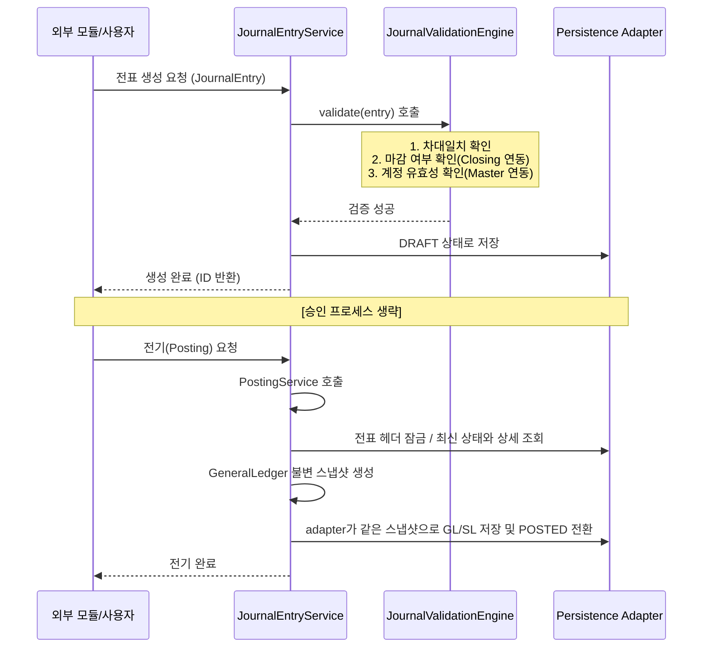
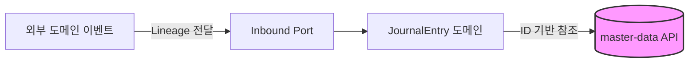
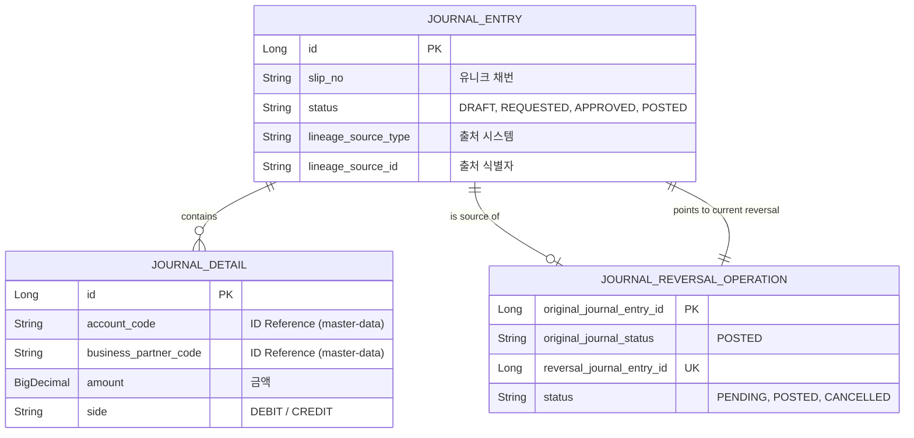

# 📝 Journal Ledger Service (전표 및 원장 관리)

`journal-ledger`는 회사에서 돈이 나가고 들어오는 모든 거래가 "차변/대변이 일치하는 복식부기 전표" 형태로 기록되는 회계 시스템의 가장 핵심적인 장부 기록 센터입니다. API는 전표/원장 조회와 전기 요청을 받고, Batch는 과거 기간 GL/SL 잔액 재집계를 실행합니다.

도메인 Java 소스는 Spring/JPA import 없이 컴파일됩니다. 저장 테이블·관계·정밀도는 core JAR의 `META-INF/journal-ledger-orm.xml`에 명시하고, Spring Data 저장소와 lifecycle listener는 `infrastructure.persistence`에 둡니다. 처음 보는 개발자는 [계층 가이드](docs/layer-guide.md)에서 도메인 → 출력 포트 → 저장 어댑터 흐름을 확인할 수 있습니다.

---

## 1. 🐣 초보자를 위한 개념 설명 (Beginner Guide)

**Q. 이 모듈은 정확히 무슨 일을 하나요?**
거래를 회계 전표로 만들고, 승인받고, 최종적으로 원장(Ledger)에 반영한 뒤, 나중에 감사관이 "이 돈 어디서 왔어?" 하고 물어볼 때 끝까지 추적할 수 있게 기록을 남기는 곳입니다.

**초보자가 알아야 할 핵심 9가지 개념:**
1. **전표 (`JournalEntry`):** 회계 처리 한 건의 헤더 ("2026-04-13 대출 실행 전표")
2. **전표 라인 (`JournalDetail`):** 실제 차변/대변 상세 줄.
3. **상태 변화:** 작성 중(`DRAFT`) -> 승인 요청(`REQUESTED`) -> 승인됨(`APPROVED`) -> 원장 반영 완료(**`POSTED`**)
4. **GL / SL:**
   - `GL (총계정원장)`: 계정과목 중심의 큰 장부
   - `SL (보조원장)`: 거래처, 부서 등 상세 차원을 포함한 보조 장부
5. **Lineage (추적 키):** 이 전표가 시스템의 어떤 원천 문서(지출결의서 등)에서 왔는지 알려주는 꼬리표(`lineageSourceType`, `lineageSourceId`). 드릴다운(Drill-down)의 핵심입니다.
6. **불변 전기 스냅샷:** 승인된 `JournalEntry`는 `GeneralLedger` Aggregate로 한 번 고정된 뒤 GL과 SL adapter에 전달됩니다. 두 장부가 서로 다른 시점의 가변 데이터를 읽지 않도록 하기 위함입니다.
7. **전기된 이력은 수정하지 않음:** `POSTED` 전표는 헤더, 감사 정보, 상세 금액·계정·차대 구분·차원·적요와 상세 구성까지 원본 그대로 보존합니다. 오류 정정은 원본을 고치는 대신 원본을 연결한 새 역분개 또는 조정 전표로 기록합니다.
8. **역분개는 원본당 하나의 작업:** 원본은 `POSTED`로 보존하고 `journal_reversal_operations`가 현재 역분개를 연결합니다. 중복 요청은 첫 요청이 만든 같은 전표를 반환하며, 전기 전 취소한 경우에만 새 역분개를 만들 수 있습니다.
9. **외화 환산:** 현재 기준통화는 KRW로 고정되어 있습니다. 전표 헤더의 거래통화와 거래통화→KRW 환율을 근거로 일반 전표 라인의 `baseAmount`를 검증하며, 예를 들어 USD 100과 환율 1300의 기준통화 금액은 KRW 130,000이어야 합니다. 관리형 역분개는 과거 실제 원장 효과를 상쇄하기 위한 exact-copy 예외입니다.

차변과 대변 금액은 단순 `BigDecimal`이 아니라 `Debit`/`Credit` Value Object로 구분합니다.
두 타입은 기존 DB의 `DECIMAL(19,2)` 계약을 공유하며 소수 둘째 자리를 넘는 값을 몰래
반올림하지 않고 실패시킵니다. IFRS 9 유효이자율 등 고정밀 계산은 각 업무 도메인에서
수행하고, 원장에는 명시적으로 확정된 금액만 전기합니다.

---

## 2. 🔄 프로세스 흐름 (Process Flow)

### 📌 전표 라이프사이클 및 검증 엔진
전표 생성부터 원장 반영까지의 전체 흐름입니다. 특히 최근 도입된 **검증 엔진(JournalValidationEngine)**이 데이터 무결성을 보장합니다.



### 📌 헥사고날 아키텍처 및 ID 기반 참조
`journal-ledger`는 계정과목, 부서, 거래처 등을 저장할 때 엔티티를 직접 연결하지 않고 **코드(ID) 값만 문자열로 저장**합니다.



---

## 3. 📊 데이터 모델 (Schema)

원천 추적과 모듈 간 격리를 최우선으로 설계되었습니다.



---

## 4. 🐳 실행 및 연동 방법

**연동 주의사항:**
- 전표 생성 전 반드시 `contracts` 모듈의 Port를 통해 계정 코드와 마감 여부를 확인해야 합니다.
- 전표 헤더의 `currencyCode`와 `exchangeRate`가 현재 계약에서 환산 근거입니다. `currencyCode`의 `null`/공백은 호환성을 위해 KRW로 취급하고, KRW는 환율 생략 또는 1만 허용합니다. 외화는 명시적인 양수 환율과 라인별 `baseAmount`가 필요합니다. 수동 HTTP는 통화와 무관하게 `baseAmount`가 필수입니다. Contract는 null/공백/KRW와 환율 생략 또는 1인 동일단위 입력에 한해서만 누락된 `baseAmount`를 `amount`로 채우며, 외화 누락이나 공급값 불일치는 저장 전에 거부합니다. 자동분개 이벤트는 거래통화 키(`transactionCurrencyCode`, `currencyCode`, `currency`)와 거래통화→기준통화 환율 키(`transactionToBaseRate`, `exchangeRate`, `fxRate`)만 사용하고, 여러 별칭이 함께 있으면 정규화 후 모두 같아야 합니다. 상세 반올림과 잔여 배분은 [업무 흐름 문서](docs/process-flow.md#거래통화에서-기준통화krw로-환산)를 확인하세요.
- **GL/SL 잔액 조회:** 외부 모듈은 `LedgerQueryPort`를 통해 journal-ledger 엔티티 구조를 모르고도 잔액을 조회할 수 있습니다.
- Kafka 자동분개에서 적용 규칙이 없으면 V18 quarantine에 topic/partition/offset과 payload를 영속 보존합니다. accounting admin은 payload/key를 노출하지 않는 completeness API로 pending age/count와 broker 좌표를 확인하고, 규칙 보정 뒤 행 잠금 기반 replay를 실행합니다. 다른 처리 예외는 기본 2회 재시도 후 같은 partition의 `<topic>.DLT`로 보내며 DLT 발행 실패는 fail-closed합니다. 자세한 흐름과 GL10 범위 제한은 [업무 흐름 문서](docs/process-flow.md#kafka-미매칭-격리와-재생)를 확인하세요.
- 전표 HTTP API는 도메인 엔티티를 직접 노출하지 않고 전용 요청/응답 DTO를 사용합니다. 쓰기 명령은 Gateway가 JWT에서 다시 만든 `X-Auth-User`와 `X-Auth-Roles`만 사용하며, maker 작성/승인요청 → 별도 approver 승인 → poster 전기 순서를 강제합니다. 역할과 오류는 [업무 흐름 문서](docs/process-flow.md#maker-checker-승인과-http-권한)를 확인하세요.
- 공개 `POST /api/journals`의 `entryType`에 caller가 `REVERSAL`을 지정하면 HTTP `400`을 반환합니다. 주변 공백이나 대소문자를 바꾸어도 같게 거부됩니다. 역분개는 원본 잠금과 operation 저장을 함께 수행하는 관리형 `reverseJournalEntry` 유스케이스로만 생성합니다.
- 미결 반제 요청은 `settlementReference`와 `X-User-ID`를 함께 저장합니다. 동일 참조번호가 재전송되면 금액을 중복 반영하지 않습니다.
- 같은 전표의 동시 전기는 헤더 잠금과 전표 상세 고유 키로 중복 반영을 차단합니다. 서로 다른 전표의 같은 계정·통화 잔액은 공통 잠금 행을 확보한 뒤 최신 값으로 갱신합니다. 과거일 전기는 GL 및 정확한 nullable SL 키의 기존 후속일 기초·기말도 같은 delta만큼 set-based로 이동합니다. `READ_COMMITTED` 쓰기 트랜잭션과 V14가 필요하며, [동작·재시도·배포 조건](docs/posting-concurrency.md)을 확인하세요.
- 역분개 생성은 원본 `POSTED` 헤더를 잠그고, V17의 원본 PK 관계를 확인합니다. V17은 `journal_entries(id, status)` UNIQUE와 operation의 `(original_journal_entry_id, original_journal_status='POSTED')` 복합 FK로 DB 경계에서도 전기된 원본만 허용합니다. 순차·동시 중복은 첫 작성자가 만든 현재 역분개로 수렴합니다. 생성 날짜는 기존 검증 엔진의 회계기간 검사를 통과해야 하고, 취소는 전기되지 않은 역분개를 `REJECTED` 처리한 뒤 권리를 다시 엽니다. [생성·재시도·취소 흐름](docs/process-flow.md#원본당-단일-역분개-작업)과 [V17 배포 조건](docs/posting-concurrency.md#v17-역분개-작업-업그레이드와-롤백)을 확인하세요.
- 관리형 역분개는 과거 `POSTED` 원본이 새 환산 의미 규칙에 맞지 않더라도 원본의 환율·거래금액·기준금액을 그대로 복사하고 차대만 반전하여 실제 원장 효과를 상쇄할 수 있습니다. 거래/기준통화 차대일치와 금액 정밀도는 계속 검사하며, 공개·임의 `REVERSAL` 생성은 허용하지 않습니다.
- 재집계 Job은 모든 writer stripe를 잡고 요청 종료일을 기존 GL/SL 최종일과 최신 `POSTED` 회계일까지 확장한 뒤, V15의 영속 제어 행을 `REBUILDING`으로 닫고 JobInstance ID와 유효 기간을 실행 context와 함께 고정합니다. 장애 중에는 잔액 조회·전기·다른 재집계를 fail-closed로 거부하며, 같은 JobInstance만 저장된 chunk checkpoint에서 재개합니다. replay 중에는 후속 delta 전파를 끄고 최종 GL/SL 대사가 성공해야 `OPEN`으로 공개됩니다.
- 재무 잔액과 기간 집계 조회에는 원장 반영이 끝난 `POSTED` 전표만 포함됩니다. `APPROVED` 전표는 아직 재무제표 금액이 아닙니다.
- `POSTED` 전표의 공개 setter, 상세 소유권 변경과 `add/remove/clear/setDetails`는 즉시 `IllegalStateException`으로 거부됩니다. JPA 저장 콜백은 일반 repository 삭제를 포함한 이미 확정된 헤더·상세의 수정, merge, 추가·삭제를 막고, 두 journal repository는 콜백을 우회하는 batch 삭제 메서드를 명시적으로 거부합니다. `DRAFT`/`REQUESTED`/`APPROVED`는 기존 상태 규칙 안에서 계속 편집할 수 있습니다. 상세 경계와 우회 위험은 [업무 흐름](docs/process-flow.md#posted-최종-이력-보호)과 [데이터 모델](docs/schema.md#posted-전표의-영속-이력-보호)을 확인하세요.
- 운영 대량 전기/재집계는 `journal-ledger.ledger.persistence-mode=jdbc-bulk` 설정으로 JDBC batch insert/upsert 어댑터를 사용할 수 있습니다. 기본값은 JPA입니다.

**실행 방법 (Docker):**
```bash
docker-compose up -d journal-ledger
```

**로컬 실행 (PowerShell / IntelliJ Gradle):**
```powershell
.\gradlew :journal-ledger:core:test :journal-ledger:api:test :journal-ledger:batch:test --console=plain --max-workers=1 --no-daemon
.\gradlew :journal-ledger:api:bootRun --console=plain
.\gradlew :journal-ledger:api:bootRun --args="--journal-ledger.ledger.persistence-mode=jdbc-bulk" --console=plain
.\gradlew :journal-ledger:batch:bootRun --args="--spring.profiles.active=local --spring.main.web-application-type=none --spring.batch.job.enabled=true --spring.batch.job.name=dailyBalanceReaggregationJob startDate=2026-04-01 endDate=2026-04-30" --console=plain
```

Linux/macOS에서 Issue #758의 전기 이력 보호를 포함한 모듈 전체 회귀는 저장소 루트에서 다음과 같이 실행합니다.

```bash
./gradlew :journal-ledger:test
```

도메인 경계만 확인하려면 저장소 루트에서 아래 명령을 실행합니다. 도메인 Java 소스에 Spring/JPA 참조가 다시 생기면 테스트가 실패합니다. 전체 명령은 core·API·Batch 테스트도 실행합니다.

```bash
./gradlew :journal-ledger:core:test --tests '*DomainFrameworkBoundaryTest'
./gradlew :journal-ledger:test
```

이 수치는 Issue #758 당시의 역사적 검증 결과(core 29 suites/215 tests, API 15/51,
batch 4/11, 합계 48 suites/277 tests)이며
실패·오류·skip은 0입니다. 이 명령은 JPA/도메인 회귀를 확인하며, 직접 SQL이나 운영 DB 권한을
검증하는 명령은 아닙니다.

Issue #759 역분개 멱등성 변경도 같은 명령으로 검증합니다. 기대 결과는 순차·동시
중복, 전기-취소 경쟁, 취소 후 재생성, V17 clean/upgrade, 재집계 회귀를 포함한
모든 테스트의 실패·오류 0입니다. 실제 통과 여부와 테스트 개수는 Issue/PR 검증 기록을
기준으로 확인합니다. PR에는 감사 기준 소스에서 실패(RED)하고 수정본에서 통과(GREEN)하는
호환 회귀 근거와 실제 전기-취소 경쟁 결과를 함께 남겨야 합니다.

Issue #763의 외화 환산 변경도 저장소 루트에서 같은 명령으로 검증합니다. 이 문서는 실제
통과를 선언하지 않으며 결과는 Issue/PR 검증 기록을 확인합니다. 현재 계약의 기준통화는
KRW로 고정되어 있고 환율 공급자·환율 출처·적용일 필드는 포함하지 않습니다. 기존 운영
데이터를 자동 보정하지 않으며, 과거의 잘못된 일반 `DRAFT`/`APPROVED` 전표는 후속 검증에서
fail-closed하므로 승인된 정정 절차가 필요합니다.

프로파일을 생략하면 API와 Batch 모두 `local`이 선택되어 각자의 전용 H2 PostgreSQL mode DB에
모듈 Flyway V1/V10/V11/V12/V13/V14/V15/V16/V17/V18/V19를 적용하고 Hibernate가 스키마를 검증합니다.
`dev`/`prod`는 주입된 PostgreSQL 접속정보를 사용하며
애플리케이션 Flyway와 SQL/Batch 자동 초기화를 끕니다. 배포 전 migration은 별도
`migration-runner`만 수행합니다. Journal의 Master Data 조회는 local에서 명시적인 local
adapter를 사용하고 dev/prod에서는 `MASTER_DATA_BASE_URL`의 날짜 명시 read-only API를
호출합니다. 원격 connect/read timeout은 기본 2초/5초이며 양수 밀리초 범위를 벗어나면
startup을 거부합니다. prod PostgreSQL은 `sslmode=verify-full` 없이는 시작하지 않습니다.

IntelliJ에서는 공유 실행 설정 `Journal Ledger API bootRun` 또는 `Journal Ledger API JDBC Bulk`를 사용할 수 있습니다. Batch는 `JournalLedgerBatchApplication`을 선택하고 Program arguments에 `--spring.batch.job.enabled=true --spring.batch.job.name=dailyBalanceReaggregationJob startDate=2026-04-01 endDate=2026-04-30`를 넣어 실행합니다.

---

## 5. 상세 문서

- 문서 안내와 추천 읽기 순서: [docs/README.md](docs/README.md)
- 초보자 개념과 코드 탐색: [docs/beginner-guide.md](docs/beginner-guide.md)
- 전표·원장·미결 업무 및 데이터 흐름: [docs/process-flow.md](docs/process-flow.md)
- 핵심 테이블과 소유권: [docs/schema.md](docs/schema.md)
- 원장 잔액 이월: [docs/ledger-carry-forward.md](docs/ledger-carry-forward.md)
- 계층/포트 가이드: [docs/layer-guide.md](docs/layer-guide.md)
