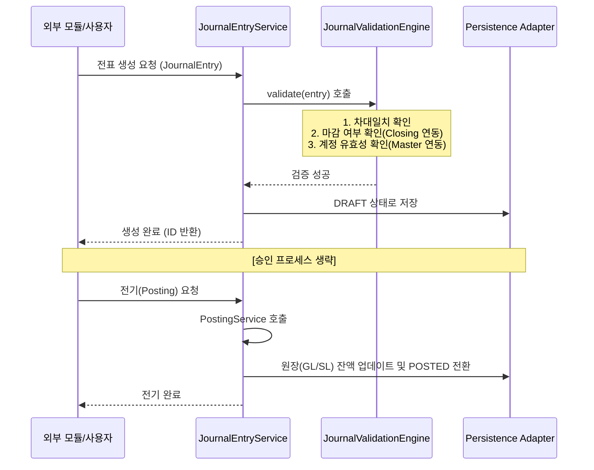
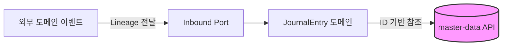
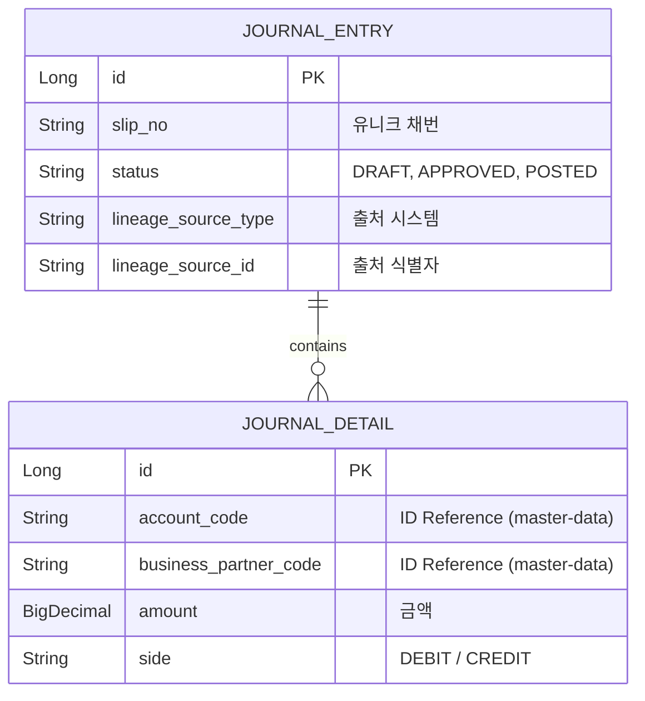

# 📝 Journal Ledger Service (전표 및 원장 관리)

`journal-ledger`는 회사에서 돈이 나가고 들어오는 모든 거래가 "차변/대변이 일치하는 복식부기 전표" 형태로 기록되는 회계 시스템의 가장 핵심적인 장부 기록 센터입니다.

---

## 1. 🐣 초보자를 위한 개념 설명 (Beginner Guide)

**Q. 이 모듈은 정확히 무슨 일을 하나요?**
거래를 회계 전표로 만들고, 승인받고, 최종적으로 원장(Ledger)에 반영한 뒤, 나중에 감사관이 "이 돈 어디서 왔어?" 하고 물어볼 때 끝까지 추적할 수 있게 기록을 남기는 곳입니다.

**초보자가 알아야 할 핵심 5가지 개념:**
1. **전표 (`JournalEntry`):** 회계 처리 한 건의 헤더 ("2026-04-13 대출 실행 전표")
2. **전표 라인 (`JournalDetail`):** 실제 차변/대변 상세 줄.
3. **상태 변화:** 작성 중(`DRAFT`) -> 승인 요청(`REQUESTED`) -> 승인됨(`APPROVED`) -> 원장 반영 완료(**`POSTED`**)
4. **GL / SL:** 
   - `GL (총계정원장)`: 계정과목 중심의 큰 장부
   - `SL (보조원장)`: 거래처, 부서 등 상세 차원을 포함한 보조 장부
5. **Lineage (추적 키):** 이 전표가 시스템의 어떤 원천 문서(지출결의서 등)에서 왔는지 알려주는 꼬리표(`lineageSourceType`, `lineageSourceId`). 드릴다운(Drill-down)의 핵심입니다.

---

## 2. 🔄 프로세스 흐름 (Process Flow)

### 📌 전표 라이프사이클 및 검증 엔진
전표 생성부터 원장 반영까지의 전체 흐름입니다. 특히 최근 도입된 **검증 엔진(JournalValidationEngine)**이 데이터 무결성을 보장합니다.



### 📌 헥사고날 아키텍처 및 ID 기반 참조
`journal-ledger`는 계정과목, 부서, 거래처 등을 저장할 때 엔티티를 직접 연결하지 않고 **코드(ID) 값만 문자열로 저장**합니다.



---

## 3. 📊 데이터 모델 (Schema)

원천 추적과 모듈 간 격리를 최우선으로 설계되었습니다.



---

## 4. 🐳 실행 및 연동 방법

**연동 주의사항:**
- 전표 생성 전 반드시 `contracts` 모듈의 Port를 통해 계정 코드와 마감 여부를 확인해야 합니다.
- **GL/SL 잔액 조회:** 외부 모듈은 `LedgerQueryPort`를 통해 journal-ledger 엔티티 구조를 모르고도 잔액을 조회할 수 있습니다.
- 전표 HTTP API는 도메인 엔티티를 직접 노출하지 않고 전용 요청/응답 DTO를 사용합니다. 작성·승인·전기 요청에는 실제 처리자를 담은 `X-User-ID` 헤더가 필요합니다.
- 미결 반제 요청은 `settlementReference`와 `X-User-ID`를 함께 저장합니다. 동일 참조번호가 재전송되면 금액을 중복 반영하지 않습니다.
- 재무 잔액과 기간 집계 조회에는 원장 반영이 끝난 `POSTED` 전표만 포함됩니다. `APPROVED` 전표는 아직 재무제표 금액이 아닙니다.
- 운영 대량 전기/재집계는 `journal-ledger.ledger.persistence-mode=jdbc-bulk` 설정으로 JDBC batch insert/upsert 어댑터를 사용할 수 있습니다. 기본값은 JPA입니다.

**실행 방법 (Docker):**
```bash
docker-compose up -d journal-ledger
```

**로컬 실행 (PowerShell / IntelliJ Gradle):**
```powershell
.\gradlew :journal-ledger:core:test :journal-ledger:api:test --console=plain --max-workers=1 --no-daemon
.\gradlew :journal-ledger:api:bootRun --console=plain
.\gradlew :journal-ledger:api:bootRun --args="--journal-ledger.ledger.persistence-mode=jdbc-bulk" --console=plain
```

IntelliJ에서는 공유 실행 설정 `Journal Ledger API bootRun` 또는 `Journal Ledger API JDBC Bulk`를 사용할 수 있습니다.

---

## 5. 상세 문서

- 문서 안내와 추천 읽기 순서: [docs/README.md](docs/README.md)
- 초보자 개념과 코드 탐색: [docs/beginner-guide.md](docs/beginner-guide.md)
- 전표·원장·미결 업무 및 데이터 흐름: [docs/process-flow.md](docs/process-flow.md)
- 핵심 테이블과 소유권: [docs/schema.md](docs/schema.md)
- 원장 잔액 이월: [docs/ledger-carry-forward.md](docs/ledger-carry-forward.md)
- 계층/포트 가이드: [docs/layer-guide.md](docs/layer-guide.md)
