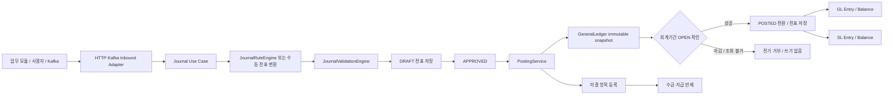
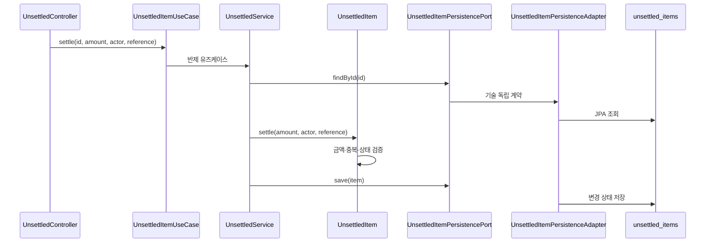
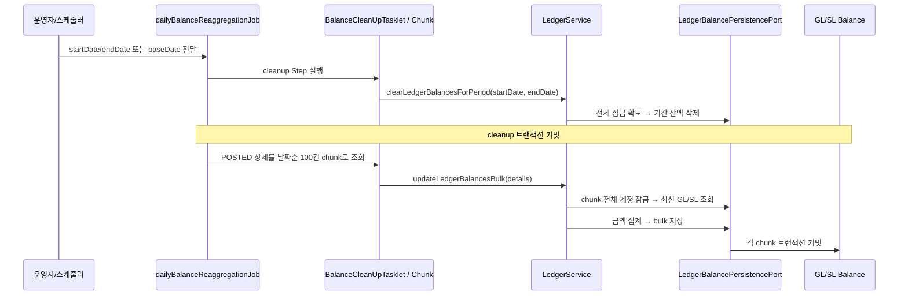

# Journal Ledger 업무·데이터 흐름

## 전체 흐름



## 전표 라이프사이클

| 단계 | 상태 | 핵심 검증 | 데이터 결과 |
| --- | --- | --- | --- |
| 작성 | `DRAFT` | 라인 금액, 차대변, 처리자, 원천 추적 | `journal_entries`, `journal_details` |
| 승인 | `APPROVED` | 승인 가능한 상태와 권한 | 승인 이력과 처리자 |
| 전기 | `POSTED` | 승인·차대일치·상세 ID 검증 후 회계기간 재확인 | 전표 상태, GL/SL 엔트리와 잔액 |

재무 잔액과 기간 집계에는 `POSTED` 전표만 포함합니다. `APPROVED`는 승인됐지만 아직 원장에 반영되지 않은 상태입니다.

전표 저장은 `JournalPersistencePort`, GL/SL 엔트리 저장은 `LedgerEntryPersistencePort`,
잔액 조회·저장·재집계는 `LedgerBalancePersistencePort`를 사용합니다.

`PostingService`는 JPA 엔티티를 직접 만들지 않습니다. 승인된 `JournalEntry`를
`GeneralLedger` Aggregate로 바꾸고 `LedgerEntryPersistencePort.save()`에 전달합니다.
JPA와 JDBC bulk adapter는 이 같은 불변 snapshot을 각 저장 형태로 변환하므로 GL과 SL의
차변/대변, 기준통화 금액, lineage가 서로 어긋나지 않습니다.

원장 금액은 `Debit`/`Credit` VO와 `AccountingPrecision`을 거칩니다. 저장 계약은
`DECIMAL(19,2)`이며 소수 센트를 무음 반올림하지 않습니다. 거래통화 합계뿐 아니라
기준통화 합계도 차대일치해야 전기할 수 있습니다.

### 작성 때와 전기 직전의 회계기간 확인

초보자 설명: 작성할 때 열려 있던 장부도 승인 후 전기하기 전에는 닫힐 수 있습니다.
따라서 저장된 `APPROVED` 상태만 믿지 않고, 실제 장부에 반영하기 직전에 다시 확인합니다.

1. 입력은 전표 ID와 처리자입니다. `PostingService`가 같은 트랜잭션에서 전표 헤더를 배타적으로 잠그고
   최신 헤더와 상세를 다시 읽은 뒤
   `GeneralLedger.fromApproved()`로 승인 상태, 거래/기준통화 차대일치, 저장된 상세 ID를
   먼저 검증하여 불변 스냅샷을 만듭니다. 비승인·이미 `POSTED`·잘못된 전표는 기간 조회 전에 거부됩니다.
2. 기존 `ClosingLockValidationFilter`가 `AccountingPeriodStatusPort`로 **회계 반영일
   (`accountingDate`)**의 기간을 다시 확인합니다. 전표 작성일(`slipDate`)이 다른 달이어도
   작성일의 기간을 조회하지 않습니다. 생성 시 `JournalValidationEngine`이 수행하는 기간 검증과
   별개이며, 전기 때 전체 엔진을 재실행하거나 계정 정보를 다시 조회하지 않습니다.
3. 기간 확인을 통과한 뒤에만 `post(poster)`로 상태와 감사 사용자를 변경하고,
   전표 저장 → 같은 스냅샷으로 GL/SL 엔트리 저장 → bulk 잔액 갱신을 각각 한 번 호출합니다.
   처리자를 생략하는 `postJournalEntry(id)`도 같은 검증을 거치며 성공 처리자는 `SYSTEM`입니다.

기존 `FiscalPeriodAccountingPeriodStatusAdapter`는 `OPEN`을 허용하고 `CLOSED`와
`PERMANENTLY_CLOSED`를 닫힌 기간으로 판단합니다. 기간 부재와 조회 예외도 전기 실패로
전파합니다. 이 거부 경로에서는 원래 `APPROVED` 상태, 감사 사용자와 상세가 유지되고,
전표·GL/SL 엔트리 저장 및 잔액 갱신 호출은 모두 0회입니다. Controller의 HTTP 계약은 바꾸지 않습니다.

유효 전표의 전기 요청마다 기간 조회가 한 번 추가됩니다. 이는 조회 당시 이미 닫힌 기간의
전기를 차단하는 통제입니다. 같은 전표의 동시 전기는 아래 DB 잠금과 고유 제약으로 차단하지만,
기간 조회 후 동시에 마감되는 분산 경쟁은 별도 통제 대상입니다. 기존 오전기 데이터를 복구하지 않습니다.

### 로컬 회귀 검증

전제: 저장소 루트의 PowerShell, 설치된 JDK 17과 Gradle 8.7/의존성 캐시입니다.
JDK 경로는 실제 설치 위치에 맞춥니다. 아래 명령은 오프라인 테스트만 실행하며 업무 Batch나
외부 DB/서버를 실행하지 않습니다.

```powershell
$env:JAVA_HOME = 'C:/Program Files/Eclipse Adoptium/jdk-17.0.19.10-hotspot'
.\gradlew.bat :journal-ledger:core:test :journal-ledger:api:test :journal-ledger:batch:test :loan:core:test :loan:api:test :loan:batch:test :loan:api:bootJar :loan:batch:bootJar --offline --no-daemon --console=plain --max-workers=1 --rerun-tasks '-Porg.gradle.java.installations.paths=C:/Program Files/Eclipse Adoptium/jdk-17.0.19.10-hotspot' '-Porg.gradle.java.installations.auto-download=false'
```

기대 결과는 종료 코드 0과 테스트 실패/오류/skip 0입니다. `PostingServiceTest`는 실제 필터와
기간 port 대역, 실제 Fiscal adapter와 조회 port 대역을 사용하여 기간별 허용·거부, 원본 불변,
쓰기 횟수, 서로 다른 작성일/회계일, 처리자/SYSTEM과 기존 전표 검증 우선순위를 확인합니다.
직접 생성자 소비자인 `LoanJournalPostingFlowTest`도 실제 필터와 명시적 OPEN 기간 대역을
연결하여 Loan → Journal → Ledger 흐름의 회계일자 조회를 확인합니다. 생성자 변경과 이
fixture를 분리하면 소비자 컴파일이 깨지므로 같은 변경에서 검증하며 Loan 업무 로직은 바꾸지 않습니다.
Loan core/API/Batch 테스트와 API/Batch 패키징까지 확인하고, `NO-SOURCE`인 task는
테스트 통과 수에 포함하지 않습니다. `bootJar`는 패키징 검증이며 서버나 업무 Job 실행이 아닙니다.
이 로컬 검증은 실제 PostgreSQL 커밋이나 분산 마감 경합의 증거가 아닙니다.

### 전기 저장 어댑터 선택

기본 어댑터는 JPA입니다. 운영에서 대량 전기/재집계가 필요하면 아래 설정으로 JDBC bulk 구현체를 사용합니다.

```yaml
journal-ledger:
  ledger:
    persistence-mode: jdbc-bulk
```

이 설정을 켜면 전기 엔트리는 batch insert, GL 잔액은 upsert, SL 잔액은 null 거래처·부서 키를 고려한 bulk update/insert로 저장됩니다.
서비스 코드는 같은 포트를 호출하므로 업무 흐름은 바뀌지 않고, 저장 기술만 바뀝니다.

JDBC bulk 모드는 H2 기준 SQL 동작을 `JdbcLedgerBulkPersistenceAdapterTest`에서 검증합니다. 운영 DB에서는 같은 포트 계약을 유지하되 배치 크기, unique index, lock wait, 재집계 동시 실행을 별도 부하 테스트로 확인합니다.

## 자동분개 규칙 흐름

1. 이벤트의 거래유형, 금액, 계정, 통화, 처리자 정보를 받습니다.
2. `JournalRuleCondition`이 문자열·숫자 조건을 평가합니다.
3. 일치한 규칙의 `JournalRuleDetail`이 생성할 전표 라인을 정의합니다.
4. 차대변은 `JournalSide` 타입으로 제한되어 잘못된 문자열을 저장 전에 차단합니다.
5. 필수 표현식 값이 없거나 금액이 0 이하이면 전표 생성을 중단합니다.

`JournalRuleEngine`은 `JournalRuleQueryPort`를 통해 규칙을 읽습니다. JPA 저장소 세부 구조와 조회 메서드는 `JournalRuleQueryAdapter` 뒤에 숨깁니다.

## 미결 등록·반제 흐름



상태는 `OPEN -> PARTIAL -> CLEARED` 순서로 진행합니다. `CLEARED`가 되면 `resolved=true`가 되어 활성 미결 조회에서 제외됩니다.

## API 계약 요약

| 기능 | 엔드포인트 | 주요 입력 |
| --- | --- | --- |
| 전표 생성 | `POST /api/journals` | 전표 DTO, `X-User-ID` |
| 이벤트 기반 전표 생성 | `POST /api/journals/from-event` | 이벤트 데이터, `X-User-ID` |
| 승인 | `POST /api/journals/{id}/approve` | `X-User-ID` |
| 전기 | `POST /api/journals/{id}/post` | `X-User-ID` |
| 거래처별 미결 조회 | `GET /api/unsettled/businesspartner/{businessPartnerCode}` | 거래처 코드 |
| 반제 | `POST /api/unsettled/{id}/settle` | 금액, `settlementReference`, `X-User-ID` |
| FX 대시보드 조회 | `GET /api/fx/dashboard` | 입력 없음 |

### FX 대시보드 현재 스냅샷

`GET /api/fx/dashboard`는 프론트엔드가 요구하는 합계, 주요 환율(`USD/KRW`, `EUR/KRW`,
`JPY/KRW`)과 통화별 포지션을 `BigDecimal` JSON 숫자로 반환합니다. 포지션의 한도 상태는
`SAFE`, `WARNING`, `EXCEEDED` 중 하나입니다. `totalKrwAmount`와
`dailyValuationGainLoss`는 각각 포지션의 `krwAmount`와 `valuationGainLoss` 합계와 반드시
일치하며 DTO 생성 시 불일치가 거부됩니다. `gainLossPercent`는 현재 응답에 계산 기준 금액이
없으므로 이 scaffold가 공급하는 화면 표시 지표이며, 다른 필드로부터 계산한 값이 아닙니다.

현재 응답은 API 계약 연결을 위한 **결정적 읽기 전용 스냅샷 scaffold**입니다. 저장소를
조회하거나 외부 환율 공급자와 통신하지 않으며, 실시간 시장 데이터 feed가 아닙니다.
따라서 같은 배포 버전에서는 호출할 때마다 같은 값이 반환됩니다. 실제 환율과 포지션을
반영하려면 별도의 core 조회 유즈케이스와 출력 포트가 먼저 정의되어야 합니다.

```http
GET /api/fx/dashboard
```

로컬에서는 저장소 루트에서 `./gradlew :journal-ledger:api:test`를 실행하고
`FxDashboardControllerTest`가 경로, 전체 중첩 필드, 소수 직렬화와 한도 상태를 검증하는지
확인합니다. 이 검증은 운영 환율 공급자나 포지션 저장소 연결을 확인하지 않습니다.

## 잔액 재집계 Batch 흐름



초보자 관점에서는 "과거 날짜의 전표가 바뀌면 그 기간 장부를 다시 더한다"고 이해하면 됩니다. Batch는 날짜 파라미터를 해석하고 core 서비스를 호출할 뿐이며, 실제 잔액 계산과 저장 순서는 `LedgerService`와 출력 포트가 담당합니다.
각 트랜잭션의 잠금은 전체 Job을 보호하지 않으므로 cleanup부터 마지막 chunk까지 전기를
중지하고 재집계 Job 하나만 실행해야 합니다. `LedgerService.reaggregateLedgerBalancesForPeriod`는
별도의 단일 트랜잭션 메서드로 삭제·POSTED 조회·재생성 전체 동안 잠금을 유지합니다.
## 재시도와 정합성 주의사항

- 동일 반제 참조번호는 다시 적용하지 않습니다.
- 같은 전표의 동시 요청은 DB 헤더 잠금으로 직렬화합니다. 커밋 후 재요청은 최신 `POSTED` 상태를 읽고 승인 상태 검증으로 거부하므로 추가 GL/SL·잔액 효과가 없습니다. 상세 동작과 검증은 [동시 전기 제어](posting-concurrency.md)를 참고합니다.
- 서로 다른 전표도 계정·통화별 공통 잠금을 먼저 확보하여 GL/SL의 최신 금액에 누적합니다. 신규 잔액과 NULL SL 차원도 포함합니다. 데드락 실패는 호출자의 전체 트랜잭션을 롤백한 뒤 새 트랜잭션으로 재시도합니다.
- 기간 검증 실패 후 재시도해도 기간을 다시 조회합니다. 재개 가능 여부는 별도 승인된 기간 관리 절차로 판단합니다.
- 과거 날짜 전표는 이후 잔액 재집계 범위를 확인해야 합니다.
- 거래처별 미결 조회는 출력 포트의 DB 조건 조회를 사용해 대량 데이터를 메모리에 올리지 않습니다.
- GL/SL 조건 조회도 `LedgerBalancePersistenceAdapter`의 DB 쿼리에서 필터링합니다.
