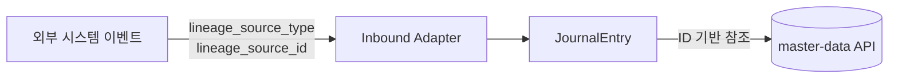

# journal-ledger 프로세스 흐름 (Process Flow)

## 1. 이 모듈이 하는 일

`journal-ledger`는 헥사고날 아키텍처를 기반으로 전표 생성부터 원장 반영까지의 파이프라인을 책임집니다.

## 2. 핵심 흐름도 (헥사고날 아키텍처 적용)

```mermaid
flowchart TD
    A[외부 도메인 이벤트\n또는 REST API] --> B[Inbound Port\n(UseCase)]
    B --> C[Application Service]
    C --> D[Domain Model\nJournalEntry 생성]
    D --> E{차대변 검증 등\n도메인 규칙 검사}
    E -->|실패| X[오류 반환]
    E -->|성공| F[Outbound Port 경유\nDRAFT 저장]
    F --> G[승인 요청 (REQUESTED)]
    G --> H{승인자 검토}
    H -->|승인| I[APPROVED]
    I --> J[전기 서비스\n(PostingService) 호출]
    J --> K[POSTED 상태 전이]
    K --> L[GL/SL 상세 및 잔액 업데이트]
```

Application Service는 도메인 규칙(차대변 검증, 상태 전이)을 도메인 모델에 위임하고, 영속성은 Outbound Port에 위임합니다. DB를 직접 다루는 Jpa Repository는 철저히 Outbound Adapter 내부로 숨겨집니다.

## 3. 원천 추적 (Lineage) 및 ID 기반 참조 흐름


모든 전표 라인은 계정과목, 부서, 거래처 정보를 식별자(ID) 값으로만 가지고 있습니다. 실제 이름이나 속성이 필요할 때는 API 조회를 통해 데이터를 조합합니다. 이는 MSA 환경과 멀티 스테이지 Docker 환경에서 서비스 간 결합도를 낮추는 핵심입니다.

## 4. GL/SL 잔액 조회 계약

`LedgerQueryPort`는 외부 모듈이 journal-ledger 엔티티를 직접 참조하지 않고 원장 잔액을 조회할 수 있게 합니다.

- `getGlBalanceSummaries`: 계정/통화 기준 총계정원장 잔액 조회
- `getSlBalanceSummaries`: 계정/거래처/부서/통화 기준 보조원장 잔액 조회

대사와 보고 모듈은 이 계약을 통해 잔액을 조회하므로, journal-ledger 내부 JPA 엔티티 구조가 외부로 새지 않습니다.
