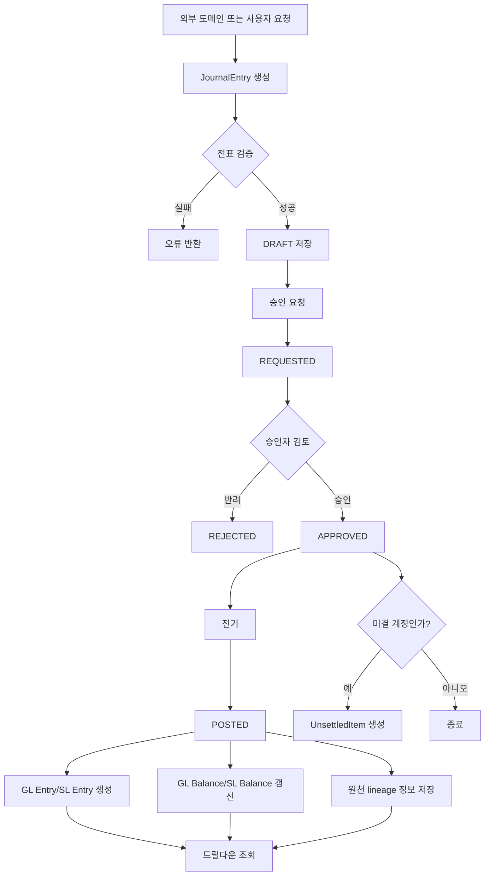
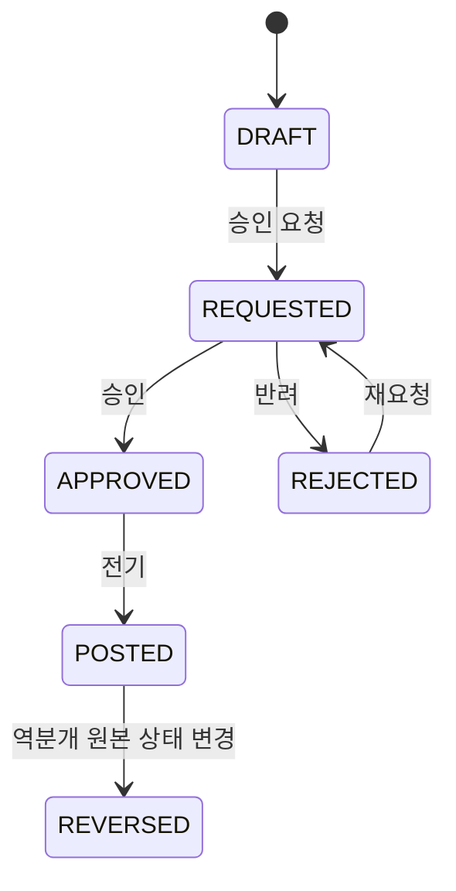

# journal-ledger process flow

## 1. 이 모듈이 하는 일

`journal-ledger`는 아래 흐름을 책임진다.

1. 전표 생성
2. 승인 요청
3. 승인 또는 반려
4. 전기
5. GL/SL 반영
6. 드릴다운과 원천 추적
7. 미결 항목 생성 및 정산

## 2. 핵심 흐름도



## 3. 전표 상태 흐름



## 4. 코드 기준 단계별 설명

### 4.1 전표 생성

- 진입점: `POST /api/journals`
- 서비스: `JournalService.createJournalEntry`
- 처리:
  - 회계일자가 비어 있으면 전표일자를 회계일자로 사용
  - 마감 여부 확인
  - 차변/대변 합계 검증
  - 계정과목, 부서, 거래처 존재 여부 검증
  - 차변 라인에 대해 예산 통제 호출
  - 전표번호 생성
  - 상태를 `DRAFT`로 저장

### 4.2 승인 요청

- 진입점: `POST /api/journals/{id}/request`
- 서비스: `JournalService.requestApproval`
- 처리:
  - `DRAFT` 또는 `REJECTED` 상태만 허용
  - 마감 월이면 차단
  - 상태를 `REQUESTED`로 변경

### 4.3 승인

- 진입점: `POST /api/journals/{id}/approve`
- 서비스: `JournalService.approveJournalEntry`
- 처리:
  - `REQUESTED` 상태만 허용
  - 작성자와 승인자 동일 여부 확인
  - 미결 계정이면 `UnsettledItem` 생성
  - 현재 구현에서는 상태 변경을 명시적으로 `APPROVED`로 세팅하지 않는다

### 4.4 반려

- 진입점: `POST /api/journals/{id}/reject`
- 서비스: `JournalService.rejectJournalEntry`
- 처리:
  - 반려 사유 저장
  - `REQUESTED` 상태의 전표만 반려 가능

### 4.5 전기

- 전기 공개 API는 `POST /api/journals/{id}/post` 하나로 사용한다.
- `JournalEntryService.postJournalEntry`는 전표 상태를 먼저 바꾸지 않고 `PostingService.postJournalEntry`에 위임한다.

처리 책임:

- `PostingService.postJournalEntry`
  - `APPROVED` 상태인지 도메인 메서드로 검증
  - 전표 상태를 `POSTED`로 변경하고 전기 처리자를 `auditUser`에 기록
  - `GlEntry`, `SlEntry`를 생성
  - `LedgerService.updateLedgerBalancesBulk`로 GL/SL 잔액을 갱신

## 5. 드릴다운 흐름

```mermaid
flowchart LR
    A[원천 문서] --> B[lineageSourceType / lineageSourceId]
    B --> C[JournalEntry]
    C --> D[JournalDetail]
    D --> E[GlEntry]
    D --> F[SlEntry]
    C --> G[/api/drilldown/journal-entry/{id}/]
    C --> H[/api/drilldown/journal-entry/{id}/source-document]
    E --> I[/api/ledger/drill-down]
```

## 6. 초보자가 꼭 기억할 포인트

- 전표는 바로 `POSTED`가 되지 않는다.
- 차변과 대변 합계가 같아야 저장된다.
- 차변 라인은 예산 통제 대상이다.
- 미결 계정은 승인 시점에 별도 추적 항목이 생긴다.
- 드릴다운 품질은 `lineageSourceType`, `lineageSourceId`를 얼마나 잘 넣느냐에 달려 있다.
