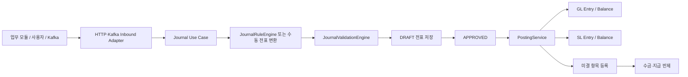
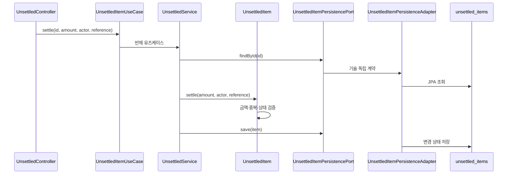
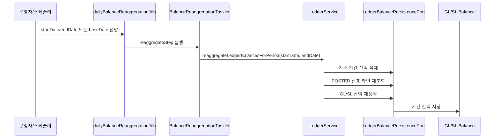

# Journal Ledger 업무·데이터 흐름

## 전체 흐름



## 전표 라이프사이클

| 단계 | 상태 | 핵심 검증 | 데이터 결과 |
| --- | --- | --- | --- |
| 작성 | `DRAFT` | 라인 금액, 차대변, 처리자, 원천 추적 | `journal_entries`, `journal_details` |
| 승인 | `APPROVED` | 승인 가능한 상태와 권한 | 승인 이력과 처리자 |
| 전기 | `POSTED` | 결산 잠금, 차대일치, 중복 전기 | GL/SL 엔트리와 잔액 |

재무 잔액과 기간 집계에는 `POSTED` 전표만 포함합니다. `APPROVED`는 승인됐지만 아직 원장에 반영되지 않은 상태입니다.

전표 저장은 `JournalPersistencePort`, GL/SL 엔트리 저장은 `LedgerEntryPersistencePort`,
잔액 조회·저장·재집계는 `LedgerBalancePersistencePort`를 사용합니다.

기본 어댑터는 JPA입니다. 운영에서 대량 전기/재집계가 필요하면 아래 설정으로 JDBC bulk 구현체를 사용합니다.

```yaml
journal-ledger:
  ledger:
    persistence-mode: jdbc-bulk
```

이 설정을 켜면 전기 엔트리는 batch insert, GL 잔액은 upsert, SL 잔액은 null 거래처·부서 키를 고려한 bulk update/insert로 저장됩니다.
서비스 코드는 같은 포트를 호출하므로 업무 흐름은 바뀌지 않고, 저장 기술만 바뀝니다.

JDBC bulk 모드는 H2 기준 SQL 동작을 `JdbcLedgerBulkPersistenceAdapterTest`에서 검증합니다. 운영 DB에서는 같은 포트 계약을 유지하되 배치 크기, unique index, lock wait, 재집계 동시 실행을 별도 부하 테스트로 확인합니다.

## 자동분개 규칙 흐름

1. 이벤트의 거래유형, 금액, 계정, 통화, 처리자 정보를 받습니다.
2. `JournalRuleCondition`이 문자열·숫자 조건을 평가합니다.
3. 일치한 규칙의 `JournalRuleDetail`이 생성할 전표 라인을 정의합니다.
4. 차대변은 `JournalSide` 타입으로 제한되어 잘못된 문자열을 저장 전에 차단합니다.
5. 필수 표현식 값이 없거나 금액이 0 이하이면 전표 생성을 중단합니다.

`JournalRuleEngine`은 `JournalRuleQueryPort`를 통해 규칙을 읽습니다. JPA 저장소 세부 구조와 조회 메서드는 `JournalRuleQueryAdapter` 뒤에 숨깁니다.

## 미결 등록·반제 흐름



상태는 `OPEN -> PARTIAL -> CLEARED` 순서로 진행합니다. `CLEARED`가 되면 `resolved=true`가 되어 활성 미결 조회에서 제외됩니다.

## API 계약 요약

| 기능 | 엔드포인트 | 주요 입력 |
| --- | --- | --- |
| 전표 생성 | `POST /api/journals` | 전표 DTO, `X-User-ID` |
| 이벤트 기반 전표 생성 | `POST /api/journals/from-event` | 이벤트 데이터, `X-User-ID` |
| 승인 | `POST /api/journals/{id}/approve` | `X-User-ID` |
| 전기 | `POST /api/journals/{id}/post` | `X-User-ID` |
| 거래처별 미결 조회 | `GET /api/unsettled/businesspartner/{businessPartnerCode}` | 거래처 코드 |
| 반제 | `POST /api/unsettled/{id}/settle` | 금액, `settlementReference`, `X-User-ID` |

## 잔액 재집계 Batch 흐름



초보자 관점에서는 "과거 날짜의 전표가 바뀌면 그 기간 장부를 다시 더한다"고 이해하면 됩니다. Batch는 날짜 파라미터를 해석하고 core 서비스를 호출할 뿐이며, 실제 잔액 계산과 저장 순서는 `LedgerService`와 출력 포트가 담당합니다.
## 재시도와 정합성 주의사항

- 동일 반제 참조번호는 다시 적용하지 않습니다.
- 전기 요청은 이미 `POSTED`인지 확인해 중복 원장 반영을 막아야 합니다.
- 과거 날짜 전표는 이후 잔액 재집계 범위를 확인해야 합니다.
- 거래처별 미결 조회는 출력 포트의 DB 조건 조회를 사용해 대량 데이터를 메모리에 올리지 않습니다.
- GL/SL 조건 조회도 `LedgerBalancePersistenceAdapter`의 DB 쿼리에서 필터링합니다.
